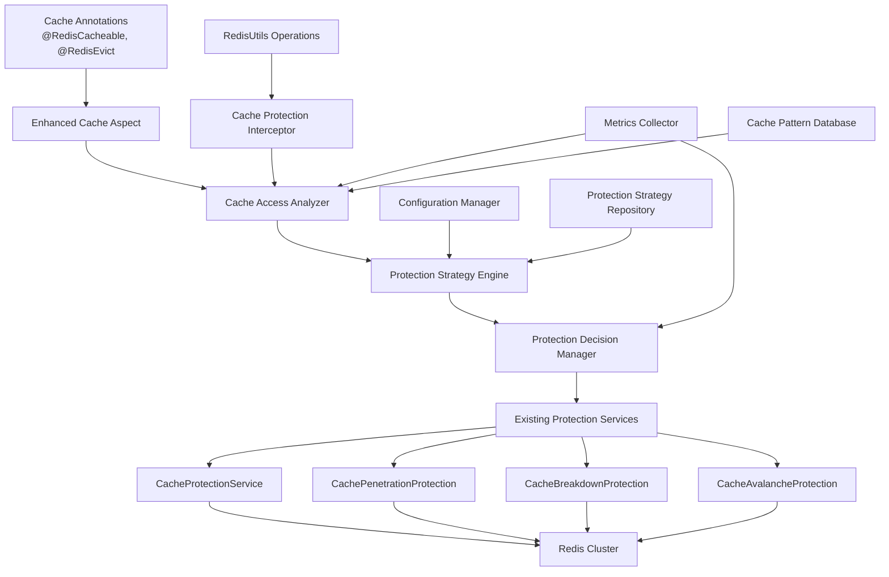

# Cache Protection Optimization Design Document

## Overview

The Cache Protection Optimization system enhances the existing Redis cache implementation by automatically applying protection mechanisms (penetration, breakdown, avalanche protection) based on intelligent analysis of cache access patterns. This design leverages the existing protection infrastructure while adding intelligent decision-making and automatic optimization capabilities.

### Design Goals

- **Automatic Protection**: Seamlessly apply protection mechanisms without manual configuration
- **Intelligent Analysis**: Use access patterns and metrics to make optimal protection decisions
- **Performance Optimization**: Minimize protection overhead while maximizing effectiveness
- **Backward Compatibility**: Work with existing cache implementations without breaking changes
- **Observability**: Provide comprehensive metrics and monitoring for protection effectiveness

## Architecture

### System Architecture



### Component Interaction Flow

```mermaid
sequenceDiagram
    participant App as Application
    participant Aspect as Cache Aspect
    participant Analyzer as Access Analyzer
    participant Engine as Strategy Engine
    participant Manager as Decision Manager
    participant Protection as Protection Service
    partic c
lass BreakdownProtectionDefaults {
        private boolean enabled = true;
        private long defaultLockWaitTime = 10000L; // 10 seconds
        private boolean enableCircuitBreaker = true;
        private int maxConcurrentRebuilds = 10;
        private double riskThreshold = 1000.0; // QPS threshold
    }

    @Data
    public static class AvalancheProtectionDefaults {
        private boolean enabled = true;
        private int defaultJitterPercent = 20;
        private boolean enableWarmup = true;
        private long warmupThreshold = 300L; // 5 minutes
        private double riskThreshold = 0.7; // Clustering coefficient threshold
    }

    @Data
    public static class AnalysisConfig {
        private long analysisWindow = 300000L; // 5 minutes
        private int minSampleSize = 100;
        private boolean enablePatternLearning = true;
        private long patternRetentionPeriod = 86400000L; // 24 hours
    }
}
```

## Data Models

### 1. Cache Access Context

```java
@Data
@Builder
public class CacheAccessContext {
    private String keyPattern;
    private String actualKey;
    private String methodSignature;
    private Class<?> returnType;
    private long timestamp;
    private CacheOperation operation; // GET, PUT, EVICT
    private Map<String, Object> metadata;

    public static CacheAccessContext from(CacheContext context) {
        return CacheAccessContext.builder()
            .keyPattern(extractKeyPattern(context.getCacheKey()))
            .actualKey(context.getCacheKey())
            .methodSignature(context.getMethodSignature())
            .returnType(context.getReturnType())
            .timestamp(System.currentTimeMillis())
            .operation(context.getOperation())
            .metadata(context.getMetadata())
            .build();
    }
}
```

### 2. Protection Requirement

```java
@Data
@Builder
public class ProtectionRequirement {
    private PenetrationRisk penetrationRisk;
    private BreakdownRisk breakdownRisk;
    private AvalancheRisk avalancheRisk;
    private Priority priority;
    private Map<String, Object> analysisData;

    public enum PenetrationRisk { LOW, MEDIUM, HIGH }
    public enum BreakdownRisk { LOW, MEDIUM, HIGH }
    public enum AvalancheRisk { LOW, MEDIUM, HIGH }
    public enum Priority { LOW, MEDIUM, HIGH, CRITICAL }
}
```

### 3. Protection Strategy

```java
@Data
@Builder
public class ProtectionStrategy {
    private PenetrationProtectionConfig penetrationProtection;
    private BreakdownProtectionConfig breakdownProtection;
    private AvalancheProtectionConfig avalancheProtection;
    private long timestamp;
    private String reasoning; // For debugging and monitoring

    @Data
    @Builder
    public static class PenetrationProtectionConfig {
        private boolean enabled;
        private String bloomFilterName;
        private long expectedInsertions;
        private double falsePositiveRate;
        private boolean warmupEnabled;
    }

    @Data
    @Builder
    public static class BreakdownProtectionConfig {
        private boolean enabled;
        private long lockWaitTime;
        private boolean enableCircuitBreaker;
        private int maxConcurrentRebuilds;
    }

    @Data
    @Builder
    public static class AvalancheProtectionConfig {
        private boolean enabled;
        private int ttlJitterPercent;
        private boolean enableWarmup;
        private long warmupThreshold;
    }
}
```

## Integration Points

### 1. Integration with Existing Cache Aspects

The enhanced cache aspect works alongside existing cache aspects using Spring's `@Order` annotation to ensure proper execution order:

```java
// Existing aspects maintain their current order
@Order(100) // RedisCacheableAspect
@Order(101) // RedisEvictAspect
@Order(102) // RedisPutAspect

// New enhanced aspect runs first
@Order(Ordered.HIGHEST_PRECEDENCE) // EnhancedCacheAspect
```

### 2. Integration with Existing Protection Services

The system leverages existing protection implementations:

```java
@Component
public class ProtectionServiceIntegrator {

    private final CacheProtectionService protectionService;
    private final CachePenetrationProtection penetrationProtection;
    private final CacheBreakdownProtection breakdownProtection;
    private final CacheAvalancheProtection avalancheProtection;

    public <T> T executeWithOptimizedProtection(CacheOperation<T> operation, ProtectionStrategy strategy) {
        if (strategy.requiresFullProtection()) {
            // Use existing CacheProtectionService for comprehensive protection
            return protectionService.executeWithFullProtection(
                operation.getCacheKey(),
                strategy.getPenetrationProtection().getBloomFilterName(),
                operation.getDataLoader(),
                operation.getCacheWriter()
            );
        } else {
            // Use individual protection services for targeted protection
            return executeWithTargetedProtection(operation, strategy);
        }
    }
}
```

### 3. Metrics Integration

The system integrates with existing metrics infrastructure:

```java
@Component
public class ProtectionMetricsIntegrator {

    private final MeterRegistry meterRegistry;
    private final CacheMetricsCollector existingMetrics;

    public void recordProtectionMetrics(String cacheKey, ProtectionStrategy strategy, ProtectionResult result) {
        // Integrate with existing cache metrics
        existingMetrics.recordCacheOperation(cacheKey, result.isSuccess());

        // Add protection-specific metrics
        Timer.Sample sample = Timer.start(meterRegistry);
        sample.stop(Timer.builder("cache.protection.execution.time")
            .tag("key.pattern", extractKeyPattern(cacheKey))
            .tag("strategy", strategy.toString())
            .register(meterRegistry));

        // Record protection effectiveness
        meterRegistry.counter("cache.protection.decisions",
            "type", strategy.getPrimaryProtectionType(),
            "result", result.isSuccess() ? "success" : "failure")
            .increment();
    }
}
```

## Error Handling and Fallback Strategies

### 1. Protection Failure Handling

```java
@Component
public class ProtectionFallbackHandler {

    public <T> T handleProtectionFailure(CacheOperation<T> operation, Exception protectionException) {
        log.warn("Protection mechanism failed, falling back to direct execution", protectionException);

        try {
            // Attempt direct cache operation without protection
            return executeDirectCacheOperation(operation);
        } catch (Exception directException) {
            // If cache operation also fails, execute data loader directly
            log.error("Direct cache operation failed, executing data loader", directException);
            return operation.getDataLoader().get();
        }
    }

    private <T> T executeDirectCacheOperation(CacheOperation<T> operation) {
        // Try to read from cache first
        T cachedValue = readFromCache(operation.getCacheKey());
        if (cachedValue != null) {
            return cachedValue;
        }

        // Load data and cache it
        T data = operation.getDataLoader().get();
        operation.getCacheWriter().write(operation.getCacheKey(), data, getDefaultTtl());
        return data;
    }
}
```

### 2. Configuration Validation

```java
@Component
public class ProtectionConfigurationValidator {

    public ValidationResult validateConfiguration(CacheProtectionProperties properties) {
        ValidationResult.Builder result = ValidationResult.builder();

        // Validate global configuration
        validateGlobalConfig(properties.getGlobal(), result);

        // Validate service-specific configurations
        properties.getServices().forEach((service, config) ->
            validateServiceConfig(service, config, result));

        // Validate method-specific configurations
        properties.getMethods().forEach((method, config) ->
            validateMethodConfig(method, config, result));

        return result.build();
    }

    private void validateGlobalConfig(GlobalProtectionConfig config, ValidationResult.Builder result) {
        if (config.getPenetration().getFalsePositiveRate() <= 0 ||
            config.getPenetration().getFalsePositiveRate() >= 1) {
            result.addError("Invalid false positive rate: must be between 0 and 1");
        }

        if (config.getBreakdown().getDefaultLockWaitTime() <= 0) {
            result.addError("Invalid lock wait time: must be positive");
        }

        if (config.getAvalanche().getDefaultJitterPercent() < 0 ||
            config.getAvalanche().getDefaultJitterPercent() > 100) {
            result.addError("Invalid jitter percent: must be between 0 and 100");
        }
    }
}
```

## Performance Considerations

### 1. Analysis Performance Optimization

```java
@Component
public class PerformanceOptimizedAnalyzer {

    private final LoadingCache<String, CachePattern> patternCache;
    private final AsyncExecutor analysisExecutor;

    public PerformanceOptimizedAnalyzer() {
        this.patternCache = Caffeine.newBuilder()
            .maximumSize(10000)
            .expireAfterWrite(Duration.ofMinutes(30))
            .build(this::loadCachePattern);

        this.analysisExecutor = new ThreadPoolTaskExecutor();
        // Configure executor for non-blocking analysis
    }

    public CompletableFuture<ProtectionRequirement> analyzeAccessAsync(CacheAccessContext context) {
        return CompletableFuture.supplyAsync(() -> {
            // Use cached patterns to avoid expensive database queries
            CachePattern pattern = patternCache.get(context.getKeyPattern());
            return performAnalysis(context, pattern);
        }, analysisExecutor);
    }

    // Batch analysis for better performance
    public Map<String, ProtectionRequirement> batchAnalyze(List<CacheAccessContext> contexts) {
        return contexts.parallelStream()
            .collect(Collectors.toConcurrentMap(
                CacheAccessContext::getKeyPattern,
                this::analyzeAccess
            ));
    }
}
```

### 2. Memory Usage Optimization

```java
@Component
public class MemoryOptimizedPatternStorage {

    private final BloomFilter<String> knownPatterns;
    private final ConcurrentHashMap<String, CompactPattern> patterns;

    public MemoryOptimizedPatternStorage() {
        // Use bloom filter to quickly check if pattern exists
        this.knownPatterns = BloomFilter.create(Funnels.stringFunnel(Charset.defaultCharset()), 100000, 0.01);
        this.patterns = new ConcurrentHashMap<>();
    }

    public void storePattern(String keyPattern, CachePattern pattern) {
        if (!knownPatterns.mightContain(keyPattern)) {
            knownPatterns.put(keyPattern);
            // Store compact representation to save memory
            patterns.put(keyPattern, CompactPattern.from(pattern));
        } else {
            // Update existing pattern
            patterns.computeIfPresent(keyPattern, (key, existing) ->
                existing.merge(CompactPattern.from(pattern)));
        }
    }
}
```

## Monitoring and Observability

### 1. Protection Decision Logging

```java
@Component
public class ProtectionDecisionLogger {

    private final Logger protectionLogger = LoggerFactory.getLogger("cache.protection.decisions");

    public void logProtectionDecision(String cacheKey, ProtectionStrategy strategy, ProtectionRequirement requirement) {
        if (protectionLogger.isDebugEnabled()) {
            protectionLogger.debug("Protection decision for key {}: strategy={}, requirement={}, reasoning={}",
                cacheKey, strategy, requirement, strategy.getReasoning());
        }

        // Log high-risk decisions at INFO level
        if (isHighRisk(requirement)) {
            protectionLogger.info("High-risk cache access detected for key {}: applying protection strategy {}",
                cacheKey, strategy);
        }
    }

    public void logProtectionEffectiveness(String cacheKey, ProtectionStrategy strategy, ProtectionResult result) {
        if (result.isSuccess()) {
            protectionLogger.debug("Protection successful for key {}: {}", cacheKey, result);
        } else {
            protectionLogger.warn("Protection failed for key {}: {}", cacheKey, result);
        }
    }
}
```

### 2. Health Indicators

```java
@Component
public class CacheProtectionHealthIndicator implements HealthIndicator {

    private final ProtectionMetricsCollector metricsCollector;
    private final ProtectionConfigurationValidator configValidator;

    @Override
    public Health health() {
        Health.Builder builder = Health.up();

        try {
            // Check protection effectiveness
            double successRate = metricsCollector.getProtectionSuccessRate();
            if (successRate < 0.95) {
                builder.down().withDetail("protection.success.rate", successRate);
            } else {
                builder.withDetail("protection.success.rate", successRate);
            }

            // Check configuration validity
            ValidationResult configValidation = configValidator.validateCurrentConfiguration();
            if (!configValidation.isValid()) {
                builder.down().withDetail("configuration.errors", configValidation.getErrors());
            }

            // Check system resources
            long memoryUsage = getProtectionMemoryUsage();
            builder.withDetail("memory.usage.mb", memoryUsage / 1024 / 1024);

            return builder.build();

        } catch (Exception e) {
            return Health.down(e).build();
        }
    }
}
```

This design provides a comprehensive solution for optimizing cache usage with existing protection mechanisms, ensuring automatic protection application, intelligent decision-making, and seamless integration with the current system.
