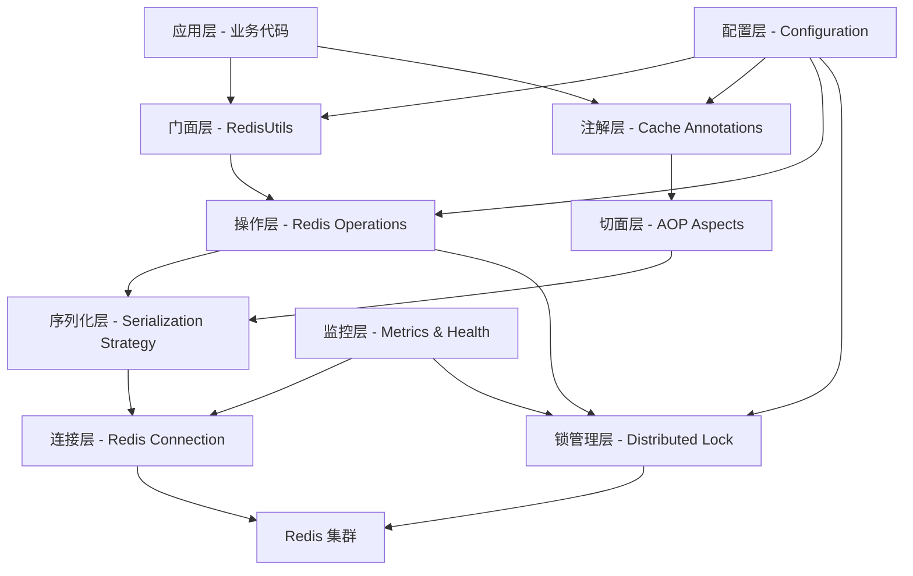

# Redis Commons 工具库设计文档

## 概述

Redis Commons 工具库是 SpringOJ 项目的核心基础设施组件，为微服务架构提供统一、高效、安全的 Redis 操作能力。该工具库采用分层架构设计，通过门面模式、策略模式、装饰器模式等设计模式，实现了高内聚、低耦合的模块化架构。

### 设计目标

- **统一性**：提供一致的 API 接口，屏蔽底层实现复杂性
- **高性能**：优化序列化策略，支持连接池管理
- **可靠性**：完善的异常处理和降级机制
- **可扩展性**：插件化架构，支持自定义扩展
- **易用性**：注解驱动开发，简化使用复杂度

## 架构设计

### 整体架构



### 分层说明

1. **门面层**：提供统一的 RedisUtils API
2. **注解层**：基于 AOP 的缓存注解支持
3. **操作层**：具体的 Redis 数据类型操作实现
4. **切面层**：处理注解逻辑的 AOP 切面
5. **序列化层**：多种序列化策略的实现
6. **连接层**：Redis 连接管理和池化
7. **锁管理层**：分布式锁的实现和管理
8. **配置层**：配置管理和自动装配
9. **监控层**：健康检查和性能监控

## 核心组件设计

### 1. RedisUtils 门面类

```java
@Component
public class RedisUtils {
    // 字符串操作
    public <T> RedisStringOperations<T> string();

    // 哈希操作
    public <T> RedisHashOperations<T> hash();

    // 列表操作
    public <T> RedisListOperations<T> list();

    // 集合操作
    public <T> RedisSetOperations<T> set();

    // 有序集合操作
    public <T> RedisZSetOperations<T> zset();

    // 通用操作
    public RedisCommonOperations common();
}
```

**设计特点：**

- 泛型支持，提供强类型安全
- 链式调用，提升代码可读性
- 操作分离，职责单一
- 统一异常处理

### 2. 分布式锁管理器

```java
public interface DistributedLockManager {
    // 获取可重入锁
    RLock getLock(String key);

    // 获取公平锁
    RLock getFairLock(String key);

    // 获取读写锁
    RReadWriteLock getReadWriteLock(String key);

    // 执行带锁操作
    <T> T executeWithLock(String key, Supplier<T> supplier, long waitTime, long leaseTime);
}
```

**实现策略：**

- 基于 Redisson 实现
- 支持锁续约机制
- 提供超时和重试配置
- 完善的异常处理

### 3. 缓存注解系统

```java
// 缓存注解
@Target({ElementType.METHOD})
@Retention(RetentionPolicy.RUNTIME)
public @interface RedisCacheable {
    String key();
    String condition() default "";
    long ttl() default -1;
    SerializationType serialization() default SerializationType.JSON;
}

// 缓存清除注解
@Target({ElementType.METHOD})
@Retention(RetentionPolicy.RUNTIME)
public @interface RedisEvict {
    String key();
    String condition() default "";
    boolean allEntries() default false;
}
```

**AOP 切面实现：**

- SpEL 表达式支持
- 条件缓存逻辑
- 异常降级处理
- 性能监控集成

### 4. 序列化策略

```java
public interface RedisSerializer<T> {
    byte[] serialize(T object);
    T deserialize(byte[] bytes, Class<T> type);
}

public enum SerializationType {
    JSON(JsonRedisSerializer.class),
    KRYO(KryoRedisSerializer.class),
    JDK(JdkRedisSerializer.class),
    PROTOBUF(ProtobufRedisSerializer.class);
}
```

**序列化策略对比：**

| 策略     | 性能 | 大小 | 兼容性 | 适用场景         |
| -------- | ---- | ---- | ------ | ---------------- |
| JSON     | 中等 | 大   | 跨语言 | 调试友好，跨服务 |
| Kryo     | 高   | 小   | Java   | 高性能场景       |
| JDK      | 低   | 大   | Java   | 简单对象         |
| Protobuf | 高   | 最小 | 跨语言 | 大数据量传输     |

## 数据模型设计

### 1. 配置模型

```java
@ConfigurationProperties(prefix = "spring.redis.commons")
@Data
public class RedisCommonsProperties {
    // 基础配置
    private boolean enabled = true;
    private String keyPrefix = "springoj:";

    // 序列化配置
    private SerializationConfig serialization = new SerializationConfig();

    // 缓存配置
    private CacheConfig cache = new CacheConfig();

    // 锁配置
    private LockConfig lock = new LockConfig();

    // 防护配置
    private ProtectionConfig protection = new ProtectionConfig();

    @Data
    public static class SerializationConfig {
        private SerializationType defaultType = SerializationType.JSON;
        private boolean enableCompression = false;
    }

    @Data
    public static class CacheConfig {
        private long defaultTtl = 3600; // 1小时
        private boolean enableNullCache = true;
        private int nullCacheTtl = 300; // 5分钟
    }

    @Data
    public static class LockConfig {
        private long defaultWaitTime = 10; // 10秒
        private long defaultLeaseTime = 30; // 30秒
        private boolean enableWatchdog = true;
    }

    @Data
    public static class ProtectionConfig {
        private boolean enableBloomFilter = true;
        private int bloomFilterExpectedInsertions = 1000000;
        private double bloomFilterFpp = 0.01;
        private boolean enableCircuitBreaker = true;
    }
}
```

### 2. 监控指标模型

```java
@Data
public class RedisMetrics {
    // 连接指标
    private ConnectionMetrics connection;

    // 操作指标
    private OperationMetrics operation;

    // 缓存指标
    private CacheMetrics cache;

    // 锁指标
    private LockMetrics lock;

    @Data
    public static class ConnectionMetrics {
        private int activeConnections;
        private int idleConnections;
        private long totalConnections;
        private double connectionUtilization;
    }

    @Data
    public static class OperationMetrics {
        private long totalOperations;
        private long successfulOperations;
        private long failedOperations;
        private double averageResponseTime;
    }

    @Data
    public static class CacheMetrics {
        private long hitCount;
        private long missCount;
        private double hitRate;
        private long evictionCount;
    }

    @Data
    public static class LockMetrics {
        private long lockAcquisitions;
        private long lockTimeouts;
        private double averageLockHoldTime;
        private int currentActiveLocks;
    }
}
```

## 错误处理策略

### 1. 异常层次结构

```java
// 基础异常
public class RedisCommonsException extends RuntimeException {
    private final String errorCode;
    private final Object[] args;
}

// 连接异常
public class RedisConnectionException extends RedisCommonsException {
    // Redis 连接相关异常
}

// 序列化异常
public class RedisSerializationException extends RedisCommonsException {
    // 序列化/反序列化异常
}

// 锁异常
public class RedisLockException extends RedisCommonsException {
    // 分布式锁相关异常
}

// 缓存异常
public class RedisCacheException extends RedisCommonsException {
    // 缓存操作异常
}
```

### 2. 降级策略

```java
@Component
public class RedisFallbackHandler {

    // 缓存降级：直接执行原方法
    public <T> T handleCacheFallback(ProceedingJoinPoint joinPoint) {
        try {
            return (T) joinPoint.proceed();
        } catch (Throwable e) {
            throw new RedisCacheException("Cache fallback failed", e);
        }
    }

    // 锁降级：使用本地锁或直接执行
    public <T> T handleLockFallback(Supplier<T> supplier, String key) {
        // 实现本地锁降级逻辑
        synchronized (key.intern()) {
            return supplier.get();
        }
    }
}
```

### 3. 重试机制

```java
@Component
public class RedisRetryHandler {

    @Retryable(
        value = {RedisConnectionException.class},
        maxAttempts = 3,
        backoff = @Backoff(delay = 1000, multiplier = 2)
    )
    public <T> T executeWithRetry(Supplier<T> operation) {
        return operation.get();
    }
}
```

## 测试策略

### 1. 单元测试

```java
@ExtendWith(MockitoExtension.class)
class RedisUtilsTest {

    @Mock
    private RedisTemplate<String, Object> redisTemplate;

    @InjectMocks
    private RedisUtils redisUtils;

    @Test
    void testStringOperations() {
        // 测试字符串操作
    }

    @Test
    void testSerializationStrategy() {
        // 测试序列化策略
    }
}
```

### 2. 集成测试

```java
@SpringBootTest
@Testcontainers
class RedisCommonsIntegrationTest {

    @Container
    static RedisContainer redis = new RedisContainer("redis:7-alpine");

    @Autowired
    private RedisUtils redisUtils;

    @Test
    void testCacheAnnotations() {
        // 测试缓存注解功能
    }

    @Test
    void testDistributedLock() {
        // 测试分布式锁功能
    }
}
```

### 3. 性能测试

```java
@Component
public class RedisPerformanceTest {

    @Test
    void benchmarkSerializationStrategies() {
        // 对比不同序列化策略的性能
    }

    @Test
    void benchmarkConcurrentOperations() {
        // 测试并发操作性能
    }
}
```

## 部署和运维

### 1. 健康检查

```java
@Component
public class RedisHealthIndicator implements HealthIndicator {

    @Override
    public Health health() {
        try {
            // 检查 Redis 连接状态
            String pong = redisTemplate.getConnectionFactory()
                .getConnection().ping();

            if ("PONG".equals(pong)) {
                return Health.up()
                    .withDetail("redis", "Available")
                    .withDetail("connections", getConnectionMetrics())
                    .build();
            }
        } catch (Exception e) {
            return Health.down()
                .withDetail("redis", "Unavailable")
                .withException(e)
                .build();
        }

        return Health.down().build();
    }
}
```

### 2. 监控端点

```java
@RestController
@RequestMapping("/actuator/redis")
public class RedisActuatorEndpoint {

    @GetMapping("/metrics")
    public RedisMetrics getMetrics() {
        // 返回 Redis 性能指标
    }

    @GetMapping("/info")
    public Map<String, Object> getInfo() {
        // 返回 Redis 配置信息
    }

    @PostMapping("/cache/clear")
    public ResponseEntity<String> clearCache(@RequestParam String pattern) {
        // 清除指定模式的缓存
    }
}
```

### 3. 配置示例

```yaml
spring:
  redis:
    commons:
      enabled: true
      key-prefix: "springoj:"
      serialization:
        default-type: JSON
        enable-compression: false
      cache:
        default-ttl: 3600
        enable-null-cache: true
        null-cache-ttl: 300
      lock:
        default-wait-time: 10
        default-lease-time: 30
        enable-watchdog: true
      protection:
        enable-bloom-filter: true
        bloom-filter-expected-insertions: 1000000
        bloom-filter-fpp: 0.01
        enable-circuit-breaker: true

management:
  endpoints:
    web:
      exposure:
        include: health,info,metrics,redis
  endpoint:
    health:
      show-details: always
```

## 性能优化建议

### 1. 连接池优化

- 合理配置最大连接数和最小空闲连接数
- 启用连接验证，避免使用失效连接
- 配置合适的连接超时和读取超时

### 2. 序列化优化

- 根据数据特点选择合适的序列化策略
- 对大对象启用压缩
- 缓存序列化结果，避免重复序列化

### 3. 缓存策略优化

- 设置合理的 TTL，避免缓存雪崩
- 使用布隆过滤器防止缓存穿透
- 实现缓存预热机制

### 4. 锁优化

- 使用公平锁避免锁饥饿
- 合理设置锁超时时间
- 启用看门狗机制防止死锁

这个设计文档提供了完整的架构设计、组件设计、数据模型、错误处理、测试策略和运维方案，为后续的实现提供了详细的技术指导。
