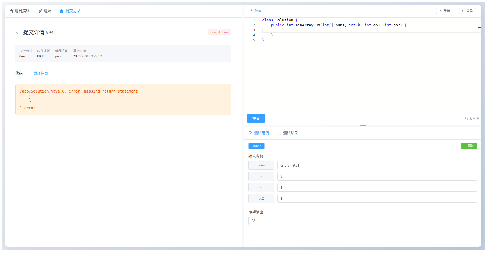
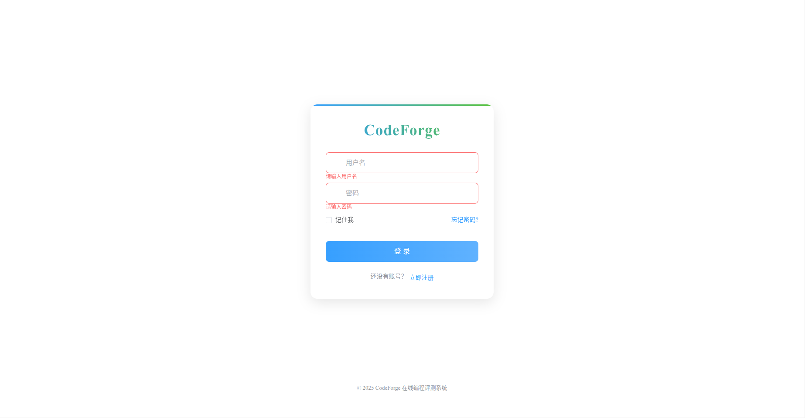

# CodeForge

## 项目简介

CodeForge 是一个基于 Spring Cloud 微服务架构的在线编程评测系统，旨在为程序员和算法爱好者提供一个高效、稳定的编程练习和竞赛平台。系统采用前后端分离架构，后端使用 Spring Cloud Alibaba 生态构建，前端采用 Vue 3 技术栈实现。

## 后端技术栈

| 技术领域 | 核心技术 | 版本 / 说明 |
| :--- | :--- |:-------------------------------------------------|
| **核心框架** |  | 企业级应用开发框架 |
| |  | 微服务架构解决方案 |
| |  | 阿里云微服务组件 |
| **数据库与持久层** |  | 关系型数据库 |
| |  | ORM 框架 |
| |  | 数据库连接池 |
| |  | 缓存/分布式方案 |
| |  | Redis 客户端 |
| **微服务组件** |  | 服务发现与配置中心 |
| |  | 流量控制与熔断 |
| |  | API 网关 |
| |  | 服务间 HTTP 客户端 |
| |  +  | 链路追踪 |
| **安全与认证** |  | 认证授权 |
| **开发与辅助工具** |  | 编程语言 |
| |  | 构建工具 |
| | API 文档 | Swagger 3 (SpringDoc) |
| | 常用库 | Lombok, Hutool, Fastjson2 |

## 前端技术栈

| 技术领域 | 核心技术 | 说明 |
| :--- | :--- |:-------------------------------------------------|
| **核心框架与生态** |  | 渐进式 JavaScript 框架 |
| |  | 下一代前端构建工具 |
| |  | JavaScript 的超集 |
| |  | 官方路由管理器 |
| |  | Vue 状态管理 |
| **UI 与样式** |  | 企业级 UI 组件库 |
| |  | 企业级 UI 设计语言 |
| |  | 实用优先的 CSS 框架 |
| **功能库与工具** |  | 基于 Promise 的 HTTP 客户端 |
| |  | VS Code 代码编辑器 |
| |  | Markdown 编辑器组件 |
| |  +  | 代码质量与格式化工具 |

## 项目预览

### 业务端项目预览

#### 1. 题库界面

#### 2. 题目页面

#### 3. 题解页面

#### 4. 提交记录页面

#### 5. 登录页面

### 管理端项目预览

#### 1. 基本的权限用户管理

#### 2. 题目管理

#### 3. 题解管理

#### 4. 登录页面

