# 🚀 CodeForge

**一个现代化的在线编程评测系统 | Modern Online Judge Platform**

[功能特性](#-功能特性) • [快速开始](#-快速开始) • [技术架构](#-技术架构) • [项目预览](#-项目预览) • [贡献指南](#-贡献指南)

---

## 📖 项目简介

**CodeForge** 是一个基于 **Spring Cloud 微服务架构** 的现代化在线编程评测系统，为程序员和算法爱好者提供高效、稳定的编程练习和竞赛平台。

### 🎯 核心亮点

- 🏗️ **微服务架构**：基于 Spring Cloud Alibaba 生态，支持高并发和水平扩展
- 🔒 **安全可靠**：JWT 认证 + Spring Security，多层安全防护
- ⚡ **高性能**：Redis 缓存 + 分布式锁，毫秒级响应
- 🎨 **现代化 UI**：Vue 3 + TypeScript + Element Plus，极致用户体验
- 🐳 **容器化部署**：Docker Compose 一键部署，开箱即用
- 📊 **可观测性**：Zipkin 链路追踪 + Sentinel 流量控制

## 🛠️ 技术架构

### 后端技术栈

<table>
<tr>
<td width="50%">

#### 🏗️ 核心框架
-  企业级应用开发框架
-  微服务架构解决方案
-  阿里云微服务组件

#### 🗄️ 数据存储
-  关系型数据库
-  ORM 框架
-  缓存/分布式方案
-  数据库连接池

</td>
<td width="50%">

#### ☁️ 微服务组件
-  服务发现与配置中心
-  流量控制与熔断
-  API 网关
-  服务间通信

#### 🔧 开发工具
-  编程语言
-  构建工具
-  认证授权
-  链路追踪

</td>
</tr>
</table>

### 前端技术栈

<table>
<tr>
<td width="50%">

#### 🎨 核心框架
-  渐进式 JavaScript 框架
-  下一代前端构建工具
-  JavaScript 的超集
-  官方路由管理器
-  Vue 状态管理

#### 🎯 UI 组件库
-  企业级 UI 组件库
-  企业级 UI 设计语言
-  实用优先的 CSS 框架

</td>
<td width="50%">

#### ⚙️ 功能组件
-  HTTP 客户端
-  VS Code 代码编辑器
-  Markdown 编辑器
-  数据可视化

#### 🔍 开发工具
-  代码质量检查
-  代码格式化
-  CSS 预处理器

</td>
</tr>
</table>

---

## ✨ 功能特性

### 🎯 用户端功能

| 模块 | 功能描述 | 技术亮点 |
|------|----------|----------|
| 🏠 **首页** | 题目推荐、数据统计、公告展示 | 个性化推荐算法 |
| 📚 **题库** | 题目浏览、分类筛选、难度标记 | 智能分页、实时搜索 |
| 💻 **在线编程** | 多语言支持、实时编译、智能提示 | Monaco Editor 集成 |
| 📊 **提交记录** | 代码提交历史、执行结果、性能分析 | 可视化数据展示 |
| 💡 **题解系统** | 题解发布、点赞评论、Markdown 支持 | 富文本编辑器 |
| 👤 **个人中心** | 用户信息、做题统计、成就系统 | 数据可视化图表 |

### 🛡️ 管理端功能

| 模块 | 功能描述 | 技术亮点 |
|------|----------|----------|
| 👥 **用户管理** | 用户信息维护、权限分配、状态管理 | RBAC 权限模型 |
| 📝 **题目管理** | 题目增删改查、测试用例管理 | 批量操作、数据校验 |
| 🏆 **题解管理** | 题解审核、质量评估、推荐设置 | 内容审核机制 |
| 📈 **数据统计** | 用户活跃度、题目难度分析 | 实时数据大屏 |

### 🏗️ 系统架构特性

- 🔄 **微服务架构**：服务独立部署，支持水平扩展
- 🔐 **安全防护**：JWT 认证 + Spring Security 多层防护
- ⚡ **高性能缓存**：Redis 多级缓存，毫秒级响应
- 📊 **链路追踪**：Zipkin 全链路监控，问题快速定位
- 🎯 **流量控制**：Sentinel 熔断降级，系统稳定性保障
- 🐳 **容器化部署**：Docker Compose 一键部署

## 📸 项目预览

### 🎯 核心功能展示

<table>
<tr>
<td width="50%" align="center">
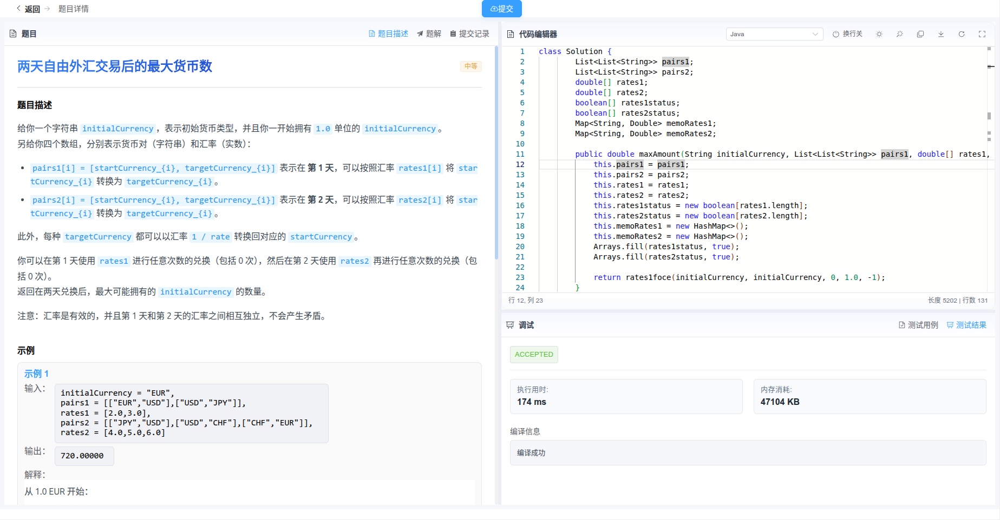
 <strong>📝 题目详情页</strong>
 Monaco Editor 代码编辑器
</td>
<td width="50%" align="center">
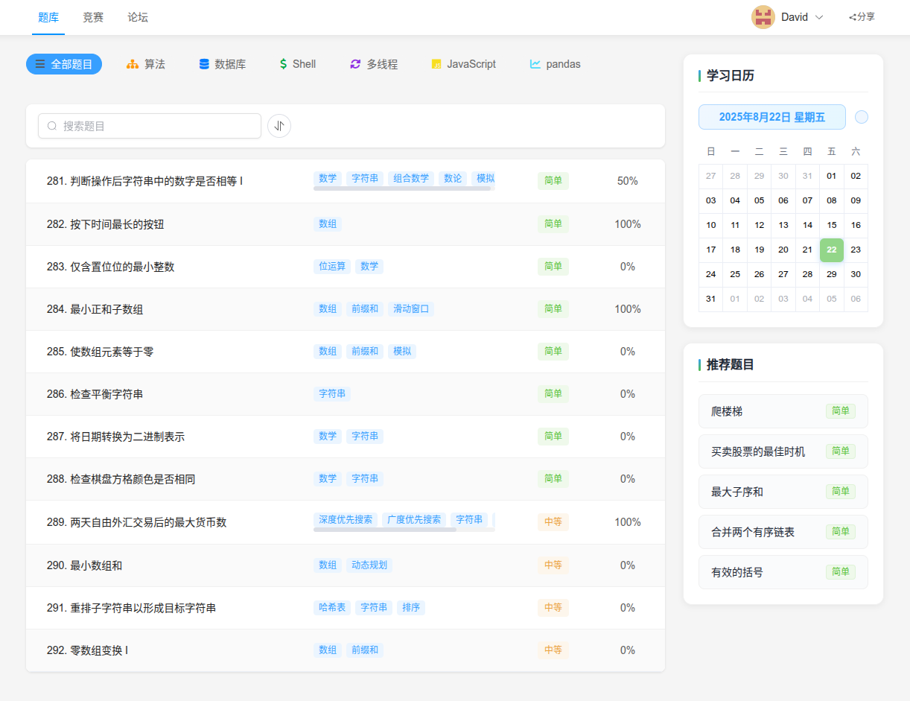
 <strong>🏠 系统首页</strong>
 数据统计与题目推荐
</td>
</tr>
<tr>
<td width="50%" align="center">
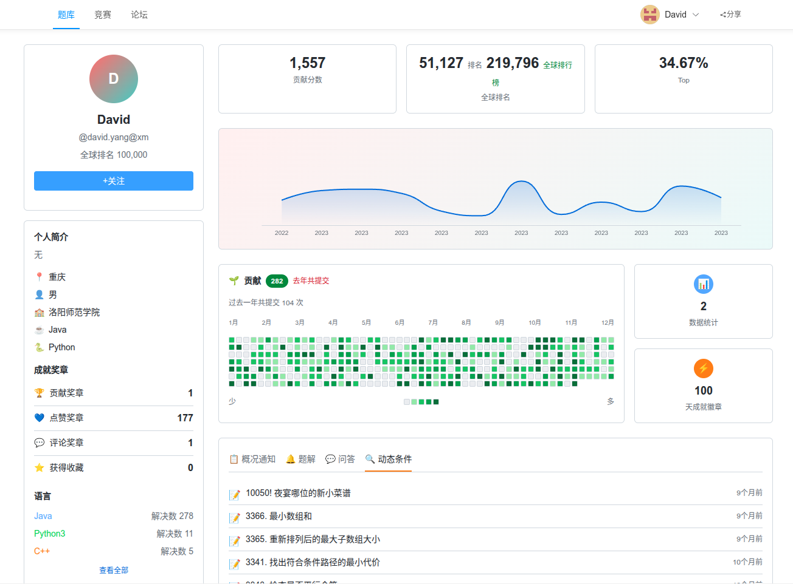
 <strong>👤 个人中心</strong>
 用户数据可视化
</td>
<td width="50%" align="center">

 <strong>🛡️ 管理后台</strong>
 系统管理界面
</td>
</tr>
</table>

### 🎨 用户端界面

> [!TIP]
> 采用现代化设计理念，提供流畅的用户体验

<strong>📚 题库与编程界面</strong>

#### 题库浏览
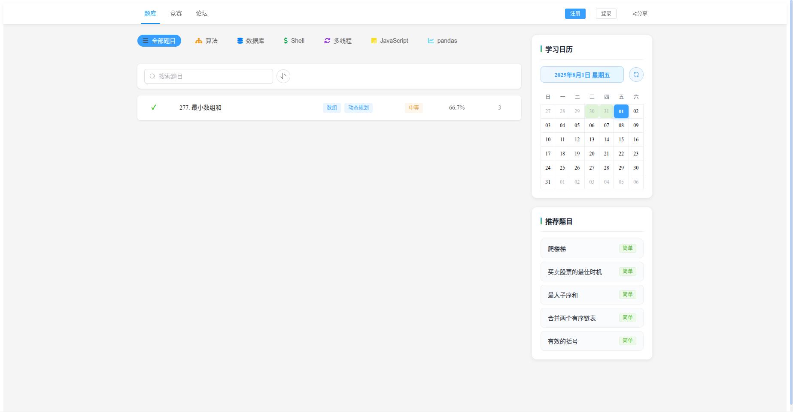
*智能分类筛选，支持多维度搜索*

#### 在线编程
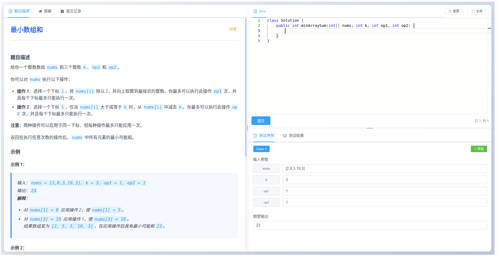
*集成 Monaco Editor，支持多语言高亮*

<strong>💡 题解与讨论系统</strong>

#### 题解浏览
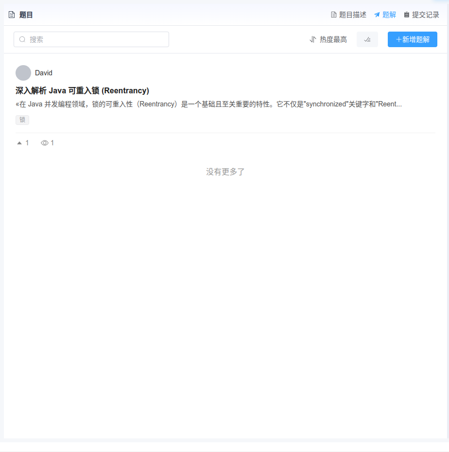
*Markdown 渲染，支持代码高亮*

#### 题解详情
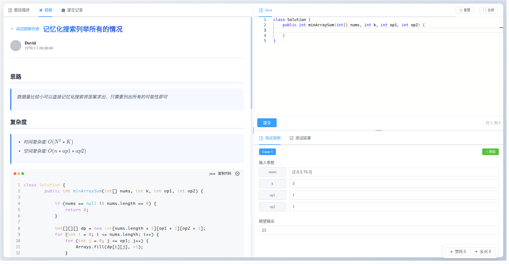
*富文本展示，交互式代码块*

#### 评论系统

*实时评论，点赞互动*

#### 发布题解
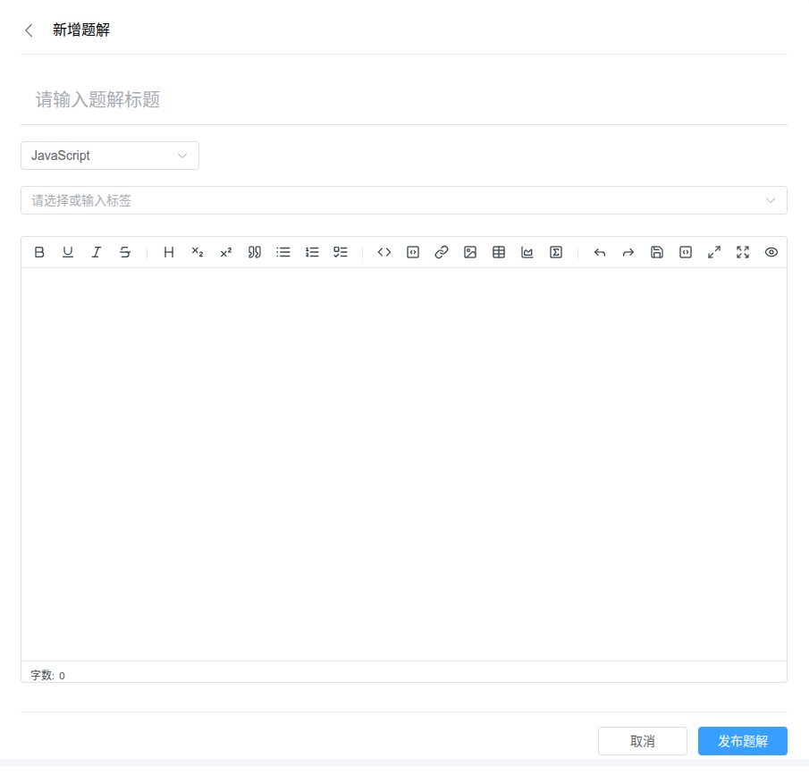
*所见即所得编辑器*

<strong>📊 提交记录与统计</strong>

#### 提交历史
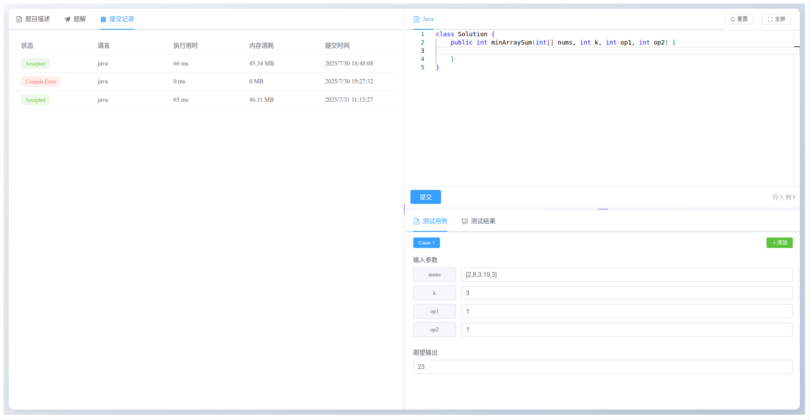
*详细的执行结果与性能分析*

#### 提交详情
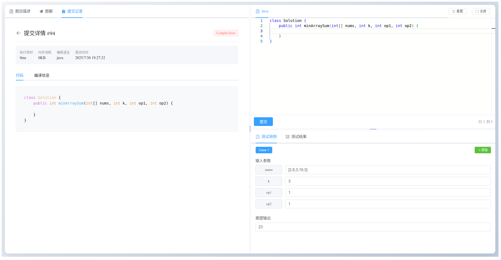
*代码回放与错误诊断*

### 🛡️ 管理端界面

> [!NOTE]
> 基于 RBAC 权限模型，精细化权限控制

<strong>👥 用户与权限管理</strong>

#### 用户管理
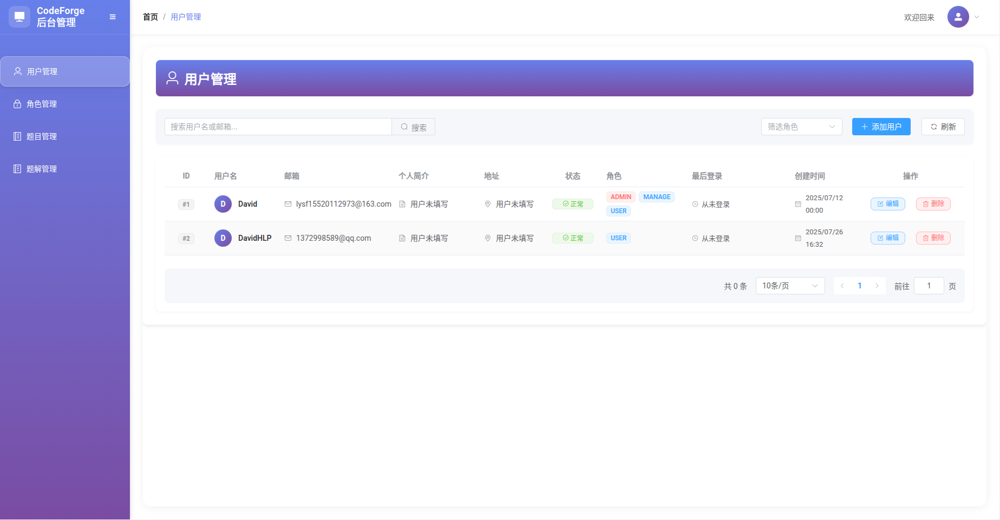
*用户信息维护与状态管理*

#### 角色管理
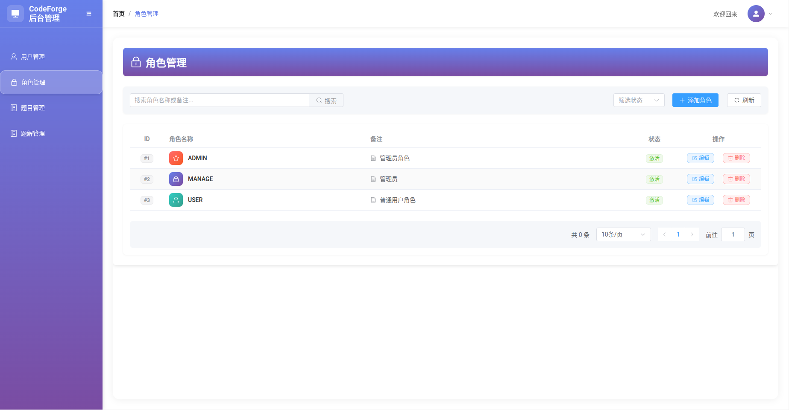
*灵活的角色权限配置*

<strong>📝 内容管理</strong>

#### 题目管理
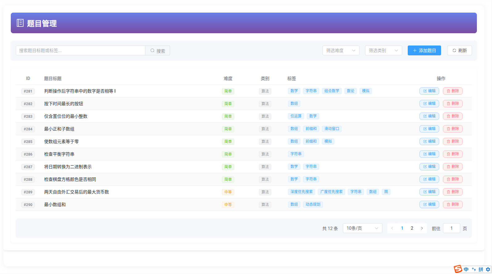
*题目维护与测试用例管理*

#### 题解管理
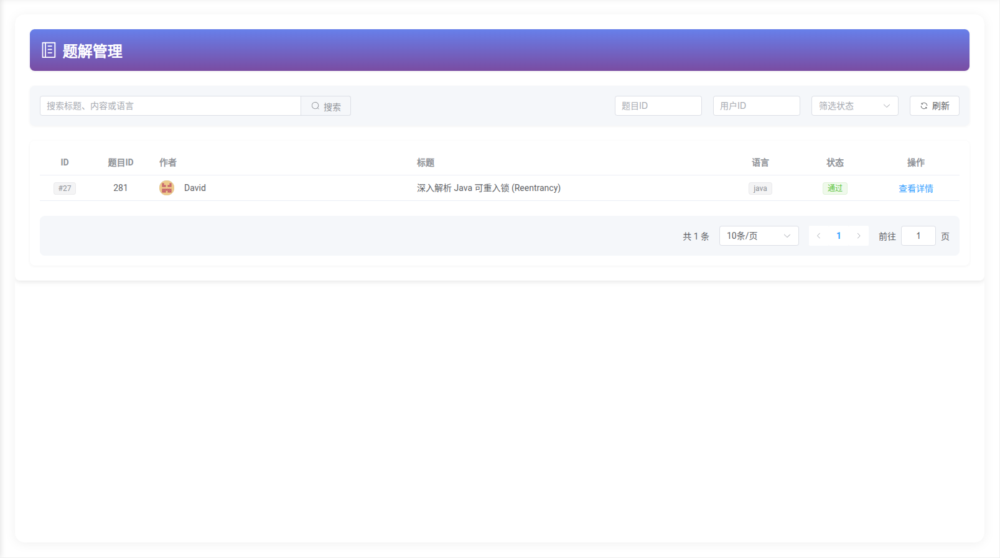
*内容审核与质量控制*

### TODO
- [ ] 用户个人中心
- [ ] 竞赛
- [ ] 讨论社区