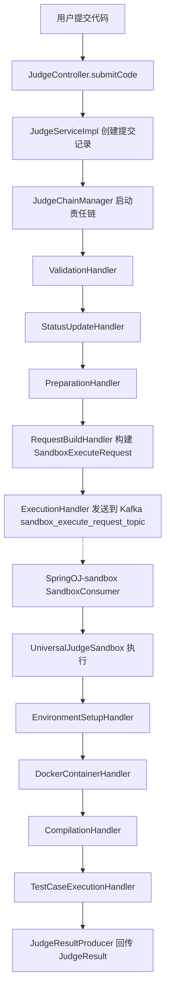

## 概述
- 职责拆分：Judge 模块负责编排与发送执行请求；Sandbox 模块负责隔离执行与回传结果。
- 流转方式：通过 Kafka 主题 sandbox_execute_request_topic 异步解耦。
- 结果回传：由 Sandbox 侧 `JudgeResultProducer` 发送 `JudgeResult`，Judge 侧负责持久化与状态更新（下节细化）。

## 组件与模块
- SpringOJ-judge：`JudgeController`，`JudgeServiceImpl`，责任链与 `SandboxProducer`。
- SpringOJ-sandbox：`SandboxConsumer`，`UniversalJudgeSandbox` 及其内部处理链。
- SpringOJ-commons：跨模块 DTO 与枚举（如 `SandboxExecuteRequest`，`LanguageType`）。

## 判题责任链（Judge）
- `com.david.chain.handler.ValidationHandler`
- `com.david.chain.handler.StatusUpdateHandler`
- `com.david.chain.handler.PreparationHandler`
- `com.david.chain.handler.RequestBuildHandler`
- `com.david.chain.handler.ExecutionHandler`
- 管理：`com.david.chain.JudgeChainManager`
- 入口：`com.david.controller.JudgeController` -> `com.david.service.impl.JudgeServiceImpl`

## 请求与数据结构
- `com.david.dto.SandboxExecuteRequest`：submissionId，language(`LanguageType`)，sourceCode，mainWrapperTemplate，timeLimit(ms)，memoryLimit(MB)，inputs[]，expectedOutputs[]。

## 沙箱侧执行链（Sandbox）
- Kafka 入站：`com.david.consumer.SandboxConsumer` 监听 sandbox_execute_request_topic
- 调度器：`com.david.chain.UniversalJudgeSandbox.execute()`
- 处理步骤：`EnvironmentSetupHandler` -> `DockerContainerHandler` -> `CompilationHandler` -> `TestCaseExecutionHandler`
- 结果回传：`com.david.producer.JudgeResultProducer.sendResult()`

## 语言策略与输出处理
- 策略接口：`com.david.strategy.LanguageStrategy`
- Java 实现：`com.david.strategy.impl.JavaLanguageStrategy`
  - DockerEnvironmentConfig / FileConfig / CompilationConfig / ExecutionConfig / OutputProcessingConfig
  - 输出：`trimWhitespace(false)` + `SmartOutputNormalizer::normalize`
- 标准化器：`com.david.strategy.utils.SmartOutputNormalizer`（结构感知，逐行处理，数字/布尔规范化）

## 异常与状态
- 开始判题时由 `StatusUpdateHandler` 设置为 JUDGING。
- 链路异常由 `JudgeServiceImpl` 统一捕获并更新提交状态；错误信息透传到结果。

## 后续章节（待补充）
- 判题责任链时序细节与关键字段填充
- 沙箱资源控制与安全隔离
- 结果入库与评测状态机
- 监控指标与告警
- 性能优化与重试策略

---
注：本大纲已对齐代码实现；其中“输出标准化”部分依据项目记忆与代码实现完成（已在 `JavaLanguageStrategy.getOutputConfig()` 接入 `SmartOutputNormalizer`）。设计流程图

## 