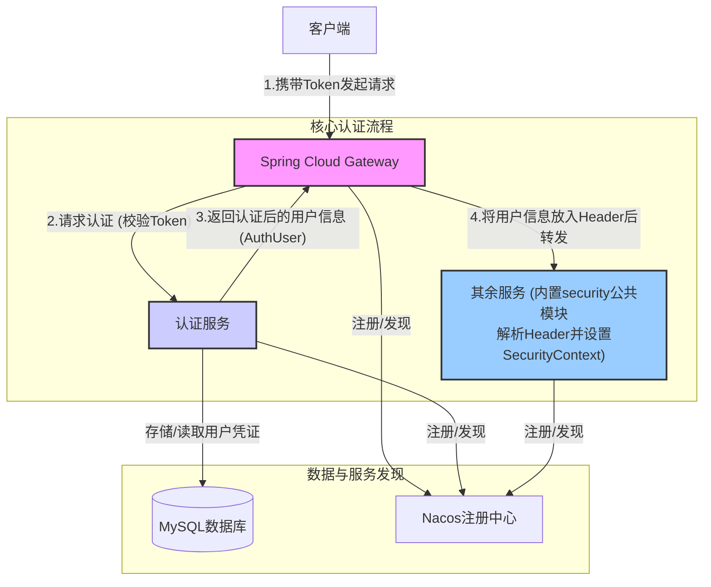

## 1. 架构概述

### 1.1 整体架构设计

本项目采用基于 Spring Cloud Gateway 的分布式权限验证架构，实现了统一的认证鉴权入口。



### 1.2 核心设计原则

- **单一认证入口**：所有请求统一通过网关进行认证
- **无状态设计**：基于 JWT Token 实现无状态认证
- **服务解耦**：认证逻辑与业务逻辑分离
- **高可用性**：支持水平扩展和故障转移
- **安全性优先**：多层安全防护机制

### 1.3 关键特性

- ✅ 基于 Spring WebFlux 的响应式编程模型
- ✅ JWT Token 认证与自动续期
- ✅ 细粒度的权限控制（RBAC）
- ✅ 统一的异常处理和错误响应
- ✅ 请求链路追踪和审计日志
- ✅ 动态路由配置和负载均衡

---

## 2. 技术栈与依赖

### 2.1 核心技术栈

| 技术组件             | 版本   | 用途               |
| -------------------- | ------ | ------------------ |
| Spring Boot          | 3.1.x  | 应用框架           |
| Spring Cloud Gateway | 4.0.x  | API 网关           |
| Spring Security      | 6.1.x  | 安全框架           |
| Spring WebFlux       | 6.0.x  | 响应式 Web 框架    |
| Nacos                | 2.2.x  | 服务注册与配置中心 |
| OpenFeign            | 4.0.x  | 服务间通信         |
| JWT                  | 0.11.x | 令牌认证           |

```xml
<properties>
    <spring-boot.version>3.1.5</spring-boot.version>
    <spring-cloud.version>2022.0.4</spring-cloud.version>
    <spring-cloud-alibaba.version>2022.0.0.0</spring-cloud-alibaba.version>
</properties>

<dependencies>
    <!-- Spring Cloud Gateway 核心依赖 -->
    <dependency>
        <groupId>org.springframework.cloud</groupId>
        <artifactId>spring-cloud-starter-gateway</artifactId>
    </dependency>

    <!-- Spring Security WebFlux 支持 -->
    <dependency>
        <groupId>org.springframework.boot</groupId>
        <artifactId>spring-boot-starter-security</artifactId>
    </dependency>

    <!-- WebFlux 响应式编程支持 -->
    <dependency>
        <groupId>org.springframework.boot</groupId>
        <artifactId>spring-boot-starter-webflux</artifactId>
    </dependency>

    <!-- Nacos 服务发现 -->
    <dependency>
        <groupId>com.alibaba.cloud</groupId>
        <artifactId>spring-cloud-starter-alibaba-nacos-discovery</artifactId>
    </dependency>

    <!-- OpenFeign 服务调用 -->
    <dependency>
        <groupId>org.springframework.cloud</groupId>
        <artifactId>spring-cloud-starter-openfeign</artifactId>
    </dependency>

    <!-- 负载均衡器 -->
    <dependency>
        <groupId>org.springframework.cloud</groupId>
        <artifactId>spring-cloud-starter-loadbalancer</artifactId>
    </dependency>

    <!-- 监控与健康检查 -->
    <dependency>
        <groupId>org.springframework.boot</groupId>
        <artifactId>spring-boot-starter-actuator</artifactId>
    </dependency>

    <!-- JWT 支持 -->
    <dependency>
        <groupId>io.jsonwebtoken</groupId>
        <artifactId>jjwt-api</artifactId>
        <version>0.11.5</version>
    </dependency>
    <dependency>
        <groupId>io.jsonwebtoken</groupId>
        <artifactId>jjwt-impl</artifactId>
        <version>0.11.5</version>
        <scope>runtime</scope>
    </dependency>
    <dependency>
        <groupId>io.jsonwebtoken</groupId>
        <artifactId>jjwt-jackson</artifactId>
        <version>0.11.5</version>
        <scope>runtime</scope>
    </dependency>
</dependencies>
```

### 2.3 依赖说明

- **spring-cloud-starter-gateway**：提供网关核心功能，包括路由、过滤器等
- **spring-boot-starter-security**：集成 Spring Security 安全框架
- **spring-boot-starter-webflux**：支持响应式编程模型
- **spring-cloud-starter-alibaba-nacos-discovery**：实现服务注册与发现
- **spring-cloud-starter-openfeign**：声明式服务调用客户端

---

## 3. 核心组件设计

### 3.1 认证过滤器（AuthGlobalFilter）

认证过滤器是网关的核心组件，负责拦截所有请求并进行权限验证。其主要职责包括：

- **请求拦截**：拦截所有进入网关的请求
- **令牌验证**：验证 JWT 令牌的有效性
- **用户信息提取**：从令牌中提取用户信息
- **请求头注入**：将用户信息注入到请求头中传递给下游服务
- **异常处理**：统一处理认证过程中的异常

#### 3.1.1 核心实现逻辑

```java
@Slf4j
@Component
public class AuthGlobalFilter implements GlobalFilter, Ordered {

    // 常量定义
    private static final String BEARER_PREFIX = "Bearer ";
    private static final int BEARER_PREFIX_LENGTH = BEARER_PREFIX.length();
    private static final String CONTENT_TYPE_JSON = "application/json;charset=UTF-8";
    private static final int HIGHEST_PRECEDENCE = -100;

    // 请求头常量
    private static final String HEADER_AUTHORIZATION = HttpHeaders.AUTHORIZATION;
    private static final String HEADER_USER_ID = "X-User-Id";
    private static final String HEADER_USER_NAME = "X-User-Name";
    private static final String HEADER_USER_EMAIL = "X-User-Email";
    private static final String HEADER_USER_ROLES = "X-User-Roles";
    private static final String HEADER_USER_AUTHORITIES = "X-User-Authorities";

    // 公开路径配置
    private static final List<String> PUBLIC_PATHS = List.of(
            "/api/auth/login",
            "/api/auth/register",
            "/api/auth/refresh",
            "/actuator/health",
            "/favicon.ico"
    );

    @Lazy
    @Resource
    private AuthFeignClient authFeignClient;

    @Override
    public Mono<Void> filter(ServerWebExchange exchange, GatewayFilterChain chain) {
        ServerHttpRequest request = exchange.getRequest();
        String path = request.getURI().getPath();

        // 1. 记录请求信息
        if (log.isInfoEnabled()) {
            log.info("处理请求: {} {}", request.getMethod(), path);
        }

        // 2. 检查是否为公开路径
        if (PUBLIC_PATHS.stream().anyMatch(path::startsWith)) {
            log.debug("公开路径，直接放行: {}", path);
            return chain.filter(exchange);
        }

        // 3. 验证认证头
        String authHeader = request.getHeaders().getFirst(HEADER_AUTHORIZATION);
        if (!StringUtils.hasText(authHeader) || !authHeader.startsWith(BEARER_PREFIX)) {
            log.warn("请求缺少有效的 Authorization 头");
            return handleUnauthorized(exchange.getResponse(), "缺少有效的认证令牌");
        }

        // 4. 提取令牌并进行异步认证
        String token = authHeader.substring(BEARER_PREFIX_LENGTH).trim();

        return Mono.fromCallable(() -> {
            try {
                return authFeignClient.loadUserByUsername(token).getData();
            } catch (Exception e) {
                log.error("认证服务调用异常: {}", e.getMessage(), e);
                throw new RuntimeException("认证服务异常: " + e.getMessage(), e);
            }
        })
        .subscribeOn(Schedulers.boundedElastic())
        .flatMap(authUser -> {
            if (authUser == null) {
                log.warn("认证服务返回空结果");
                return handleUnauthorized(exchange.getResponse(), "认证失败");
            }

            // 记录认证成功并添加用户信息到请求头
            if (log.isInfoEnabled()) {
                log.info("用户认证成功: {}", authUser);
            }

            String roleName = authUser.getRole() != null ? authUser.getRole().getRoleName() : "USER";
            String authorities = authUser.getAuthorities().stream()
                    .map(GrantedAuthority::getAuthority)
                    .collect(Collectors.joining(","));

            ServerHttpRequest mutatedRequest = exchange.getRequest().mutate()
                    .header(HEADER_USER_ID, String.valueOf(authUser.getUserId()))
                    .header(HEADER_USER_NAME, Objects.toString(authUser.getUsername(), ""))
                    .header(HEADER_USER_EMAIL, Objects.toString(authUser.getEmail(), ""))
                    .header(HEADER_USER_ROLES, roleName)
                    .header(HEADER_USER_AUTHORITIES, authorities)
                    .build();

            return chain.filter(exchange.mutate().request(mutatedRequest).build());
        })
        .onErrorResume(throwable -> {
            log.error("认证过程中发生异常: {}", throwable.getMessage(), throwable);
            return handleUnauthorized(exchange.getResponse(), "认证服务异常: " + throwable.getMessage());
        });
    }

    /**
     * 处理未授权请求
     */
    private Mono<Void> handleUnauthorized(ServerHttpResponse response, String message) {
        response.setStatusCode(HttpStatus.UNAUTHORIZED);
        response.getHeaders().add(HttpHeaders.CONTENT_TYPE, CONTENT_TYPE_JSON);

        String jsonResponse = String.format(
                "{\"code\": %d, \"message\": \"%s\", \"data\": null}",
                HttpStatus.UNAUTHORIZED.value(), message);

        return response.writeWith(
                Mono.just(response.bufferFactory().wrap(jsonResponse.getBytes(StandardCharsets.UTF_8))));
    }

    @Override
    public int getOrder() {
        return HIGHEST_PRECEDENCE;
    }
}
```

### 3.2 认证服务客户端（AuthFeignClient）

```java
@FeignClient(name = "user-service", path = "/api/auth")
public interface AuthFeignClient {

    /**
     * 根据令牌加载用户信息
     *
     * @param token JWT 令牌
     * @return 用户认证信息
     */
    @GetMapping("/loadUserByUsername")
    Result<AuthUser> loadUserByUsername(@RequestParam("token") String token);
}
```

---

## 4. 配置详解

### 4.1 应用配置文件（application.yml）

```yaml
spring:
  application:
    name: gateway

  # 数据库配置（如果网关需要访问数据库）
  datasource:
    driver-class-name: com.mysql.cj.jdbc.Driver
    url: jdbc:mysql://localhost:3306/springoj?useUnicode=true&characterEncoding=utf-8&useSSL=false&serverTimezone=Asia/Shanghai
    username: ${DB_USERNAME:root}
    password: ${DB_PASSWORD:123456}

  # Nacos 服务发现配置
  cloud:
    nacos:
      discovery:
        server-addr: 10.25.0.11:8848 #配置Nacos地址
        username: nacos
        password: "#Alone117"
    gateway:
      discovery:
        locator:
          enabled: true # 开启服务发现
          lower-case-service-id: true # 服务名小写
      routes:
        # 认证服务路由
        - id: authentication
          uri: lb://authentication
          predicates:
            - Path=/api/auth/**
          filters:
            - StripPrefix=0
      default-filters:
        - DedupeResponseHeader=Access-Control-Allow-Credentials Access-Control-Allow-Origin
        - AddResponseHeader=Access-Control-Allow-Origin,*
        - AddResponseHeader=Access-Control-Allow-Methods,GET,POST,PUT,DELETE,OPTIONS
        - AddResponseHeader=Access-Control-Allow-Headers,*
        - AddResponseHeader=Access-Control-Max-Age,3600
```

### 拦截代码

- AuthGlobalFilter

```java
/**
 * Gateway 全局权限验证过滤器
 * 拦截所有请求，通过 AuthenticationService 验证用户权限
 * 将用户信息存储到请求头中传递给下游服务
 */
@Slf4j
@Component
public class AuthGlobalFilter implements GlobalFilter, Ordered {
    // 常量定义
    private static final String BEARER_PREFIX = "Bearer ";
    private static final int BEARER_PREFIX_LENGTH = BEARER_PREFIX.length();
    private static final String CONTENT_TYPE_JSON = "application/json;charset=UTF-8";
    private static final int HIGHEST_PRECEDENCE = -100;

    // 请求头常量
    private static final String HEADER_AUTHORIZATION = HttpHeaders.AUTHORIZATION;
    private static final String HEADER_USER_ID = "X-User-Id";
    private static final String HEADER_USER_NAME = "X-User-Name";
    private static final String HEADER_USER_EMAIL = "X-User-Email";
    private static final String HEADER_USER_ROLES = "X-User-Roles";
    private static final String HEADER_USER_AUTHORITIES = "X-User-Authorities";

    // 默认值
    private static final String DEFAULT_ROLE = "USER";
    private static final String EMPTY_STRING = "";

    /**
     * 公开路径，无需权限验证
     */
    private static final List<String> PUBLIC_PATHS = List.of(
            "/api/auth/login",
            "/api/auth/register",
            "/api/auth/refresh",
            "/actuator/health",
            "/favicon.ico");

    @Lazy
    @Resource
    private AuthFeignClient authFeignClient;

    @Override
    public Mono<Void> filter(ServerWebExchange exchange, GatewayFilterChain chain) {
        ServerHttpRequest request = exchange.getRequest();
        String path = request.getURI().getPath();

        // 1. 记录请求信息
        if (log.isInfoEnabled()) {
            log.info("处理请求: {} {}", request.getMethod(), path);
        }

        // 2. 检查是否为公开路径
        if (PUBLIC_PATHS.stream().anyMatch(path::startsWith)) {
            log.debug("公开路径，直接放行: {}", path);
            return chain.filter(exchange);
        }

        // 3. 验证认证头
        String authHeader = request.getHeaders().getFirst(HEADER_AUTHORIZATION);
        if (!StringUtils.hasText(authHeader) || !authHeader.startsWith(BEARER_PREFIX)) {
            log.warn("请求缺少有效的 Authorization 头");
            return handleUnauthorized(exchange.getResponse(), "缺少有效的认证令牌");
        }

        // 4. 提取令牌
        String token = authHeader.substring(BEARER_PREFIX_LENGTH).trim();

        // 5. 异步调用认证服务验证令牌
        return Mono.fromCallable(() -> {
            try {
                return authFeignClient.loadUserByUsername(token).getData();
            } catch (Exception e) {
                log.error("认证服务调用异常: {}", e.getMessage(), e);
                throw new RuntimeException("认证服务异常: " + e.getMessage(), e);
            }
        })
        .subscribeOn(Schedulers.boundedElastic())
        .flatMap(authUser -> {
            // 6. 处理认证结果
            if (authUser == null) {
                log.warn("认证服务返回空结果");
                return handleUnauthorized(exchange.getResponse(), "认证失败");
            }

            // 7. 记录认证成功日志
            if (log.isInfoEnabled()) {
                log.info("用户认证成功: {}", authUser);
            }

            // 8. 添加用户信息到请求头
            String roleName = authUser.getRole() != null ? authUser.getRole().getRoleName() : DEFAULT_ROLE;
            String authorities = authUser.getAuthorities().stream()
                    .map(GrantedAuthority::getAuthority)
                    .collect(Collectors.joining(","));

            ServerHttpRequest mutatedRequest = exchange.getRequest().mutate()
                    .header(HEADER_USER_ID, String.valueOf(authUser.getUserId()))
                    .header(HEADER_USER_NAME, Objects.toString(authUser.getUsername(), EMPTY_STRING))
                    .header(HEADER_USER_EMAIL, Objects.toString(authUser.getEmail(), EMPTY_STRING))
                    .header(HEADER_USER_ROLES, roleName)
                    .header(HEADER_USER_AUTHORITIES, authorities)
                    .build();

            // 9. 继续处理请求
            return chain.filter(exchange.mutate().request(mutatedRequest).build());
        })
        .onErrorResume(throwable -> {
            // 10. 处理认证过程中的错误
            log.error("认证过程中发生异常: {}", throwable.getMessage(), throwable);
            return handleUnauthorized(exchange.getResponse(),
                    "认证服务异常: " + throwable.getMessage());
        });
    }

    /**
     * 处理未授权请求
     *
     * @param response HTTP 响应对象
     * @param message  错误消息
     * @return 包含错误响应的 Mono 对象
     */
    private Mono<Void> handleUnauthorized(ServerHttpResponse response, String message) {
        response.setStatusCode(HttpStatus.UNAUTHORIZED);
        response.getHeaders().add(HttpHeaders.CONTENT_TYPE, CONTENT_TYPE_JSON);

        String jsonResponse = String.format(
                "{\"code\": %d, \"message\": \"%s\", \"data\": null}",
                HttpStatus.UNAUTHORIZED.value(),
                message);

        return response.writeWith(
                Mono.just(response.bufferFactory().wrap(jsonResponse.getBytes(StandardCharsets.UTF_8))));
    }

    @Override
    public int getOrder() {
        return HIGHEST_PRECEDENCE;
    }
}
```

- WebConfig

```java
/**
 * WebFlux 配置类
 * 配置响应式 CORS 支持
 */
@Configuration
public class WebConfig {

    /**
     * 配置 WebFlux CORS 过滤器
     * 适配 Gateway 的响应式架构
     *
     * @return 配置完成的 CorsWebFilter 实例
     */
    @Bean
    public CorsWebFilter corsWebFilter() {
        CorsConfiguration config = new CorsConfiguration();
        config.addAllowedOriginPattern("*"); // 允许所有来源
        config.addAllowedMethod("*"); // 允许所有 HTTP 方法
        config.addAllowedHeader("*"); // 允许所有请求头
        config.setAllowCredentials(true); // 允许凭证传递
        config.addExposedHeader("*"); // 暴露所有响应头

        UrlBasedCorsConfigurationSource source = new UrlBasedCorsConfigurationSource();
        source.registerCorsConfiguration("/**", config); // 应用配置到所有路径

        return new CorsWebFilter(source);
    }
}
```

- WebClientConfig

```java
@Configuration
public class WebClientConfig {

    @Bean
    @LoadBalanced
    public WebClient.Builder loadBalancedWebClientBuilder() {
        return WebClient.builder();
    }

    /**
     * 为WebFlux环境提供HttpMessageConverters Bean
     */
    @Bean
    public HttpMessageConverters messageConverters() {
        List<HttpMessageConverter<?>> converters = new ArrayList<>();
        converters.add(new MappingJackson2HttpMessageConverter());
        return new HttpMessageConverters(converters);
    }
}
```

- SecurityConfiguration

```java
@Configuration
@EnableWebFluxSecurity
public class SecurityConfiguration {

    /**
     * 公开路径，无需认证
     */
    private static final String[] PUBLIC_PATHS = {
            "/api/auth/login",
            "/api/auth/register",
            "/api/auth/refresh",
            "/actuator/**",
            "/favicon.ico"
    };

    /**
     * 配置 WebFlux 安全过滤器链
     * 简化配置，主要权限验证交给 AuthGlobalFilter 处理
     */
    @Bean
    public SecurityWebFilterChain securityWebFilterChain(ServerHttpSecurity http) {
        return http
                // 禁用 CSRF（API 网关不需要）
                .csrf(ServerHttpSecurity.CsrfSpec::disable)
                // 禁用表单登录
                .formLogin(ServerHttpSecurity.FormLoginSpec::disable)
                // 禁用 HTTP Basic 认证
                .httpBasic(ServerHttpSecurity.HttpBasicSpec::disable)
                // 配置无状态会话管理
                .securityContextRepository(NoOpServerSecurityContextRepository.getInstance())
                // 简化权限配置，允许所有请求通过，具体权限由 AuthGlobalFilter 控制
                .authorizeExchange(exchanges -> exchanges
                        .pathMatchers(PUBLIC_PATHS).permitAll()
                        .anyExchange().permitAll() // 改为 permitAll，由 AuthGlobalFilter 控制
                )
                .build();
    }
}
```

- AuthFeignClient

```java
/**
 * 认证服务Feign客户端
 * 用于Gateway调用认证服务进行token验证
 */
@FeignClient(name = "authentication", path = "/api/auth")
public interface AuthFeignClient {
    /**
     * 验证token并获取用户信息
     * 调用认证服务的 GET /validate 接口
     *
     * @param token JWT token
     * @return 用户信息
     */
    @GetMapping("/validate/{token}")
    ResponseResult<AuthUser> loadUserByUsername(@PathVariable("token") String token);
}
```

## Spring Security 通用模块

### 1. 引入依赖

```xml
    <dependencies>
    <dependency>
        <groupId>org.springframework.boot</groupId>
        <artifactId>spring-boot-starter-validation</artifactId>
    </dependency>
    <dependency>
        <groupId>org.springframework.boot</groupId>
        <artifactId>spring-boot-starter-web</artifactId>
        <optional>true</optional>
    </dependency>
    <dependency>
        <groupId>org.springframework.boot</groupId>
        <artifactId>spring-boot-starter-security</artifactId>
        <optional>true</optional>
    </dependency>
    <dependency>
        <groupId>com.baomidou</groupId>
        <artifactId>mybatis-plus-spring-boot3-starter</artifactId>
        <version>${mybatis-plus}</version>
        <optional>true</optional>
    </dependency>
    <dependency>
        <groupId>org.springframework.boot</groupId>
        <artifactId>spring-boot-starter-data-jdbc</artifactId>
        <optional>true</optional>
    </dependency>
    <dependency>
        <groupId>io.projectreactor</groupId>
        <artifactId>reactor-core</artifactId>
    </dependency>
    <dependency>
        <groupId>org.projectlombok</groupId>
        <artifactId>lombok</artifactId>
        <scope>provided</scope>
    </dependency>
</dependencies>
```

### 实现类

- ApplicationAuditAware

```java
/**
 * 审计感知器实现类
 * 用于 JPA 审计功能，从请求头获取当前用户信息
 * 下游服务通过网关传递的用户信息进行审计
 */
@Slf4j
public class ApplicationAuditAware implements AuditorAware<Integer> {

    @Override
    public Optional<Integer> getCurrentAuditor() {
        try {
            // 首先尝试从 Spring Security 上下文获取
            Authentication authentication = SecurityContextHolder.getContext().getAuthentication();
            if (authentication != null && authentication.isAuthenticated()
                    && !"anonymousUser".equals(authentication.getPrincipal())) {
                log.debug("从 Security 上下文获取审计用户: {}", authentication.getName());
                return Optional.of(1); // 这里可以根据实际需求返回用户ID
            }

            // 如果 Security 上下文中没有，尝试从请求头获取
            ServletRequestAttributes attributes = (ServletRequestAttributes) RequestContextHolder
                    .getRequestAttributes();
            if (attributes != null) {
                HttpServletRequest request = attributes.getRequest();
                Optional<Long> userId = UserContextUtil.getCurrentUserId(request);
                Optional<String> username = UserContextUtil.getCurrentUsername(request);

                if (userId.isPresent() && username.isPresent()) {
                    log.debug("从请求头获取审计用户: {} (ID: {})", username.get(), userId.get());
                    return Optional.of(userId.get().intValue());
                }
            }

            log.debug("未找到当前用户信息，使用默认审计用户");
            return Optional.of(0); // 默认系统用户ID

        } catch (Exception e) {
            log.warn("获取当前审计用户失败: {}", e.getMessage());
            return Optional.of(0); // 异常情况下使用默认用户ID
        }
    }
}
```

- ApplicationConfig

```java
/**
 * 应用程序配置类，提供下游服务的基础配置。
 * 下游服务不需要从数据库验证用户，直接从网关传递的请求头获取用户信息。
 */
@Configuration
@RequiredArgsConstructor
@ConditionalOnMissingClass("org.springframework.web.reactive.config.WebFluxConfigurer")
public class ApplicationConfig {

  /**
   * 配置 AuditorAware，用于审计实体的创建者和修改者。
   * 从请求头获取当前用户信息用于审计。
   *
   * @return AuditorAware 实例。
   */
  @Bean
  public AuditorAware<Integer> auditorAware() {
    return new ApplicationAuditAware();
  }

  /**
   * 配置 AuthenticationManager，用于管理认证（虽然下游服务主要依赖网关认证）。
   *
   * @param config AuthenticationConfiguration 实例。
   * @return AuthenticationManager 实例。
   * @throws Exception 如果获取失败。
   */
  @Bean
  public AuthenticationManager authenticationManager(AuthenticationConfiguration config) throws Exception {
    return config.getAuthenticationManager();
  }

  /**
   * 配置 PasswordEncoder，主要用于兼容性（下游服务通常不需要密码验证）。
   *
   * @return PasswordEncoder 实例。
   */
  @Bean
  public PasswordEncoder passwordEncoder() {
    return new BCryptPasswordEncoder();
  }

  /**
   * 提供当前请求范围内的 AuthUser Bean
   * 便于在其他组件中直接注入使用
   *
   * @return 当前用户的 AuthUser 对象，如果未找到则返回 null
   */
  @Bean
  @RequestScope
  public AuthUser currentAuthUser() {
    // 首先尝试从 Security 上下文获取
    Authentication authentication = SecurityContextHolder.getContext().getAuthentication();
    if (authentication != null && authentication.getPrincipal() instanceof AuthUser) {
      return (AuthUser) authentication.getPrincipal();
    }

    // 如果 Security 上下文中没有，尝试从请求头获取
    ServletRequestAttributes attributes = (ServletRequestAttributes) RequestContextHolder.getRequestAttributes();
    if (attributes != null) {
      HttpServletRequest request = attributes.getRequest();
      Optional<AuthUser> authUserOpt = UserContextUtil.getCurrentAuthUser(request);
      return authUserOpt.orElse(null);
    }

    return null;
  }
}
```

- SecurityConfiguration

```java
/**
 * 下游服务安全配置
 * 依赖网关传递的用户信息，不进行独立的用户认证
 * 启用方法级安全，支持 @PreAuthorize、@PostAuthorize 等注解
 */
@Configuration
@EnableWebSecurity
@RequiredArgsConstructor
@EnableMethodSecurity(prePostEnabled = true)
@ConditionalOnMissingClass("org.springframework.web.reactive.config.WebFluxConfigurer")
public class SecurityConfiguration {
    private static final String[] AUTH_WHITELIST = {
            "/api/auth/**",
            "/preauthorize/**",  // 预授权端点
            "/actuator/**"  // 添加监控端点
    };

    private final GatewayAuthenticationFilter gatewayAuthenticationFilter;

    @Bean
    public SecurityFilterChain filterChain(HttpSecurity http) throws Exception {
        http
                .authorizeHttpRequests(auth -> auth
                        .requestMatchers(AUTH_WHITELIST).permitAll()
                        .anyRequest().authenticated())
                .sessionManagement(session -> session
                        .sessionCreationPolicy(SessionCreationPolicy.STATELESS))
                // 添加网关认证过滤器，从请求头获取用户信息
                .addFilterBefore(gatewayAuthenticationFilter, UsernamePasswordAuthenticationFilter.class)
                // 禁用 CSRF，因为是无状态服务
                .csrf(csrf -> csrf.disable())
                // 禁用默认的登录页面和HTTP基本认证
                .formLogin(form -> form.disable())
                .httpBasic(basic -> basic.disable())
                // 配置安全头
                .headers(headers -> headers
                        .frameOptions(frameOptions -> frameOptions.deny())
                        .contentTypeOptions(contentTypeOptions -> {})
                        .httpStrictTransportSecurity(hstsConfig -> hstsConfig
                                .maxAgeInSeconds(31536000)
                                .includeSubDomains(true)))
                // 配置异常处理
                .exceptionHandling(exceptions -> exceptions
                        .authenticationEntryPoint((request, response, authException) -> {
                            response.setStatus(401);
                            response.setContentType("application/json;charset=UTF-8");
                            response.getWriter().write("{\"error\":\"Unauthorized\",\"message\":\"请求头中缺少有效的用户信息\"}");
                        })
                        .accessDeniedHandler((request, response, accessDeniedException) -> {
                            response.setStatus(403);
                            response.setContentType("application/json;charset=UTF-8");
                            response.getWriter().write("{\"error\":\"Forbidden\",\"message\":\"权限不足\"}");
                        }));

        return http.build();
    }
}
```

- GatewayAuthenticationFilter

```java
/**
 * 下游服务权限过滤器
 * 将 Gateway 传递的用户信息转换为 Spring Security 认证上下文
 * 只在传统 Servlet 环境下加载，避免在 WebFlux Gateway 中冲突
 */
@Slf4j
@Component
@ConditionalOnWebApplication(type = ConditionalOnWebApplication.Type.SERVLET)
public class GatewayAuthenticationFilter extends OncePerRequestFilter {
    @Override
    protected void doFilterInternal(
            @NonNull HttpServletRequest request,
            @NonNull HttpServletResponse response,
            @NonNull FilterChain filterChain) throws ServletException, IOException {

        // 尝试从请求头构建 AuthUser 对象
        Optional<AuthUser> authUserOpt = UserContextUtil.getCurrentAuthUser(request);

        if (authUserOpt.isPresent()) {
            AuthUser authUser = authUserOpt.get();

            // 创建 Authentication 对象，使用 AuthUser 作为 principal
            Authentication authentication = new UsernamePasswordAuthenticationToken(
                    authUser, // principal - 使用完整的 AuthUser 对象
                    null, // credentials (不需要密码)
                    authUser.getAuthorities() // authorities - 使用 AuthUser 的 getAuthorities 方法
            );

            // 设置到 Security 上下文
            SecurityContextHolder.getContext().setAuthentication(authentication);

            log.debug("设置用户认证上下文: {} (ID: {}), 权限: {}",
                    authUser.getUsername(), authUser.getUserId(), authUser.getAuthorities());
        } else {
            log.debug("请求中未找到用户信息，跳过认证设置");
        }

        try {
            filterChain.doFilter(request, response);
        } finally {
            // 清理上下文
            SecurityContextHolder.clearContext();
        }
    }
}
```

- UserContextUtil

```java
/**
 * 统一用户上下文工具类
 * 支持 WebFlux 响应式和传统 Servlet 两种方式获取用户信息
 */
@Slf4j
public class UserContextUtil {

    // 用户信息请求头常量
    public static final String USER_ID_HEADER = "X-User-Id";
    public static final String USER_NAME_HEADER = "X-User-Name";
    public static final String USER_EMAIL_HEADER = "X-User-Email";
    public static final String USER_ROLES_HEADER = "X-User-Roles";
    public static final String USER_AUTHORITIES_HEADER = "X-User-Authorities";

    // ==================== WebFlux 响应式方法 ====================

    /**
     * 从 ServerWebExchange 获取用户ID
     */
    public static Optional<Long> getCurrentUserId(ServerWebExchange exchange) {
        try {
            String userIdStr = exchange.getRequest().getHeaders().getFirst(USER_ID_HEADER);
            if (userIdStr != null) {
                return Optional.of(Long.parseLong(userIdStr));
            }
        } catch (NumberFormatException e) {
            log.warn("解析用户ID失败: {}", e.getMessage());
        }
        return Optional.empty();
    }

    /**
     * 从 ServerWebExchange 获取用户名
     */
    public static Optional<String> getCurrentUsername(ServerWebExchange exchange) {
        String username = exchange.getRequest().getHeaders().getFirst(USER_NAME_HEADER);
        return Optional.ofNullable(username);
    }

    /**
     * 从 ServerWebExchange 获取用户邮箱
     */
    public static Optional<String> getCurrentUserEmail(ServerWebExchange exchange) {
        String email = exchange.getRequest().getHeaders().getFirst(USER_EMAIL_HEADER);
        return Optional.ofNullable(email);
    }

    /**
     * 从 ServerWebExchange 获取用户角色
     */
    public static Optional<String> getCurrentUserRole(ServerWebExchange exchange) {
        String role = exchange.getRequest().getHeaders().getFirst(USER_ROLES_HEADER);
        return Optional.ofNullable(role);
    }

    /**
     * 从 ServerWebExchange 获取用户权限
     */
    public static Optional<String> getCurrentUserAuthorities(ServerWebExchange exchange) {
        String authorities = exchange.getRequest().getHeaders().getFirst(USER_AUTHORITIES_HEADER);
        return Optional.ofNullable(authorities);
    }

    /**
     * 检查当前用户是否具有指定角色
     */
    public static boolean hasRole(ServerWebExchange exchange, String role) {
        return getCurrentUserRole(exchange)
                .map(userRole -> userRole.equals(role))
                .orElse(false);
    }

    /**
     * 检查当前用户是否具有管理员权限
     */
    public static boolean isAdmin(ServerWebExchange exchange) {
        return hasRole(exchange, "ADMIN");
    }

    // ==================== 传统 Servlet 方法（用于下游服务） ====================

    /**
     * 从 HttpServletRequest 获取用户ID
     */
    public static Optional<Long> getCurrentUserId(HttpServletRequest request) {
        try {
            String userIdStr = request.getHeader(USER_ID_HEADER);
            if (userIdStr != null) {
                return Optional.of(Long.parseLong(userIdStr));
            }
        } catch (NumberFormatException e) {
            log.warn("解析用户ID失败: {}", e.getMessage());
        }
        return Optional.empty();
    }

    /**
     * 从 HttpServletRequest 获取用户名
     */
    public static Optional<String> getCurrentUsername(HttpServletRequest request) {
        String username = request.getHeader(USER_NAME_HEADER);
        return Optional.ofNullable(username);
    }

    /**
     * 从 HttpServletRequest 获取用户邮箱
     */
    public static Optional<String> getCurrentUserEmail(HttpServletRequest request) {
        String email = request.getHeader(USER_EMAIL_HEADER);
        return Optional.ofNullable(email);
    }

    /**
     * 从 HttpServletRequest 获取用户角色
     */
    public static Optional<String> getCurrentUserRole(HttpServletRequest request) {
        String role = request.getHeader(USER_ROLES_HEADER);
        return Optional.ofNullable(role);
    }

    /**
     * 从 HttpServletRequest 获取用户权限
     */
    public static Optional<String> getCurrentUserAuthorities(HttpServletRequest request) {
        String authorities = request.getHeader(USER_AUTHORITIES_HEADER);
        return Optional.ofNullable(authorities);
    }

    /**
     * 检查当前用户是否具有指定角色（Servlet版本）
     */
    public static boolean hasRole(HttpServletRequest request, String role) {
        return getCurrentUserRole(request)
                .map(userRole -> userRole.equals(role))
                .orElse(false);
    }

    /**
     * 检查当前用户是否具有管理员权限（Servlet版本）
     */
    public static boolean isAdmin(HttpServletRequest request) {
        return hasRole(request, "ADMIN");
    }

    // ==================== 响应式安全上下文方法 ====================

    /**
     * 从响应式安全上下文获取当前认证信息
     */
    public static Mono<Authentication> getCurrentAuthentication() {
        return ReactiveSecurityContextHolder.getContext()
                .map(SecurityContext::getAuthentication)
                .filter(Authentication::isAuthenticated)
                .doOnNext(auth -> log.debug("获取当前认证信息: {}", auth.getName()))
                .doOnError(error -> log.warn("获取认证信息失败: {}", error.getMessage()));
    }

    /**
     * 从响应式安全上下文获取当前用户名
     */
    public static Mono<String> getCurrentUsernameFromContext() {
        return getCurrentAuthentication()
                .map(Authentication::getName);
    }

    /**
     * 检查当前用户是否为指定用户（通过用户ID）
     */
    public static boolean isCurrentUser(ServerWebExchange exchange, Long userId) {
        return getCurrentUserId(exchange)
                .map(currentUserId -> currentUserId.equals(userId))
                .orElse(false);
    }

    /**
     * 检查当前用户是否为指定用户（Servlet版本）
     */
    public static boolean isCurrentUser(HttpServletRequest request, Long userId) {
        return getCurrentUserId(request)
                .map(currentUserId -> currentUserId.equals(userId))
                .orElse(false);
    }

    // ==================== 便捷方法 ====================

    /**
     * 从 HttpServletRequest 构建完整的用户信息对象
     */
    public static Optional<AuthUser> getCurrentAuthUser(HttpServletRequest request) {
        Optional<Long> userId = getCurrentUserId(request);
        Optional<String> username = getCurrentUsername(request);

        if (userId.isPresent() && username.isPresent()) {
            List<String> authorities = parseAuthoritiesList(
                getCurrentUserAuthorities(request).orElse(""));

            // 构建 Role 对象
            String roleName = getCurrentUserRole(request).orElse("USER");
            Role role = Role.builder()
                    .roleName(roleName)
                    .status(1)
                    .build();

            AuthUser authUser = AuthUser.builder()
                    .userId(userId.get())
                    .username(username.get())
                    .email(getCurrentUserEmail(request).orElse(null))
                    .status(1) // 下游服务认为通过网关的用户都是启用状态
                    .role(role)
                    .authorities(authorities) // 这里是字符串列表，不是GrantedAuthority对象
                    .build();

            // 清理权限列表，确保没有空值
            authUser.cleanAuthorities();

            return Optional.of(authUser);
        }
        return Optional.empty();
    }

    /**
     * 从 ServerWebExchange 构建完整的用户信息对象
     */
    public static Optional<AuthUser> getCurrentAuthUser(ServerWebExchange exchange) {
        Optional<Long> userId = getCurrentUserId(exchange);
        Optional<String> username = getCurrentUsername(exchange);

        if (userId.isPresent() && username.isPresent()) {
            List<String> authorities = parseAuthoritiesList(
                getCurrentUserAuthorities(exchange).orElse(""));

            // 构建 Role 对象
            String roleName = getCurrentUserRole(exchange).orElse("USER");
            Role role = Role.builder()
                    .roleName(roleName)
                    .status(1)
                    .build();

            AuthUser authUser = AuthUser.builder()
                    .userId(userId.get())
                    .username(username.get())
                    .email(getCurrentUserEmail(exchange).orElse(null))
                    .status(1) // 下游服务认为通过网关的用户都是启用状态
                    .role(role)
                    .authorities(authorities) // 这里是字符串列表，不是GrantedAuthority对象
                    .build();

            // 清理权限列表，确保没有空值
            authUser.cleanAuthorities();

            return Optional.of(authUser);
        }
        return Optional.empty();
    }

    /**
     * 解析权限字符串为权限列表
     */
    private static List<String> parseAuthoritiesList(String authoritiesStr) {
        if (!StringUtils.hasText(authoritiesStr)) {
            return Collections.emptyList();
        }

        // 处理格式如 "[PERMISSION1, PERMISSION2]" 或 "PERMISSION1,PERMISSION2"
        String cleanStr = authoritiesStr.replaceAll("[\\[\\]]", "").trim();
        if (cleanStr.isEmpty()) {
            return Collections.emptyList();
        }

        return Arrays.stream(cleanStr.split(","))
                .map(String::trim)
                .filter(StringUtils::hasText)
                .collect(Collectors.toList());
    }
}
```
