# SpringOJ 微服务权限信息传递系统 - 架构设计

## 1. 整体系统架构

### 1.1 系统架构图

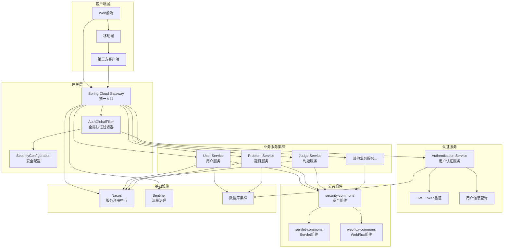

### 1.2 权限信息传递流程

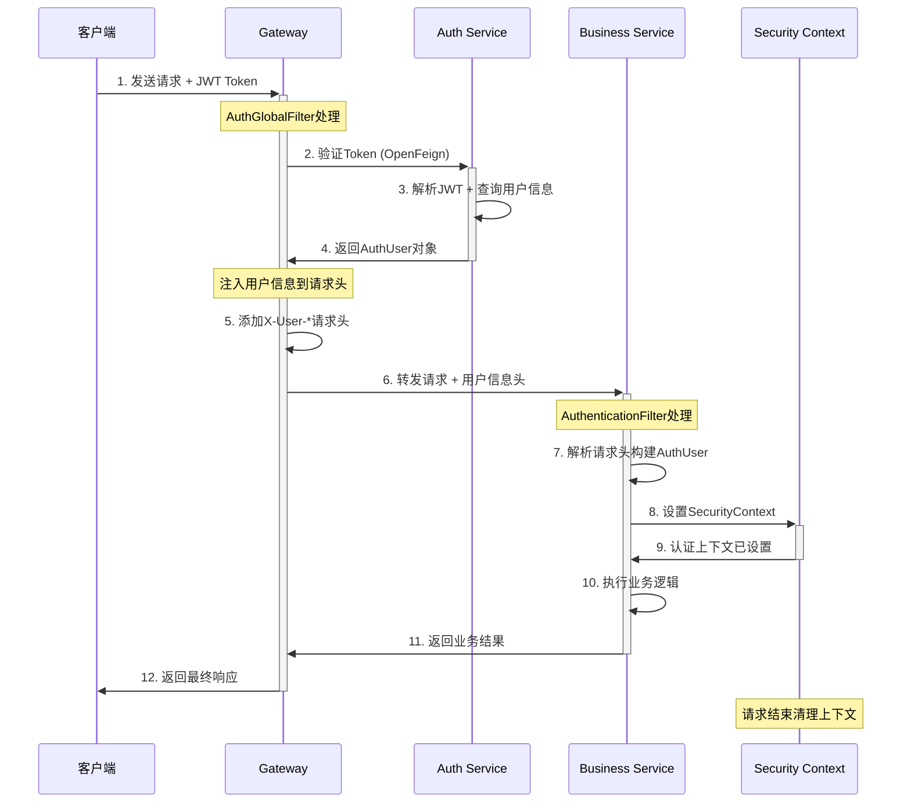

## 2. 网关层架构设计

### 2.1 Gateway 组件架构

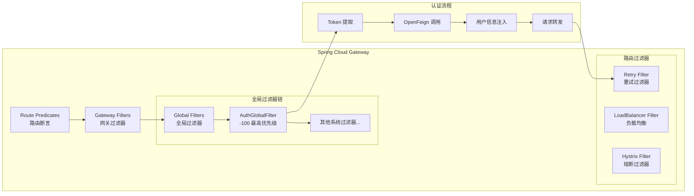

### 2.2 安全配置架构

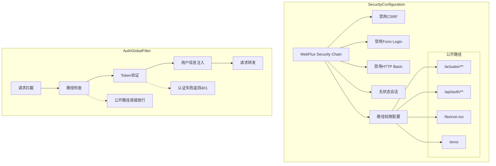

## 3. 权限传递机制设计

### 3.1 HTTP 头字段规范

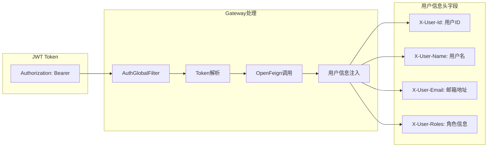

### 3.2 下游服务接收机制

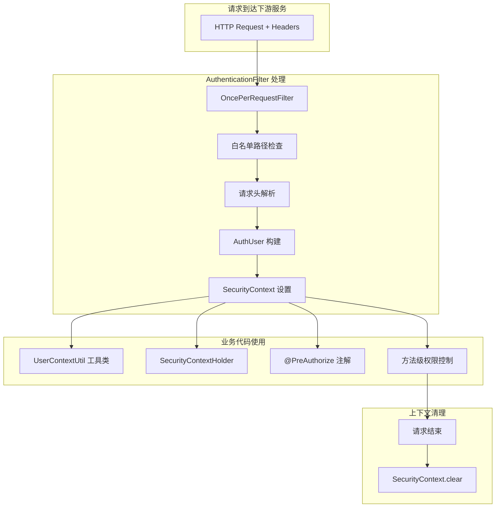

## 4. 服务间通信架构

### 4.1 OpenFeign 集成设计

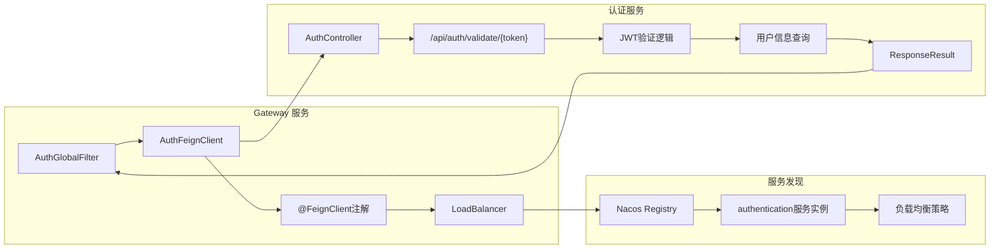

### 4.2 异常处理机制

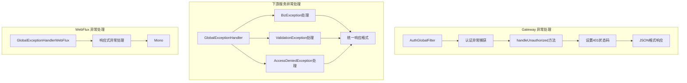

## 5. 技术栈架构

### 5.1 核心技术栈

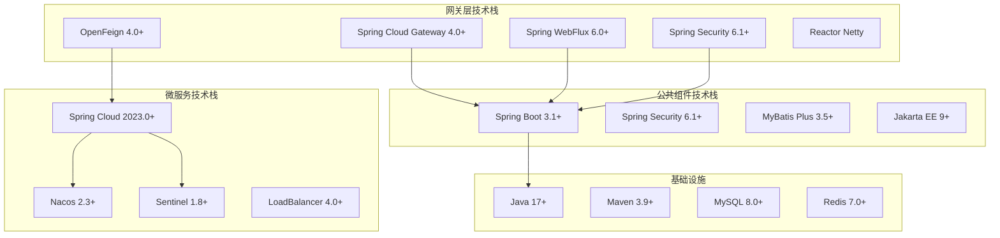

### 5.2 部署架构

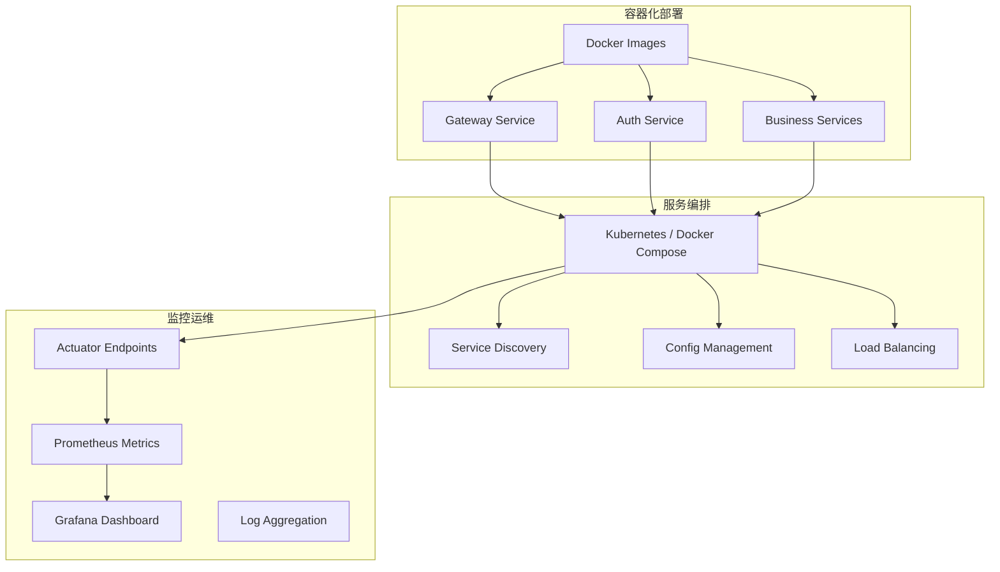

## 6. 性能与扩展性设计

### 6.1 高并发处理架构

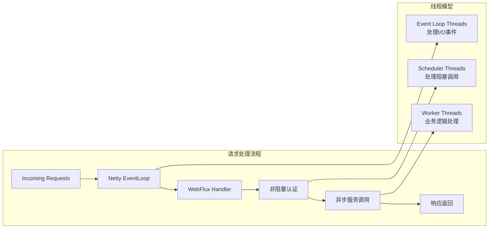

### 6.2 可扩展性设计

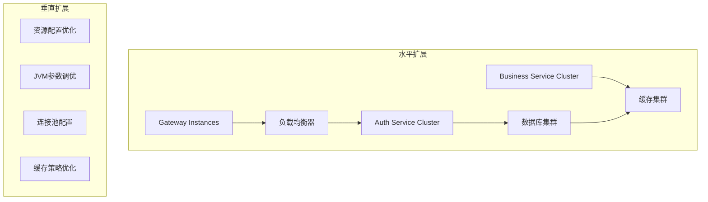

## 7. 安全架构设计

### 7.1 多层安全防护

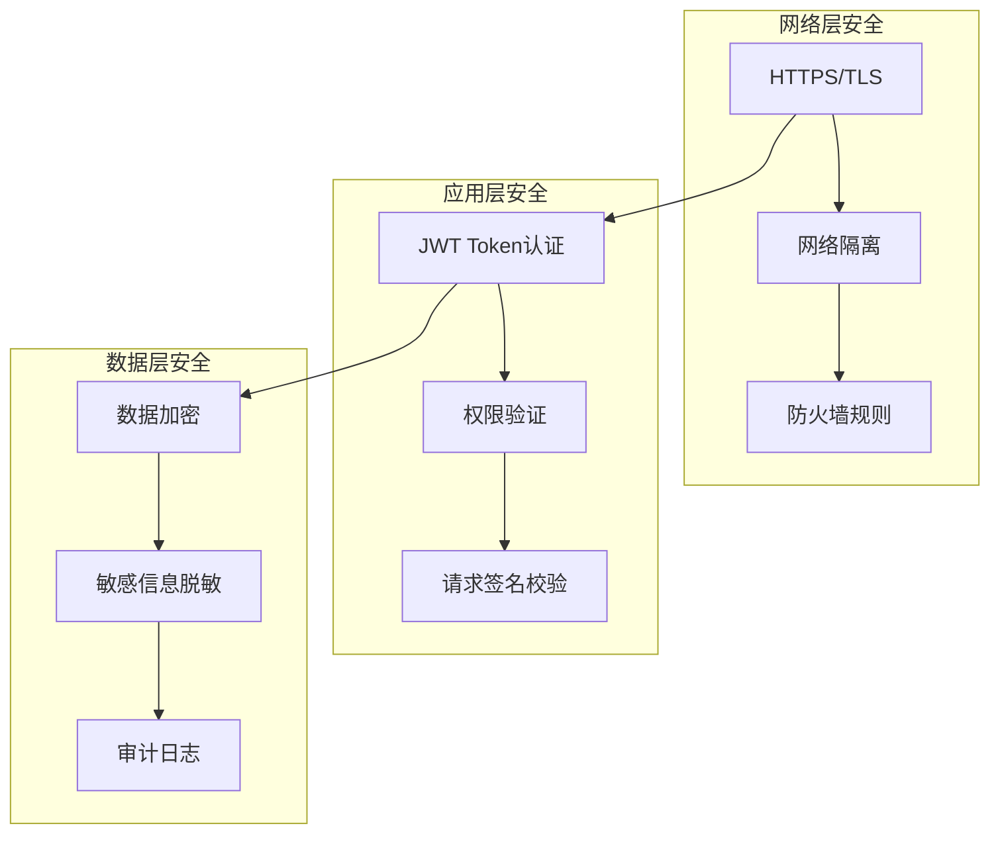

---

**上一章节：** [01-项目概述.md](./01-项目概述.md)  
**下一章节：** [03-核心模块.md](./03-核心模块.md)
