# SpringOJ 微服务权限信息传递系统 - 核心模块

## 1. 模块架构概览

### 1.1 模块依赖关系图

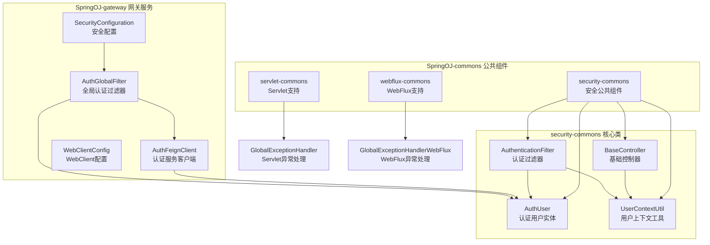

## 2. 网关核心模块

### 2.1 AuthGlobalFilter 类设计

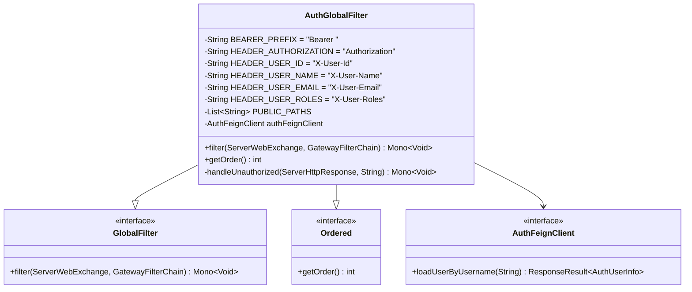

**核心功能：**

- **请求拦截**：拦截所有进入网关的请求
- **路径过滤**：公开路径直接放行，需认证路径进行token验证
- **Token验证**：提取Bearer Token并调用认证服务验证
- **信息注入**：将用户信息注入到请求头中传递给下游服务
- **异常处理**：统一处理认证失败场景，返回401错误

### 2.2 AuthFeignClient 接口设计

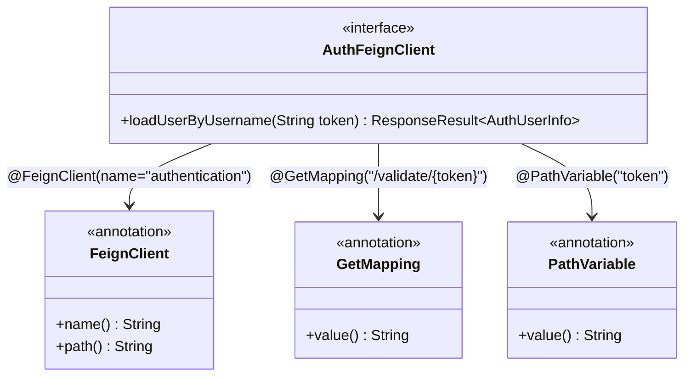

**设计特点：**

- **服务发现**：通过name="authentication"自动发现认证服务
- **负载均衡**：自动集成LoadBalancer进行负载均衡
- **异常处理**：支持熔断、重试等容错机制
- **类型安全**：强类型返回值，避免运行时错误

### 2.3 SecurityConfiguration 配置类

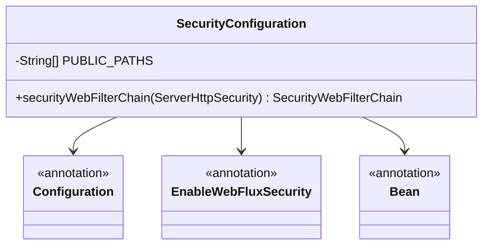

**配置要点：**

- **WebFlux支持**：专门为响应式网关设计
- **简化配置**：主要权限控制交给AuthGlobalFilter处理
- **路径配置**：定义公开路径，无需认证直接访问
- **无状态设计**：禁用session，使用JWT无状态认证

## 3. 安全公共组件模块

### 3.1 AuthUser 用户实体类

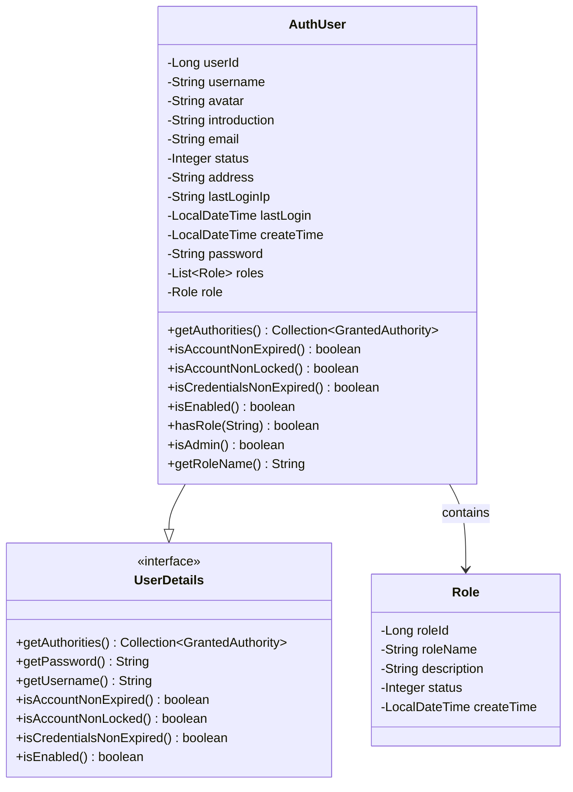

**设计优势：**

- **Spring Security集成**：实现UserDetails接口，无缝集成
- **权限支持**：支持多角色和权限管理
- **状态管理**：支持账户状态、锁定状态等控制
- **扩展性**：支持用户基础信息和扩展字段

### 3.2 UserContextUtil 工具类

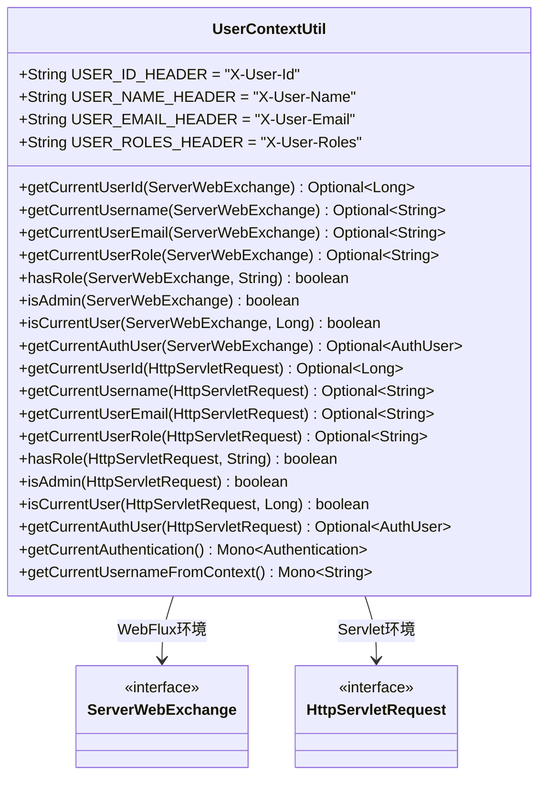

**功能特色：**

- **双环境支持**：同时支持WebFlux和Servlet环境
- **类型安全**：使用Optional避免空指针异常
- **便捷方法**：提供常用的权限判断快捷方法
- **上下文构建**：能够从请求头重建完整的AuthUser对象

### 3.3 AuthenticationFilter 过滤器

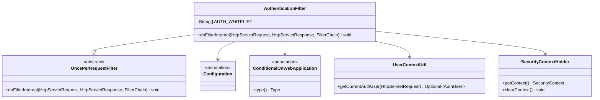

**处理流程：**

1. **白名单检查**：跳过公开路径的权限验证
2. **请求头解析**：从HTTP头中提取用户信息
3. **上下文构建**：构建AuthUser对象和Authentication
4. **上下文设置**：将认证信息设置到SecurityContext
5. **请求处理**：继续处理业务请求
6. **上下文清理**：请求结束后清理认证上下文

## 4. 异常处理模块

### 4.1 Servlet 异常处理器

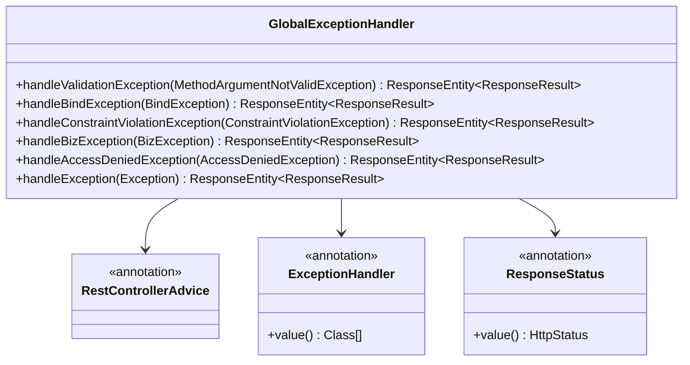

### 4.2 WebFlux 异常处理器

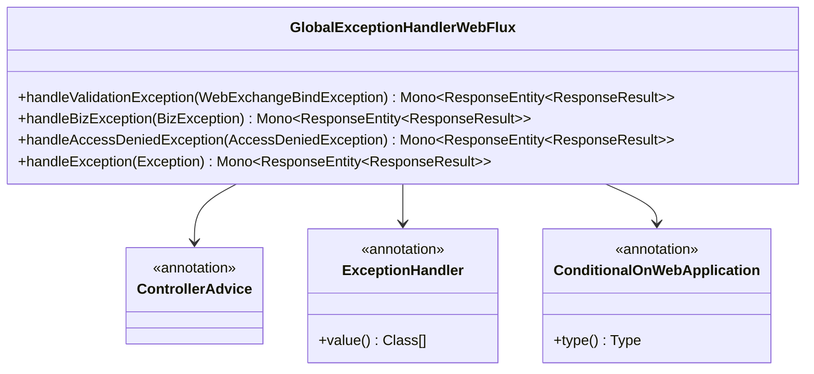

## 5. 模块交互流程

### 5.1 认证流程时序图

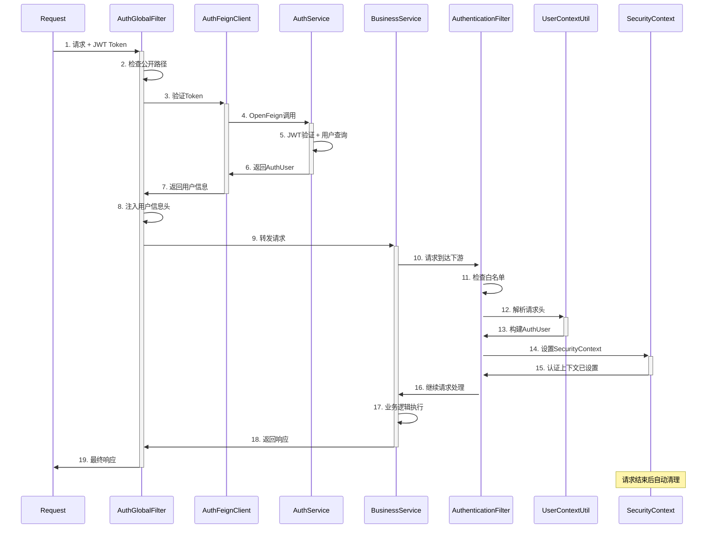

### 5.2 权限检查流程

```mermaid
flowchart TD
    A[业务方法调用] --> B{使用@PreAuthorize?}
    B -->|是| C[Spring Security拦截]
    B -->|否| D[直接执行方法]

    C --> E[获取SecurityContext]
    E --> F[提取Authentication]
    F --> G[获取AuthUser Principal]
    G --> H[执行权限表达式]

    H --> I{权限验证通过?}
    I -->|是| J[执行业务方法]
    I -->|否| K[抛出AccessDeniedException]

    J --> L[返回业务结果]
    K --> M[异常处理器处理]
    M --> N[返回403响应]

    D --> O[使用UserContextUtil]
    O --> P[从请求头获取用户信息]
    P --> Q[执行业务逻辑]
    Q --> L
```

## 6. 关键设计模式

### 6.1 过滤器链模式

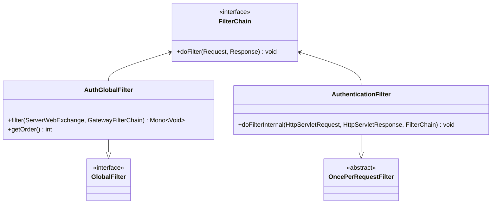

### 6.2 工厂模式

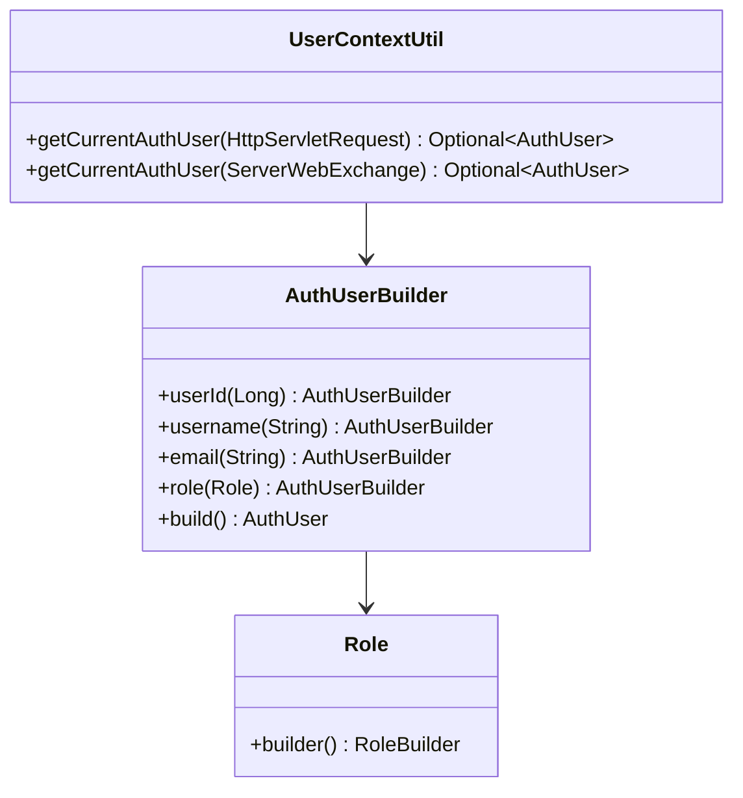

---

**上一章节：** [02-架构设计.md](./02-架构设计.md)
**下一章节：** [04-使用示例.md](./04-使用示例.md)
