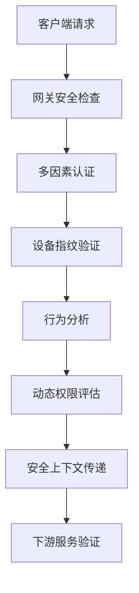
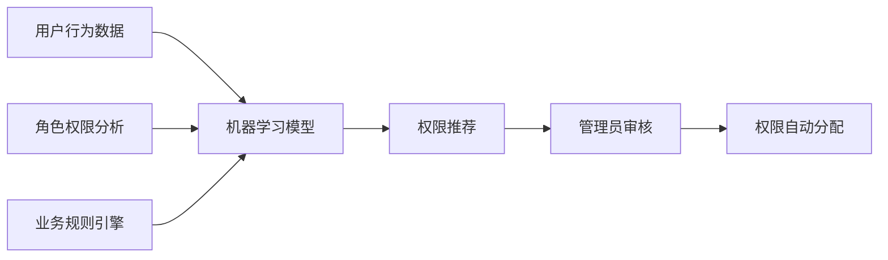
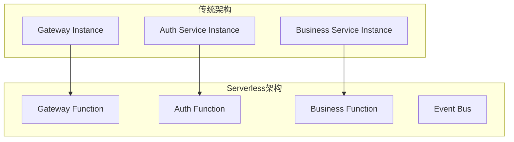
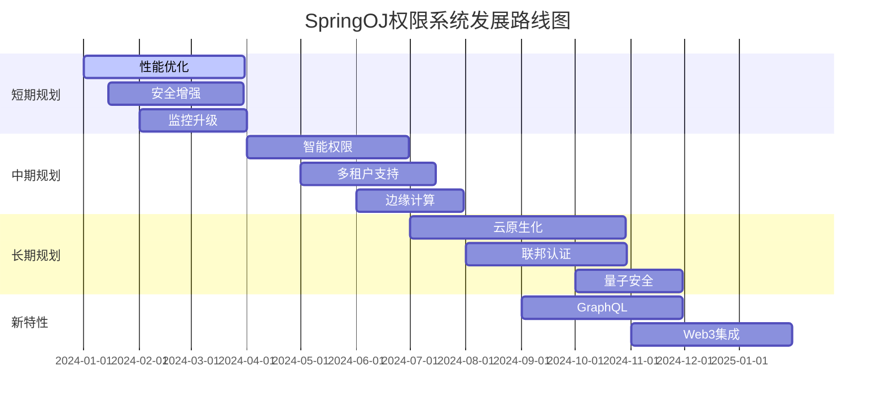

# SpringOJ 微服务权限信息传递系统 - 未来规划

## 1. 短期规划（1-3个月）

### 1.1 性能优化增强

**响应式全链路优化**

- **目标**: 将整个认证链路改造为全响应式架构
- **具体措施**:
  - 使用 R2DBC 替代传统 JDBC 数据库访问
  - 实现 WebClient 替代 OpenFeign 进行服务间调用
  - 优化线程模型，减少线程切换开销
- **预期收益**: 响应时间降低 30%，并发处理能力提升 50%

**智能缓存策略**

- **多级缓存架构**: L1本地缓存 + L2分布式缓存 + L3数据库
- **缓存预热机制**: 系统启动时预加载热点用户权限信息
- **缓存一致性**: 实现基于事件驱动的缓存更新机制

### 1.2 安全增强

**零信任安全模型**



**实现计划**:

- **设备指纹识别**: 基于浏览器特征、IP地址、设备信息的综合指纹
- **行为分析**: 用户登录时间、访问模式、操作频率的异常检测
- **动态权限**: 基于时间、地理位置、设备类型的动态权限调整

### 1.3 监控与可观测性

**全链路追踪增强**

- **分布式链路追踪**: Zipkin/Jaeger 集成，实现请求全生命周期跟踪
- **业务链路监控**: 用户认证 → 权限检查 → 业务执行的完整链路可视化
- **性能基线建立**: 建立各环节性能基线，实现自动告警

## 2. 中期规划（3-6个月）

### 2.1 智能化权限管理

**基于AI的权限推荐系统**



**核心特性**:

- **智能角色发现**: 基于用户操作模式自动发现潜在角色
- **权限异常检测**: 识别异常权限分配和使用模式
- **自适应权限**: 基于用户工作模式动态调整权限范围

### 2.2 多租户架构支持

**租户隔离架构**

- **数据隔离**: 基于租户ID的数据分离和访问控制
- **权限隔离**: 租户级别的权限体系和管理
- **资源隔离**: 计算资源、存储资源的租户级配额管理

**实现方案**:

```java
@Component
public class TenantContextFilter implements GlobalFilter, Ordered {

    @Override
    public Mono<Void> filter(ServerWebExchange exchange, GatewayFilterChain chain) {
        String tenantId = extractTenantId(exchange.getRequest());

        ServerHttpRequest mutatedRequest = exchange.getRequest().mutate()
                .header("X-Tenant-Id", tenantId)
                .build();

        return chain.filter(exchange.mutate().request(mutatedRequest).build())
                .contextWrite(Context.of("tenantId", tenantId));
    }
}
```

### 2.3 边缘计算支持

**边缘节点权限缓存**

- **地理分布式缓存**: 在靠近用户的边缘节点部署权限缓存
- **本地权限验证**: 常用权限在边缘节点本地验证，减少网络延迟
- **数据同步机制**: 中心权限变更到边缘节点的实时同步

## 3. 长期规划（6-12个月）

### 3.1 云原生演进

**Serverless架构迁移**



**优势**:

- **弹性伸缩**: 基于请求量自动扩缩容，成本更优
- **冷启动优化**: 使用GraalVM原生镜像，启动时间 < 100ms
- **事件驱动**: 基于事件的权限状态变更和通知

### 3.2 联邦身份认证

**跨系统身份联邦**

- **SAML 2.0 支持**: 与企业SSO系统集成
- **OAuth 2.0/OIDC**: 支持第三方身份提供商（Google、微信等）
- **跨域权限映射**: 不同系统间的权限转换和映射

**架构示例**:

```java
@Configuration
public class FederatedAuthConfig {

    @Bean
    public ReactiveClientRegistrationRepository clientRegistrationRepository() {
        return new InMemoryReactiveClientRegistrationRepository(
            googleClientRegistration(),
            wechatClientRegistration(),
            enterpriseClientRegistration()
        );
    }

    @Bean
    public ServerOAuth2AuthorizedClientRepository authorizedClientRepository() {
        return new WebSessionServerOAuth2AuthorizedClientRepository();
    }
}
```

### 3.3 量子安全加密

**后量子加密算法**

- **算法升级**: 迁移到抗量子计算的加密算法
- **密钥管理**: 量子安全的密钥生成和分发机制
- **渐进式迁移**: 支持传统加密和量子安全加密的混合模式

## 4. 技术债务清理

### 4.1 代码质量提升

**重构计划**

- **循环复杂度优化**: 将复杂方法拆分，保持CC < 5
- **代码重复消除**: 提取公共逻辑，重复率降低到 < 3%
- **测试覆盖率**: 单元测试覆盖率达到 85%，集成测试覆盖率达到 70%

**质量门禁**:

```yaml
# sonar-project.properties
sonar.coverage.exclusions=**/*Config.java,**/*Application.java
sonar.java.coveragePlugin=jacoco
sonar.jacoco.reportPaths=target/jacoco.exec
sonar.coverage.jacoco.xmlReportPaths=target/site/jacoco/jacoco.xml

# 质量阈值
sonar.qualitygate.wait=true
sonar.quality.gate=SpringOJ-Gateway-Quality-Gate
```

### 4.2 依赖升级路线图

**升级时间表**:
| 组件 | 当前版本 | 目标版本 | 预计时间 | 风险评估 |
|------|----------|----------|----------|----------|
| Spring Boot | 3.1.x | 3.3.x | Q1 2024 | 低 |
| Spring Cloud | 2023.0.x | 2024.0.x | Q2 2024 | 中 |
| Java | 17 | 21 LTS | Q3 2024 | 低 |
| Netty | 4.1.x | 5.0.x | Q4 2024 | 高 |

## 5. 新特性开发

### 5.1 GraphQL API网关

**统一API入口**

```graphql
type Query {
  user(id: ID!): User
  problems(filter: ProblemFilter): [Problem]
  submissions(userId: ID!): [Submission]
}

type Mutation {
  updateUser(input: UpdateUserInput!): User
  submitSolution(input: SubmissionInput!): Submission
}

type Subscription {
  judgeResult(submissionId: ID!): JudgeResult
}
```

**权限集成**:

```java
@Component
public class GraphQLAuthorizationInstrumentation implements Instrumentation {

    @Override
    public InstrumentationContext<ExecutionResult> beginExecution(
            InstrumentationExecutionParameters parameters) {

        return new SimpleInstrumentationContext<ExecutionResult>() {
            @Override
            public void onCompleted(ExecutionResult result, Throwable t) {
                // 记录GraphQL查询权限使用情况
                logPermissionUsage(parameters);
            }
        };
    }
}
```

### 5.2 Web3身份认证

**区块链身份验证**

- **DID集成**: 支持去中心化身份标识
- **NFT权限**: 基于NFT的权限证明和管理
- **智能合约**: 权限规则的链上存储和执行

```java
@Service
public class Web3AuthService {

    public boolean verifyNFTPermission(String walletAddress, String contractAddress, String tokenId) {
        // 验证用户钱包是否拥有特定NFT
        return web3Service.isTokenOwner(walletAddress, contractAddress, tokenId);
    }

    public AuthUser authenticateWithWallet(String signature, String message, String publicKey) {
        // 验证钱包签名并构建用户信息
        if (cryptoService.verifySignature(signature, message, publicKey)) {
            return buildWeb3User(publicKey);
        }
        throw new UnauthorizedException("钱包签名验证失败");
    }
}
```

## 6. 社区与生态

### 6.1 开源贡献

**开源计划**

- **模块开源**: 将security-commons等通用模块开源
- **文档完善**: 提供详细的开发文档和最佳实践
- **社区建设**: 建立开发者社区，收集反馈和贡献

### 6.2 插件生态

**扩展机制**

```java
public interface AuthenticationPlugin {
    String getName();
    boolean supports(AuthenticationRequest request);
    Mono<AuthenticationResult> authenticate(AuthenticationRequest request);
}

@Configuration
public class PluginRegistry {

    private final List<AuthenticationPlugin> plugins;

    public Optional<AuthenticationPlugin> findPlugin(AuthenticationRequest request) {
        return plugins.stream()
                .filter(plugin -> plugin.supports(request))
                .findFirst();
    }
}
```

**插件市场**

- **第三方认证插件**: 支持各种认证方式的插件
- **权限扩展插件**: 特定业务场景的权限逻辑
- **监控插件**: 各种监控和分析工具集成

## 7. 路线图总结



## 8. 风险评估与应对

### 8.1 技术风险

**风险识别**:

- **新技术成熟度**: 量子加密、Web3等新技术的成熟度风险
- **系统复杂性**: 功能增加导致的系统复杂性风险
- **性能影响**: 新功能对现有性能的影响

**应对策略**:

- **渐进式演进**: 采用金丝雀部署，逐步推进新功能
- **回滚机制**: 确保每个版本都有完整的回滚方案
- **性能基线**: 建立性能基线和监控，及时发现问题

### 8.2 运维风险

**持续改进**:

- **自动化测试**: 提升自动化测试覆盖率，减少人工测试依赖
- **监控告警**: 完善监控体系，实现故障的快速发现和定位
- **文档维护**: 保持文档的实时更新，降低维护成本

---

**上一章节：** [05-最佳实践.md](./05-最佳实践.md)

## 结语

SpringOJ微服务权限信息传递系统将持续演进，在保持稳定性的同时引入创新技术，为用户提供更安全、更高效、更智能的权限管理体验。我们将密切关注技术发展趋势，及时调整规划，确保系统始终处于技术前沿。
