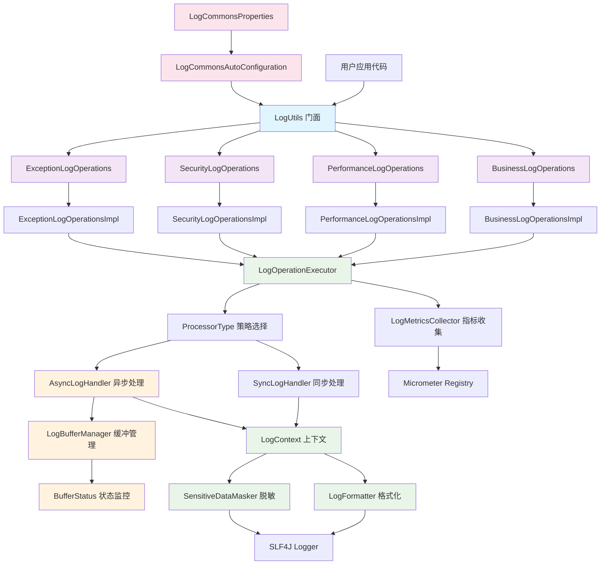
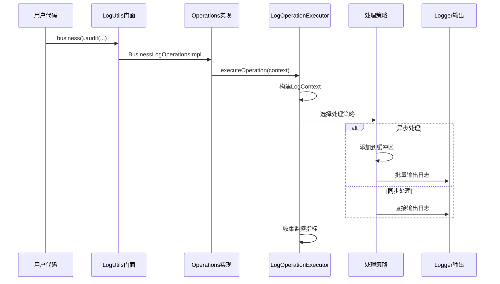
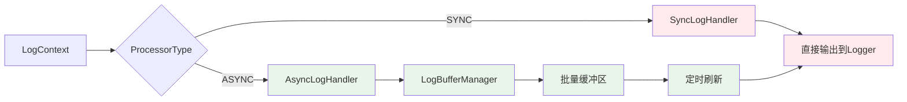
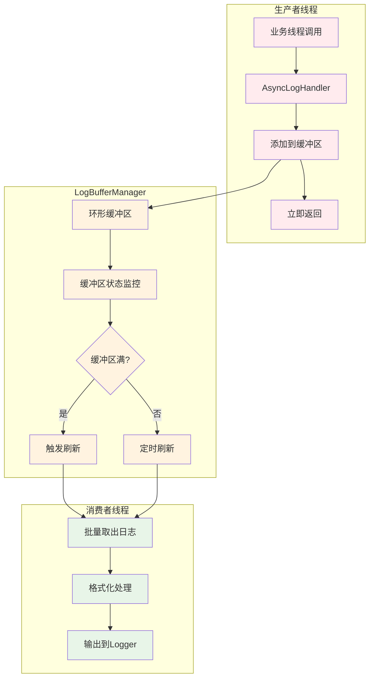
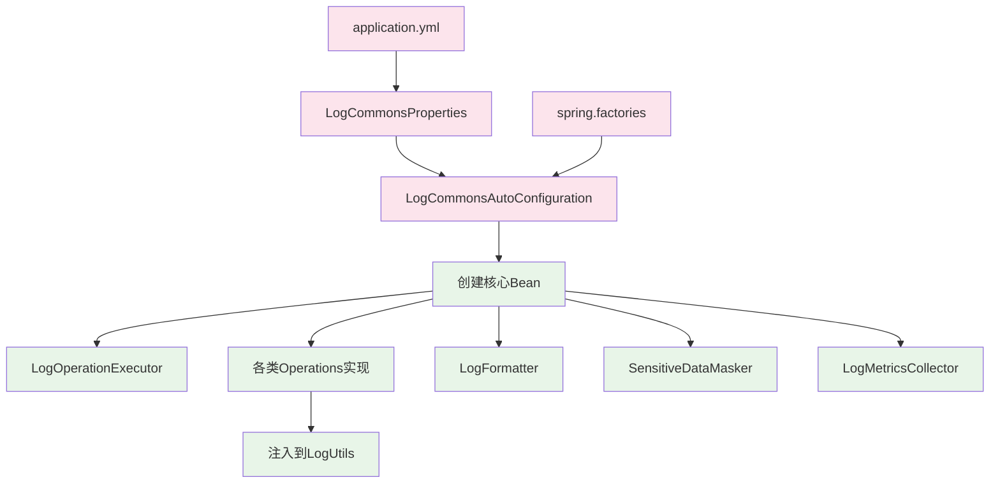
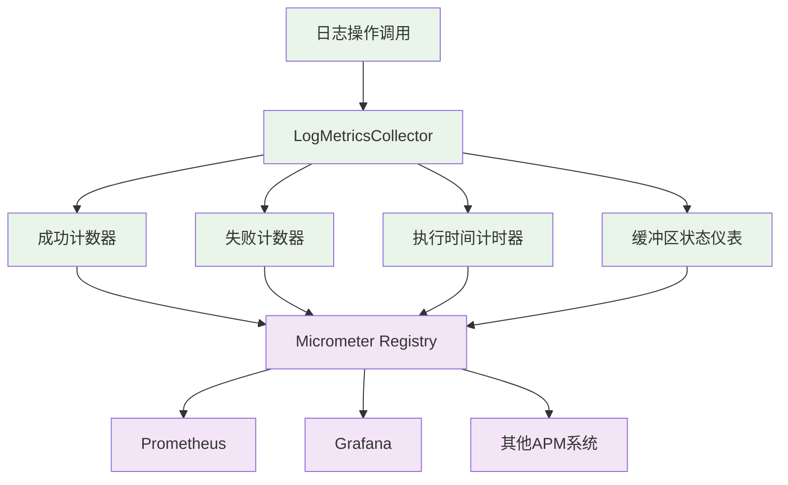

# LogCommons 架构设计

## 设计理念

LogCommons 组件采用**分层架构**和**模块化设计**，遵循**单一职责原则**和**开闭原则**，通过多种设计模式的有机结合，构建了一个高性能、易扩展的企业级日志组件。

### 核心设计原则

1. **门面模式 (Facade Pattern)** - 提供统一简洁的 API 接口
2. **策略模式 (Strategy Pattern)** - 支持同步/异步处理策略切换
3. **建造者模式 (Builder Pattern)** - 构建不可变的日志上下文对象
4. **模板方法模式 (Template Method)** - 统一日志处理流程
5. **依赖注入 (Dependency Injection)** - 松耦合的组件协作

## 整体架构图



## 分层架构详解

### 1. 门面层 (Facade Layer)

**核心类**：`LogUtils`

作为整个组件的统一入口点，隐藏内部复杂性，提供简洁的 API 接口。

```java
@Component
public class LogUtils {
    public static BusinessLogOperations business() { ... }
    public static PerformanceLogOperations performance() { ... }
    public static SecurityLogOperations security() { ... }
    public static ExceptionLogOperations exception() { ... }
}
```

**设计优势**：
- 统一的 API 风格，降低学习成本
- 封装复杂的初始化和依赖关系
- 支持静态方法调用，使用便捷

### 2. 操作抽象层 (Operations Layer)

**接口设计**：
- `BusinessLogOperations` - 业务日志操作
- `PerformanceLogOperations` - 性能日志操作  
- `SecurityLogOperations` - 安全日志操作
- `ExceptionLogOperations` - 异常日志操作

每个接口都继承自 `LogOperations` 基接口，提供各自领域的专门方法。

```java
public interface BusinessLogOperations extends LogOperations {
    void audit(String userId, String action, String result, Object... params);
    void trace(String traceId, String step, String status, Object... params);
    void event(String eventType, Object... params);
    void metric(String metricName, Number value, Object... params);
}
```

### 3. 核心处理层 (Core Processing Layer)

**核心组件**：`LogOperationExecutor`

统一的日志处理执行器，负责协调各个组件完成日志处理流程。



### 4. 处理策略层 (Processing Strategy Layer)

采用策略模式实现同步/异步处理：

**同步处理器** (`SyncLogHandler`):
- 直接调用 SLF4J Logger 输出
- 响应时间：< 1ms
- 适用场景：错误日志、关键业务日志

**异步处理器** (`AsyncLogHandler`):
- 通过缓冲区批量处理
- 响应时间：< 0.1ms  
- 适用场景：高频率的性能监控日志



### 5. 数据处理层 (Data Processing Layer)

**日志上下文** (`LogContext`):
采用建造者模式构建不可变对象，包含日志的所有元数据。

```java
public class LogContext {
    private final LogType type;           // 日志类型
    private final LogLevel level;         // 日志级别  
    private final String message;         // 日志消息
    private final Object[] parameters;    // 参数列表
    private final Map<String, Object> extra; // 扩展信息
    private final long timestamp;         // 时间戳
    // ... 其他字段
}
```

**格式化器** (`LogFormatter`):
负责将 LogContext 转换为最终的日志字符串。

**敏感数据脱敏器** (`SensitiveDataMasker`):
自动检测并脱敏敏感信息，保护数据安全。

```mermaid
graph TD
    A[原始日志数据] --> B[LogContext.Builder]
    B --> C[LogContext 不可变对象]
    
    C --> D[SensitiveDataMasker]
    D --> E[脱敏后数据]
    
    E --> F[LogFormatter]
    F --> G[格式化后字符串]
    
    G --> H[SLF4J Logger输出]
    
    classDef data fill:#e1f5fe
    classDef process fill:#f3e5f5
    classDef output fill:#e8f5e8
    
    class A,C,E data
    class B,D,F process  
    class G,H output
```

### 6. 异步处理架构

LogCommons 的异步处理是其性能优势的核心，采用生产者-消费者模式：



**缓冲区管理特性**：
- **环形缓冲区**：高效的内存使用，避免频繁 GC
- **智能刷新策略**：结合缓冲区大小和时间间隔
- **背压处理**：缓冲区满时的降级策略
- **状态监控**：实时监控缓冲区使用情况

### 7. 配置与自动装配

采用 Spring Boot 自动配置机制，实现零配置启动：



### 8. 监控与可观测性架构

集成 Micrometer 框架，提供全面的监控能力：



**监控指标类别**：
- **计数器指标**：操作成功/失败次数
- **计时器指标**：操作执行时间分布
- **仪表指标**：缓冲区使用率、队列长度
- **直方图指标**：性能数据分布统计

## 架构优势

### 1. 高性能设计
- **异步处理**：核心路径响应时间 < 0.1ms
- **批量操作**：减少系统调用开销
- **内存优化**：环形缓冲区避免频繁 GC

### 2. 高可扩展性
- **策略模式**：支持自定义处理策略
- **插件化设计**：可扩展格式化器和脱敏器
- **配置驱动**：支持运行时配置调整

### 3. 高可靠性
- **优雅降级**：异步失败自动切换同步
- **异常隔离**：组件异常不影响业务流程
- **状态监控**：实时掌控组件运行状态

### 4. 易于使用
- **零配置启动**：Spring Boot 自动装配
- **统一API**：门面模式简化使用复杂度
- **类型安全**：编译期类型检查

这种架构设计确保了 LogCommons 组件既能满足高性能要求，又具备良好的可维护性和扩展性，为企业级应用提供可靠的日志记录基础设施。
