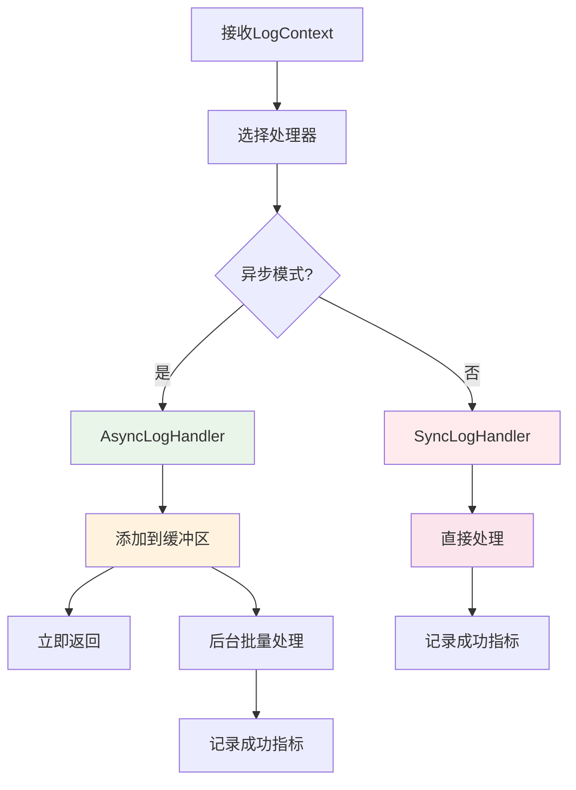
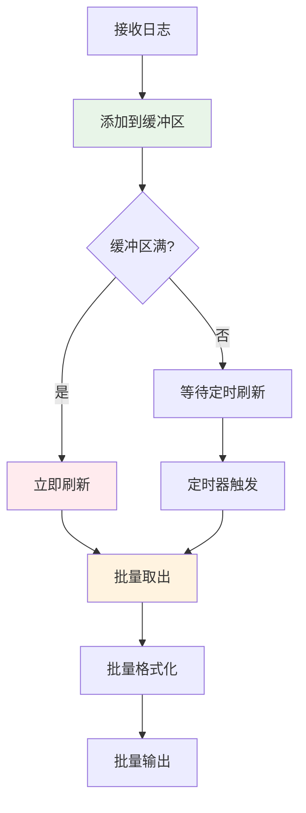
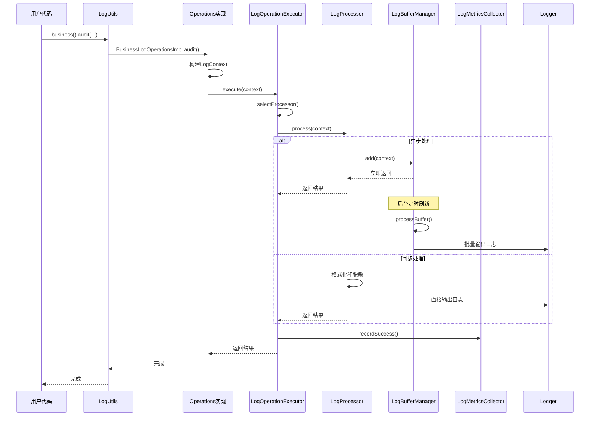

# LogCommons 核心模块详解

## 模块概览

LogCommons 组件采用模块化设计，将功能按职责划分为多个独立模块。每个模块职责单一，相互协作，形成完整的日志处理体系。

## 核心模块结构图

```mermaid
classDiagram
    %% 门面层
    class LogUtils {
        -BusinessLogOperations businessLogOperations
        -PerformanceLogOperations performanceLogOperations
        -SecurityLogOperations securityLogOperations
        -ExceptionLogOperations exceptionLogOperations
        +business() BusinessLogOperations
        +performance() PerformanceLogOperations
        +security() SecurityLogOperations
        +exception() ExceptionLogOperations
        -checkInitialization() void
    }
    
    %% 操作接口层
    class LogOperations {
        <<interface>>
    }
    
    class BusinessLogOperations {
        <<interface>>
        +audit(String userId, String operation, String result, Object... details) void
        +trace(String processId, String step, String status, Object... data) void
        +event(String eventType, Object... eventData) void
        +metric(String metric, Object value, Object... tags) void
    }
    
    class PerformanceLogOperations {
        <<interface>>
        +timing(String method, long duration, Object... params) void
        +sql(String sql, long duration, Object... params) void
        +http(String method, String uri, int status, long duration) void
        +memory(String component, long used, long total) void
        +qps(String resource, double qps, double avgTime) void
    }
    
    class SecurityLogOperations {
        <<interface>>
        +login(String username, String password, boolean success, String ip, String userAgent) void
        +logout(String username, String sessionId, String reason) void
        +permission(String username, String resource, String action, boolean granted) void
        +threat(String threatType, String level, String description, String source) void
        +dataAccess(String username, String dataType, String action, int count) void
    }
    
    class ExceptionLogOperations {
        <<interface>>
        +business(String operation, Throwable throwable, Object... context) void
        +system(String component, Throwable throwable, String severity) void
        +network(String endpoint, Throwable throwable, int retryCount) void
        +database(String sql, Throwable throwable, Object... params) void
        +validation(String field, String value, String rule, String message) void
    }
    
    %% 实现类
    class BaseLogOperationsImpl {
        #LogOperationExecutor executor
        #buildContext(String operation, LogLevel level, String message, Object... args) LogContext
        #executeOperation(LogContext context) Object
    }
    
    class BusinessLogOperationsImpl {
        +audit(String userId, String operation, String result, Object... details) void
        +trace(String processId, String step, String status, Object... data) void
        +event(String eventType, Object... eventData) void
        +metric(String metric, Object value, Object... tags) void
    }
    
    %% 核心执行器
    class LogOperationExecutor {
        -List<LogProcessor> processors
        -LogMetricsCollector metricsCollector
        +execute(LogContext context) Object
        +executeAsync(LogContext context) CompletableFuture<Void>
        -selectProcessor(LogContext context) LogProcessor
        -handleException(LogContext context, Exception e) void
        -recordSuccessMetrics(LogContext context, long startTime) void
        -recordErrorMetrics(LogContext context, Exception error, long startTime) void
    }
    
    %% 上下文对象
    class LogContext {
        -String operation
        -String module
        -String userId
        -String traceId
        -String sessionId
        -String message
        -Object[] args
        -Throwable throwable
        -LogLevel level
        -boolean async
        -LocalDateTime timestamp
        -Map<String, Object> metadata
        -LogType logType
        +getMetadata() Map<String, Object>
        +getMetadataValue(String key) Object
        +withMetadata(String key, Object value) LogContext
        +withLevel(LogLevel level) LogContext
        +withAsync(boolean async) LogContext
    }
    
    %% 处理器接口
    class LogProcessor {
        <<interface>>
        +process(LogContext context) Object
        +getType() ProcessorType
        +isEnabled() boolean
    }
    
    class SyncLogHandler {
        -LogFormatter formatter
        -SensitiveDataMasker masker
        +process(LogContext context) Object
        +getType() ProcessorType
        +isEnabled() boolean
    }
    
    class AsyncLogHandler {
        -LogBufferManager bufferManager
        +process(LogContext context) Object
        +getType() ProcessorType
        +isEnabled() boolean
    }
    
    %% 工具组件
    class LogFormatter {
        <<interface>>
        +format(LogContext context) String
    }
    
    class DefaultLogFormatter {
        +format(LogContext context) String
        -formatMessage(LogContext context) String
        -formatMetadata(LogContext context) String
    }
    
    class SensitiveDataMasker {
        <<interface>>
        +maskSensitiveData(String content) String
    }
    
    class DefaultSensitiveDataMasker {
        -Set<Pattern> patterns
        +maskSensitiveData(String content) String
        -initializePatterns() void
    }
    
    %% 异步处理
    class LogBufferManager {
        -BlockingQueue<LogContext> buffer
        -ScheduledExecutorService scheduler
        -LogProcessor syncProcessor
        -BufferStatus status
        +add(LogContext context) void
        +flush() void
        +getStatus() BufferStatus
        -processBuffer() void
    }
    
    class BufferStatus {
        -int capacity
        -int current
        -long totalProcessed
        -long lastFlushTime
        +getUsageRate() double
        +isHealthy() boolean
    }
    
    %% 监控组件
    class LogMetricsCollector {
        -MeterRegistry meterRegistry
        -Counter successCounter
        -Counter errorCounter
        -Timer operationTimer
        +recordSuccess(LogContext context, long duration) void
        +recordError(LogContext context, Exception error, long duration) void
        -getTags(LogContext context) Tags
    }
    
    %% 继承关系
    BusinessLogOperations --|> LogOperations
    PerformanceLogOperations --|> LogOperations
    SecurityLogOperations --|> LogOperations
    ExceptionLogOperations --|> LogOperations
    
    BaseLogOperationsImpl ..|> LogOperations
    BusinessLogOperationsImpl --|> BaseLogOperationsImpl
    BusinessLogOperationsImpl ..|> BusinessLogOperations
    
    SyncLogHandler ..|> LogProcessor
    AsyncLogHandler ..|> LogProcessor
    DefaultLogFormatter ..|> LogFormatter
    DefaultSensitiveDataMasker ..|> SensitiveDataMasker
    
    %% 依赖关系
    LogUtils --> BusinessLogOperations
    LogUtils --> PerformanceLogOperations
    LogUtils --> SecurityLogOperations
    LogUtils --> ExceptionLogOperations
    
    BaseLogOperationsImpl --> LogOperationExecutor
    LogOperationExecutor --> LogProcessor
    LogOperationExecutor --> LogMetricsCollector
    
    LogOperationExecutor --> LogContext
    LogProcessor --> LogContext
    SyncLogHandler --> LogFormatter
    SyncLogHandler --> SensitiveDataMasker
    AsyncLogHandler --> LogBufferManager
    
    LogBufferManager --> BufferStatus
    LogBufferManager --> LogContext
```



## 1. 门面模块 (Facade Module)

### LogUtils - 统一门面入口

**职责**：作为整个日志组件的统一入口点，提供简洁的静态 API。

**核心特性**：
- **单例模式**：通过 Spring 容器管理单例实例
- **延迟初始化**：运行时检查组件初始化状态
- **异常隔离**：初始化失败时提供明确的错误信息

```java
// 使用示例
LogUtils.business().audit("user123", "login", "success");
LogUtils.performance().timing("getUserInfo", 150);
LogUtils.security().login("user", "pwd", true, "192.168.1.1");
LogUtils.exception().business("createUser", ex, userData);
```

**设计亮点**：
- 静态方法访问，使用便捷
- 内部依赖注入，保持 Spring 生态一致性
- 运行时状态检查，确保组件可用性

## 2. 操作抽象模块 (Operations Module)

### 接口层次结构

**基础接口** - `LogOperations`：
定义所有日志操作的基础契约，提供通用方法签名。

**专门接口**：
- `BusinessLogOperations` - 业务日志操作
- `PerformanceLogOperations` - 性能日志操作  
- `SecurityLogOperations` - 安全日志操作
- `ExceptionLogOperations` - 异常日志操作

### BusinessLogOperations - 业务日志操作

```java
public interface BusinessLogOperations extends LogOperations {
    void audit(String userId, String operation, String result, Object... details);
    void trace(String processId, String step, String status, Object... data);
    void event(String eventType, Object... eventData);
    void metric(String metric, Object value, Object... tags);
}
```

**方法详解**：
- `audit()` - 用户操作审计，记录关键业务操作
- `trace()` - 业务流程追踪，支持复杂流程监控
- `event()` - 业务事件记录，记录重要业务事件
- `metric()` - 业务指标记录，支持自定义业务指标

### PerformanceLogOperations - 性能日志操作

专门用于性能监控的日志操作，提供：
- **方法性能监控** - `timing()` 方法执行时间
- **数据库性能监控** - `sql()` SQL 执行性能
- **HTTP 性能监控** - `http()` HTTP 请求性能
- **内存使用监控** - `memory()` 内存使用情况
- **QPS 统计** - `qps()` 请求处理能力

### SecurityLogOperations - 安全日志操作

专注于安全相关事件记录：
- **认证日志** - `login()` / `logout()` 用户认证
- **授权日志** - `permission()` 权限检查
- **威胁检测** - `threat()` 安全威胁记录
- **数据访问审计** - `dataAccess()` 敏感数据访问

### ExceptionLogOperations - 异常日志操作

分类记录各种异常情况：
- **业务异常** - `business()` 业务逻辑异常
- **系统异常** - `system()` 系统级异常
- **网络异常** - `network()` 网络通信异常
- **数据库异常** - `database()` 数据库操作异常
- **验证异常** - `validation()` 数据验证异常

## 3. 核心处理模块 (Core Processing Module)

### LogOperationExecutor - 统一执行器

**职责**：统一协调各种处理器完成日志记录操作。

**核心功能**：
- **处理器选择**：根据上下文选择合适的处理器
- **异常处理**：统一异常处理和降级策略
- **指标收集**：集成监控指标收集
- **异步支持**：支持异步执行模式

**处理流程**：


**降级策略**：
- 异步处理器不可用时，自动降级到同步处理器
- 处理器异常时，使用最简单的日志输出方式
- 指标收集失败不影响日志记录主流程

### LogContext - 日志上下文

**设计模式**：采用建造者模式构建不可变对象

**核心属性**：
- **业务信息**：`operation`, `module`, `userId`
- **链路信息**：`traceId`, `sessionId`  
- **日志内容**：`message`, `args`, `throwable`
- **处理控制**：`level`, `async`, `timestamp`
- **扩展信息**：`metadata`, `logType`

**不可变设计优势**：
- **线程安全**：多线程环境下无需同步
- **缓存友好**：可以安全地缓存和重用
- **调试便利**：状态不变，便于问题排查

```java
// 构建示例
LogContext context = LogContext.builder()
    .operation("createUser")
    .module("UserService")  
    .userId("user123")
    .traceId("trace-001")
    .message("创建用户成功")
    .level(LogLevel.INFO)
    .async(true)
    .metadata(Map.of("ip", "192.168.1.1"))
    .build();
```

## 4. 处理器模块 (Processor Module)

### SyncLogHandler - 同步处理器

**特点**：
- **直接输出**：直接调用 SLF4J Logger 输出
- **低延迟**：处理时间 < 1ms
- **高可靠性**：同步处理，确保日志及时输出

**适用场景**：
- 错误和异常日志
- 关键业务事件
- 安全相关日志

**处理流程**：
1. 接收 `LogContext` 
2. 调用 `SensitiveDataMasker` 脱敏
3. 调用 `LogFormatter` 格式化
4. 直接输出到 SLF4J Logger

### AsyncLogHandler - 异步处理器

**特点**：
- **高吞吐量**：响应时间 < 0.1ms
- **批量处理**：减少系统调用开销
- **内存缓冲**：使用环形缓冲区

**核心组件**：
- `LogBufferManager` - 缓冲区管理器
- `BufferStatus` - 缓冲区状态监控

**处理策略**：


### LogBufferManager - 缓冲区管理器

**核心功能**：
- **环形缓冲区**：高效内存使用，避免频繁 GC
- **智能刷新**：基于大小和时间的双重策略
- **状态监控**：实时监控缓冲区使用情况
- **背压处理**：缓冲区满时的处理策略

**配置参数**：
- `buffer-size` - 缓冲区大小（默认 1000）
- `flush-interval-seconds` - 刷新间隔（默认 5 秒）
- `batch-size` - 批处理大小（默认 50）

## 5. 工具模块 (Utility Module)

### LogFormatter - 日志格式化器

**接口设计**：
```java
public interface LogFormatter {
    String format(LogContext context);
}
```

**DefaultLogFormatter 实现**：
- **结构化输出**：JSON 格式的结构化日志
- **元数据支持**：包含完整的上下文信息
- **性能优化**：使用 StringBuilder 减少字符串拼接

**输出格式示例**：
```json
{
  "timestamp": "2024-08-29T13:48:54",
  "level": "INFO",
  "type": "BUSINESS",
  "operation": "createUser",
  "module": "UserService",
  "userId": "user123",
  "traceId": "trace-001",
  "message": "创建用户成功",
  "metadata": {
    "ip": "192.168.1.1",
    "duration": 150
  }
}
```

### SensitiveDataMasker - 敏感信息脱敏器

**脱敏规则**：
- **密码相关**：password, pwd, secret 等关键词
- **手机号码**：11 位数字脱敏为 `138****1234`
- **邮箱地址**：邮箱脱敏为 `u***@example.com`
- **身份证号**：18 位数字脱敏中间部分
- **银行卡号**：16-19 位数字脱敏中间部分

**性能优化**：
- 使用预编译正则表达式
- 缓存常用的脱敏结果
- 支持自定义脱敏规则

## 6. 监控模块 (Metrics Module)

### LogMetricsCollector - 指标收集器

**监控指标**：
- **计数器指标**：
  - `log.operations.success` - 成功操作计数
  - `log.operations.error` - 失败操作计数
- **计时器指标**：
  - `log.operations.duration` - 操作执行时间
- **仪表指标**：
  - `log.buffer.usage` - 缓冲区使用率
  - `log.buffer.size` - 缓冲区队列长度

**标签维度**：
- `type` - 日志类型（BUSINESS/PERFORMANCE/SECURITY/EXCEPTION）
- `level` - 日志级别（DEBUG/INFO/WARN/ERROR）
- `module` - 模块名称
- `async` - 是否异步处理（true/false）

**集成方式**：
```java
// Micrometer 集成
@Component
public class LogMetricsCollector {
    private final MeterRegistry meterRegistry;
    
    public void recordSuccess(LogContext context, long duration) {
        Tags tags = getTags(context);
        successCounter.increment(tags);
        operationTimer.record(Duration.ofNanos(duration), tags);
    }
}
```

## 模块交互图



LogCommons 的模块化设计确保了组件的高内聚、低耦合，每个模块职责清晰，便于维护和扩展。通过合理的抽象和封装，为用户提供了简洁易用的 API，同时保持了内部实现的灵活性。
