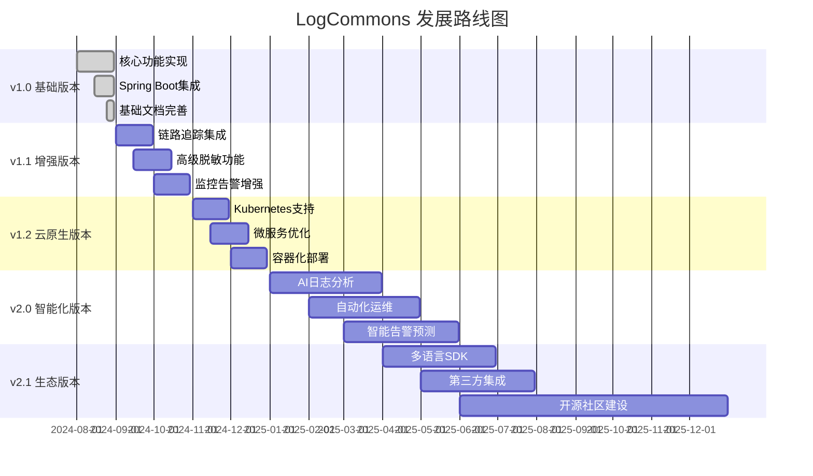
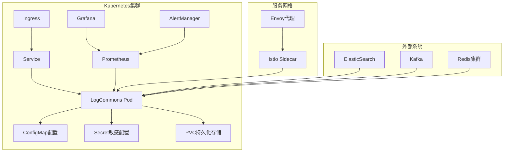
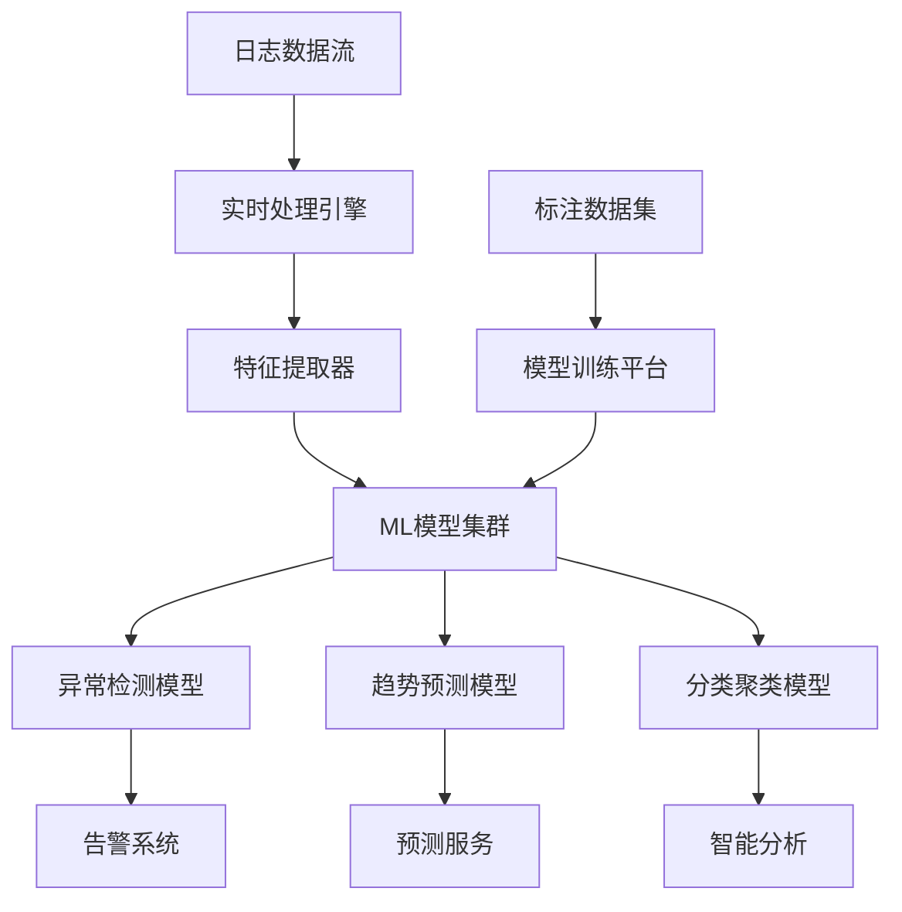
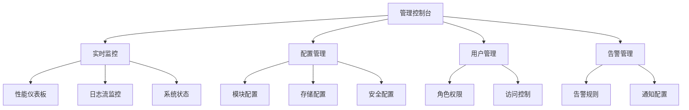

# LogCommons 未来规划与技术路线图

## 发展愿景

LogCommons 组件的发展愿景是成为 Java 生态系统中最优秀的企业级统一日志解决方案，为现代化应用提供高性能、易使用、功能完备的日志记录基础设施。

### 核心目标
- **性能领先**：异步处理能力达到 100,000+ QPS，响应时间 < 0.01ms
- **功能丰富**：覆盖企业级应用的所有日志记录需求
- **生态融合**：深度集成主流框架和云原生技术栈
- **智能化运维**：基于 AI 的日志分析和自动化运维能力

## 版本规划路线图



## 近期规划 (v1.1 - v1.2)

### 1. 链路追踪深度集成

**目标**：与主流链路追踪系统深度集成，提供完整的分布式系统可观测性。

**核心特性**：
```java
// 未来的链路追踪API设计
@Component
public class TracingLogOperations {
    
    // 自动关联TraceId和SpanId
    @TraceLogging
    public void logWithTrace(String operation, Object... params) {
        String traceId = TraceContext.current().traceId();
        String spanId = TraceContext.current().spanId();
        
        business().trace(traceId)
            .span(spanId)
            .operation(operation)
            .params(params)
            .log();
    }
    
    // 跨服务日志关联
    @CrossServiceTrace
    public void logServiceCall(String targetService, String method, Object request) {
        String parentTraceId = getCurrentTraceId();
        String childSpanId = generateChildSpanId();
        
        performance().serviceCall(targetService)
            .parentTrace(parentTraceId)
            .childSpan(childSpanId)
            .method(method)
            .request(request)
            .log();
    }
}
```

**集成计划**：
- **Jaeger 集成**：支持 Jaeger 原生格式和传输协议
- **Zipkin 集成**：兼容 Zipkin B3 传播格式
- **OpenTelemetry 集成**：深度集成 OpenTelemetry 标准
- **Spring Cloud Sleuth 集成**：无缝集成 Spring 生态

### 2. 高级敏感信息脱敏

**目标**：提供更智能、更灵活的敏感信息识别和脱敏能力。

**技术特性**：
```java
// AI驱动的敏感信息识别
@Component
public class AIEnhancedDataMasker implements SensitiveDataMasker {
    
    // 基于机器学习的模式识别
    private final MLPatternRecognizer patternRecognizer;
    
    // 上下文感知的脱敏策略
    private final ContextAwareMaskingStrategy maskingStrategy;
    
    @Override
    public String maskSensitiveData(String content, LogContext context) {
        // 基于上下文智能识别敏感信息
        List<SensitivePattern> patterns = patternRecognizer.identify(content, context);
        
        // 应用不同的脱敏策略
        for (SensitivePattern pattern : patterns) {
            MaskingLevel level = determineLevel(pattern, context);
            content = maskingStrategy.apply(content, pattern, level);
        }
        
        return content;
    }
}
```

**功能规划**：
- **智能识别**：基于机器学习的敏感信息自动识别
- **动态脱敏**：根据用户角色和安全等级动态调整脱敏策略
- **合规支持**：支持 GDPR、CCPA 等法规要求的数据保护
- **自定义规则**：可视化的脱敏规则配置界面

### 3. 云原生架构优化

**目标**：全面支持 Kubernetes 和云原生部署模式。

**架构演进**：


**特性规划**：
- **容器化部署**：提供官方 Docker 镜像和 Helm Chart
- **服务发现**：集成 Kubernetes Service Discovery
- **配置热更新**：支持 ConfigMap/Secret 的热更新
- **资源限制**：智能的资源使用和限制管理

### 4. 多存储后端支持

**目标**：支持多种日志存储后端，提供灵活的存储选择。

```java
// 多存储后端架构
@Configuration
public class MultiStorageConfiguration {
    
    @Bean
    @ConditionalOnProperty("log-commons.storage.elasticsearch.enabled")
    public LogStorage elasticsearchStorage() {
        return new ElasticsearchLogStorage();
    }
    
    @Bean 
    @ConditionalOnProperty("log-commons.storage.kafka.enabled")
    public LogStorage kafkaStorage() {
        return new KafkaLogStorage();
    }
    
    @Bean
    @ConditionalOnProperty("log-commons.storage.clickhouse.enabled") 
    public LogStorage clickhouseStorage() {
        return new ClickHouseLogStorage();
    }
    
    @Bean
    public LogStorageRouter storageRouter(List<LogStorage> storages) {
        return new LogStorageRouter(storages);
    }
}
```

**支持的存储系统**：
- **Elasticsearch**：结构化日志搜索和分析
- **Apache Kafka**：高吞吐量的日志流处理
- **ClickHouse**：高性能分析型数据库
- **MongoDB**：文档型存储，灵活的数据结构
- **AWS CloudWatch**：云原生日志服务
- **阿里云日志服务**：国内云厂商集成

## 中长期规划 (v2.0+)

### 1. AI 驱动的智能日志分析

**愿景**：构建基于人工智能的智能日志分析平台，提供主动的问题发现和预警能力。

**核心功能**：
```java
// AI日志分析服务
@Service
public class AILogAnalysisService {
    
    // 异常模式识别
    public List<AnomalyPattern> detectAnomalies(TimeRange range) {
        List<LogEntry> logs = logRepository.findByTimeRange(range);
        return aiEngine.detectAnomalies(logs);
    }
    
    // 性能趋势预测
    public PerformanceForecast predictPerformance(String service, Duration horizon) {
        List<PerformanceMetric> history = metricsRepository.getHistory(service);
        return aiEngine.predictTrend(history, horizon);
    }
    
    // 智能告警降噪
    public List<Alert> intelligentFiltering(List<RawAlert> rawAlerts) {
        return aiEngine.filterAndPrioritize(rawAlerts);
    }
    
    // 根因分析
    public RootCauseAnalysis analyzeIncident(Incident incident) {
        List<LogEntry> relevantLogs = findRelevantLogs(incident);
        return aiEngine.analyzeRootCause(incident, relevantLogs);
    }
}
```

**技术架构**：


### 2. 自动化运维与自愈能力

**目标**：实现日志系统的自动化运维和自愈能力，减少人工干预。

**自愈架构**：
```java
@Component
public class SelfHealingLogSystem {
    
    @EventListener
    public void handleSystemEvent(SystemEvent event) {
        if (event.getType() == EventType.BUFFER_OVERFLOW) {
            // 自动扩容缓冲区
            autoScaleBuffer(event);
        } else if (event.getType() == EventType.PERFORMANCE_DEGRADATION) {
            // 自动优化配置
            autoOptimizeConfiguration(event);
        } else if (event.getType() == EventType.STORAGE_FAILURE) {
            // 自动故障转移
            autoFailover(event);
        }
    }
    
    private void autoScaleBuffer(SystemEvent event) {
        int currentSize = bufferManager.getCurrentSize();
        int targetSize = calculateOptimalSize(event.getMetrics());
        
        if (targetSize > currentSize) {
            bufferManager.scaleUp(targetSize);
            notifyOperators("自动扩容缓冲区: {} -> {}", currentSize, targetSize);
        }
    }
    
    private void autoFailover(SystemEvent event) {
        String failedStorage = event.getSource();
        List<String> availableStorages = findAvailableStorages();
        
        if (!availableStorages.isEmpty()) {
            routingManager.redirectTraffic(failedStorage, availableStorages.get(0));
            healingManager.scheduleRecovery(failedStorage);
        }
    }
}
```

### 3. 多语言 SDK 支持

**目标**：提供多种编程语言的 SDK，扩大组件的适用范围。

**SDK 规划**：
- **Java SDK** ✅ (已实现)
- **Spring Boot SDK** ✅ (已实现)
- **Python SDK** - 计划中
- **Go SDK** - 计划中
- **Node.js SDK** - 计划中
- **C# SDK** - 规划中
- **PHP SDK** - 规划中

**统一API设计**：
```python
# Python SDK示例
from log_commons import LogUtils

# 业务日志
LogUtils.business().audit("user123", "login", "success")

# 性能日志
LogUtils.performance().timing("process_data", 150)

# 安全日志
LogUtils.security().login("user", "***", True, "192.168.1.1")

# 异常日志
try:
    risky_operation()
except Exception as e:
    LogUtils.exception().business("risky_operation", e)
```

### 4. 可视化管理平台

**愿景**：提供完整的 Web 管理界面，实现日志系统的可视化管理。

**功能模块**：


**技术栈**：
- **前端**：Vue 3 + TypeScript + Element Plus
- **后端**：Spring Boot + Spring Security
- **数据库**：PostgreSQL + Redis
- **监控**：Prometheus + Grafana
- **部署**：Docker + Kubernetes

## 生态集成规划

### 1. 框架集成

**Spring 生态**：
- Spring Boot 3.x 深度集成
- Spring Cloud 微服务支持
- Spring Security 安全集成
- Spring Data 数据访问优化

**微服务生态**：
- Dubbo 集成
- Nacos 配置中心集成
- Sentinel 限流熔断集成
- Seata 分布式事务集成

**云原生生态**：
- Kubernetes 原生支持
- Istio 服务网格集成
- Prometheus 监控集成
- OpenTelemetry 标准兼容

### 2. 中间件集成

**消息队列**：
- Apache Kafka
- RabbitMQ
- Apache RocketMQ
- Apache Pulsar

**缓存系统**：
- Redis Cluster
- Apache Ignite
- Hazelcast

**数据库**：
- MySQL/PostgreSQL
- MongoDB
- Elasticsearch
- ClickHouse

### 3. 云服务集成

**国际云厂商**：
- AWS CloudWatch
- Azure Monitor
- Google Cloud Logging

**国内云厂商**：
- 阿里云日志服务
- 腾讯云日志服务
- 华为云应用运维管理

## 开源生态建设

### 1. 社区建设规划

**开源时间线**：
- **2024年12月**：开源 v1.0 核心代码
- **2025年3月**：发布完整文档和示例
- **2025年6月**：建立社区治理结构
- **2025年9月**：举办首届社区大会

**社区资源**：
- **GitHub 仓库**：主代码仓库和示例项目
- **官方网站**：文档、教程、最佳实践
- **技术博客**：技术分享和案例分析
- **社区论坛**：用户交流和技术支持
- **在线文档**：API文档和开发指南

### 2. 贡献者发展

**贡献者等级**：
- **使用者**：使用组件并提供反馈
- **贡献者**：提交代码或文档改进
- **提交者**：有代码提交权限的核心贡献者
- **维护者**：项目维护和版本发布责任人

**激励机制**：
- 贡献者认证和徽章
- 年度优秀贡献者奖励
- 技术大会演讲机会
- 开源项目经验证明

### 3. 商业化考虑

**开源 vs 商业版本**：
- **开源版本**：核心功能完全免费
- **企业版本**：提供专业服务和高级功能
- **云服务版本**：SaaS 模式的托管服务

**商业化功能**：
- 专业技术支持
- 定制化开发服务
- 企业级安全增强
- 高可用部署方案
- 7x24 运维服务

## 技术演进方向

### 1. 架构演进

**当前架构** → **目标架构**：
- 单体组件 → 微服务化架构
- 同步处理 → 流式处理
- 本地缓存 → 分布式缓存
- 固定配置 → 动态配置
- 被动监控 → 主动智能运维

### 2. 性能提升

**性能目标**：
- **吞吐量**：100,000+ QPS
- **延迟**：P99 < 10ms，P50 < 1ms
- **可用性**：99.99% SLA
- **扩展性**：支持 10,000+ 并发连接
- **资源效率**：CPU使用率 < 10%，内存占用 < 500MB

### 3. 创新技术应用

**新兴技术整合**：
- **WebAssembly**：高性能数据处理
- **GraphQL**：灵活的查询接口
- **gRPC**：高效的服务间通信
- **Rust组件**：性能关键路径优化
- **边缘计算**：日志边缘处理能力

LogCommons 的未来规划体现了对技术发展趋势的前瞻性思考，通过持续的技术创新和生态建设，将为用户提供更加强大、智能、易用的日志解决方案。
