# Redis Commons - 架构设计

## 🏗️ 整体架构概览

Redis Commons 采用分层架构设计，将复杂的 Redis 操作抽象为清晰的模块层次，确保高内聚低耦合的设计原则。整体架构分为以下几个核心层次：

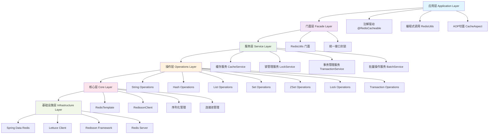

## 🎯 核心设计原则

### 1. 门面模式 (Facade Pattern)

**设计理念**：通过 `RedisUtils` 类作为统一入口，隐藏底层复杂的 Redis 操作实现细节。

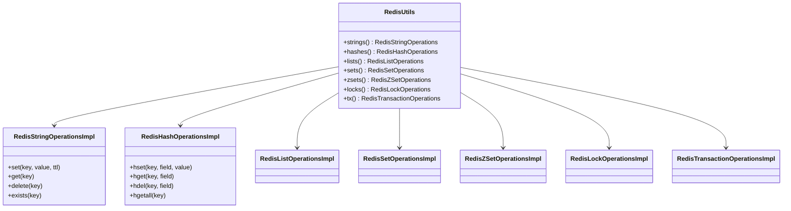

### 2. 策略模式 (Strategy Pattern)

**缓存更新策略**：支持多种缓存更新策略，适应不同业务场景。

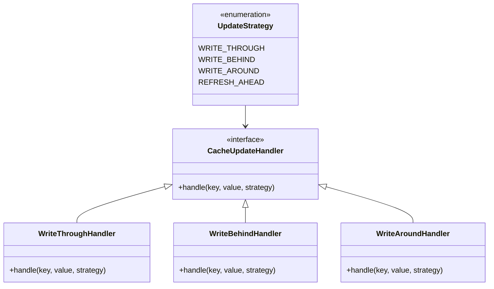

### 3. 观察者模式 (Observer Pattern)

**性能监控**：通过事件驱动的方式收集缓存性能指标。

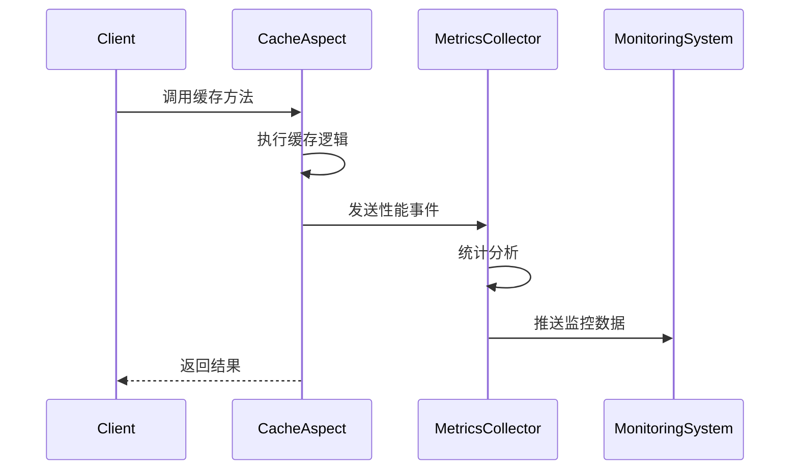

## 🔧 模块架构详解

### 配置管理模块

**自动配置机制**：基于 Spring Boot 的条件化自动配置，实现零配置启动。

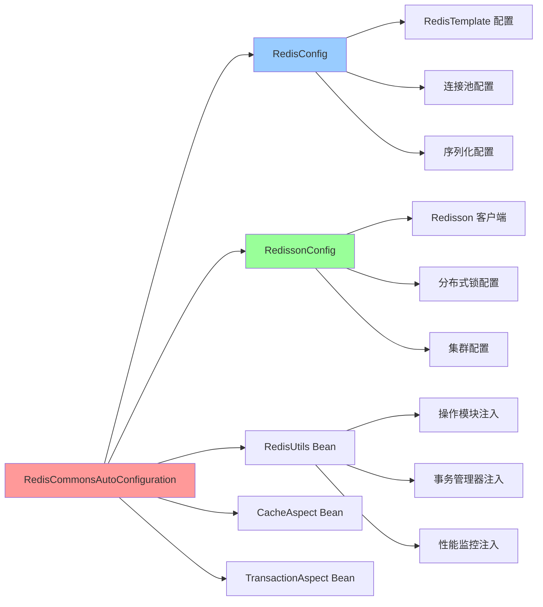

### 缓存增强模块

**多级缓存架构**：支持 L1(本地缓存) + L2(Redis缓存) + L3(数据源) 的多级缓存体系。

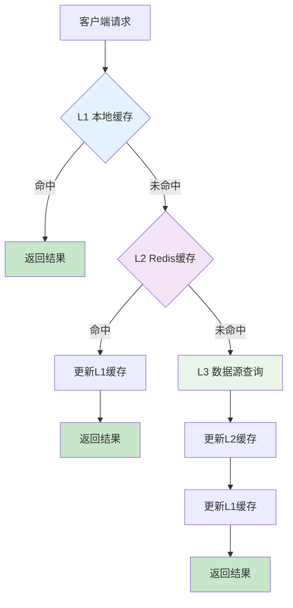

### 分布式锁模块

**锁管理架构**：基于 Redisson 实现的高可靠分布式锁机制。

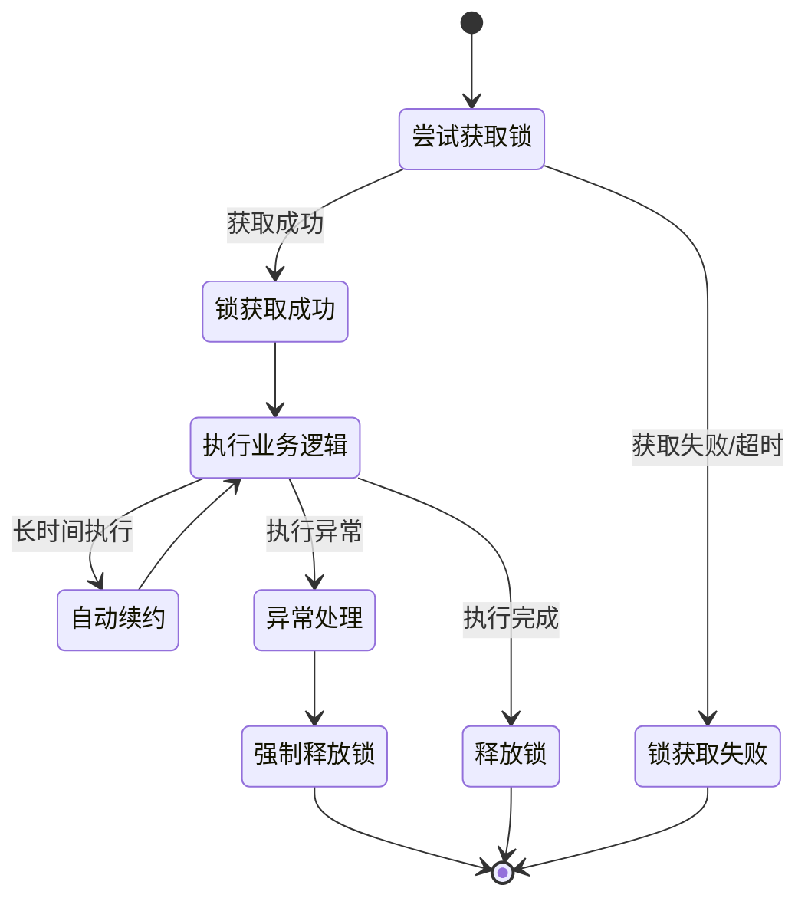

### 事务管理模块

**声明式事务**：通过 AOP 实现的声明式 Redis 事务管理。

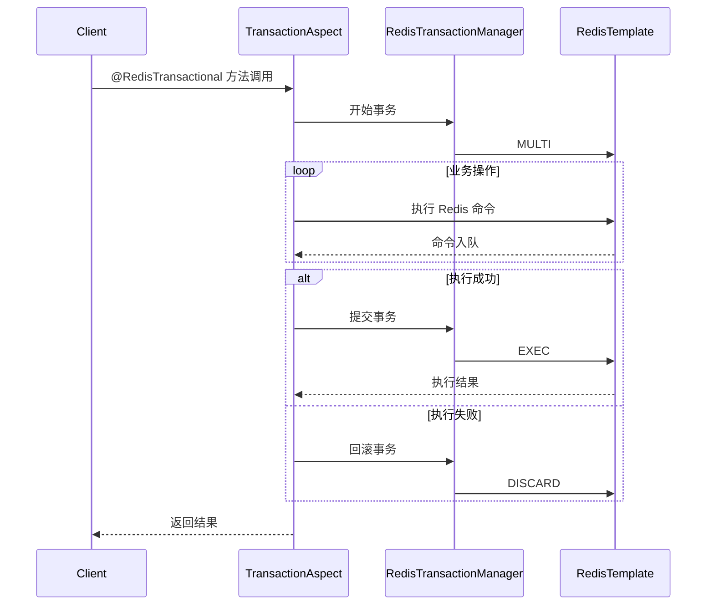

## ⚡ 性能优化架构

### 批量操作优化

**智能批量合并**：自动识别并合并批量操作，减少网络 IO 开销。

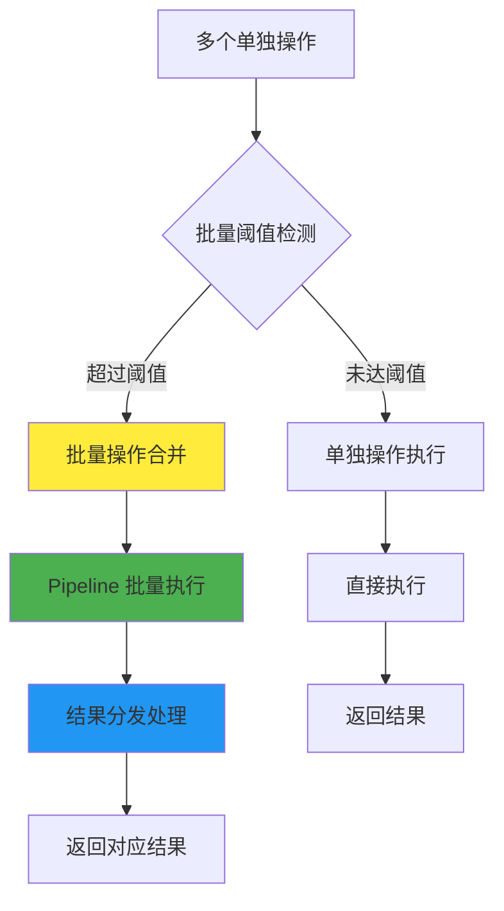

### 缓存预热机制

**智能预热策略**：基于优先级的缓存预热，提升应用启动后性能。

```mermaid
gantt
    title 缓存预热执行时序
    dateFormat X
    axisFormat %s

    section 应用启动
    Spring容器初始化    :0, 5
    Redis连接建立      :3, 8

    section 预热执行
    高优先级缓存预热    :crit, 8, 15
    中优先级缓存预热    :15, 25
    低优先级缓存预热    :25, 40

    section 服务就绪
    对外提供服务       :40, 45
```

## 🔍 监控与诊断架构

### 性能指标收集

**全链路监控**：从请求到响应的全链路性能指标收集。

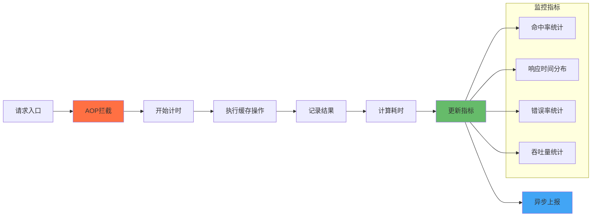

### 健康检查机制

**多维度健康检查**：Redis 连接状态、缓存命中率、响应时间等多维度健康评估。

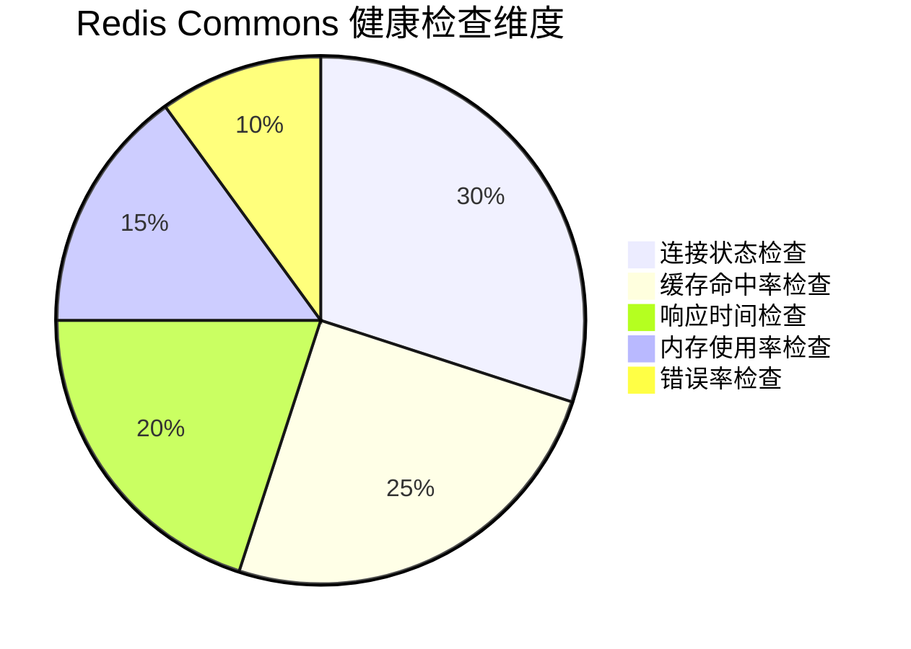

## 🛡️ 可靠性保障架构

### 异常处理机制

**分层异常处理**：不同层级的异常处理策略，确保系统稳定性。

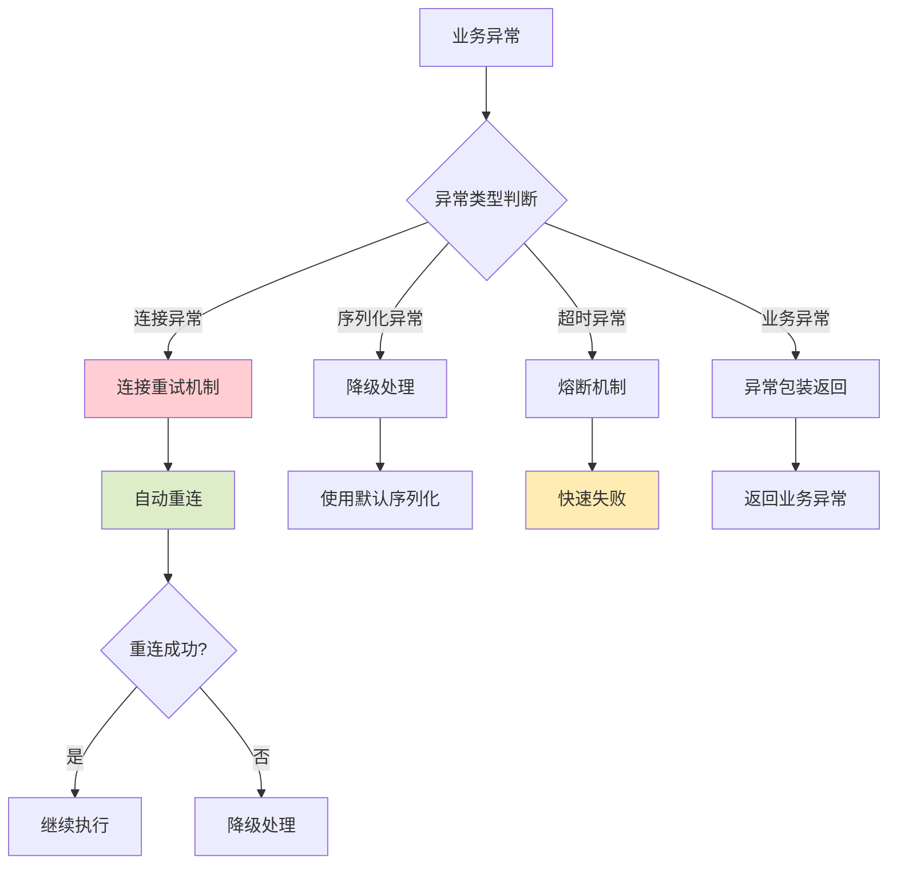
