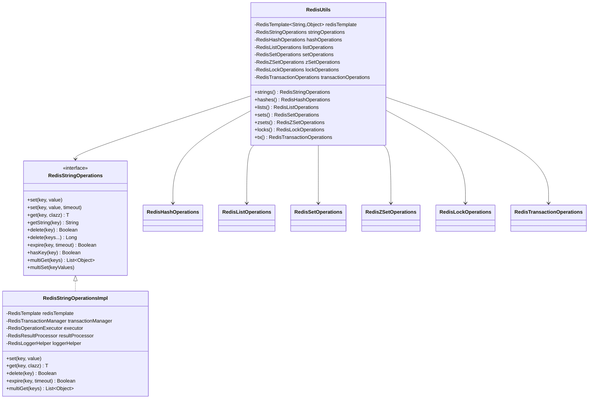
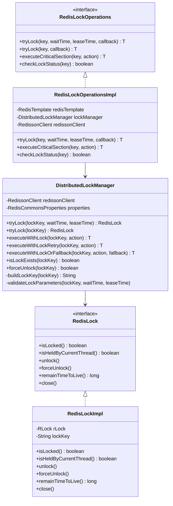
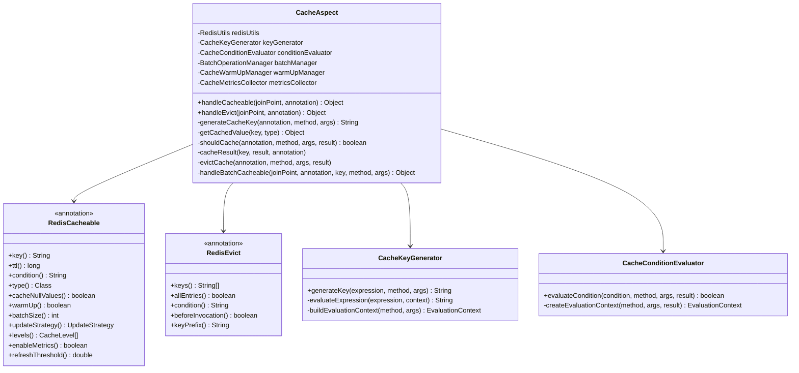
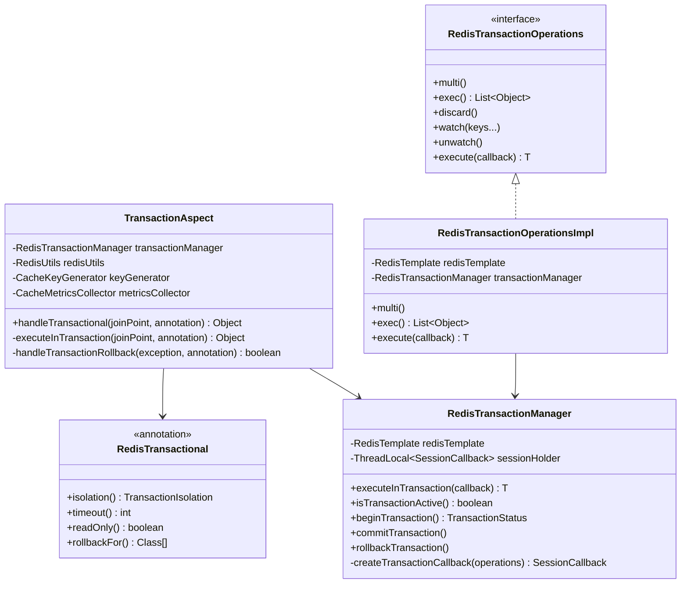
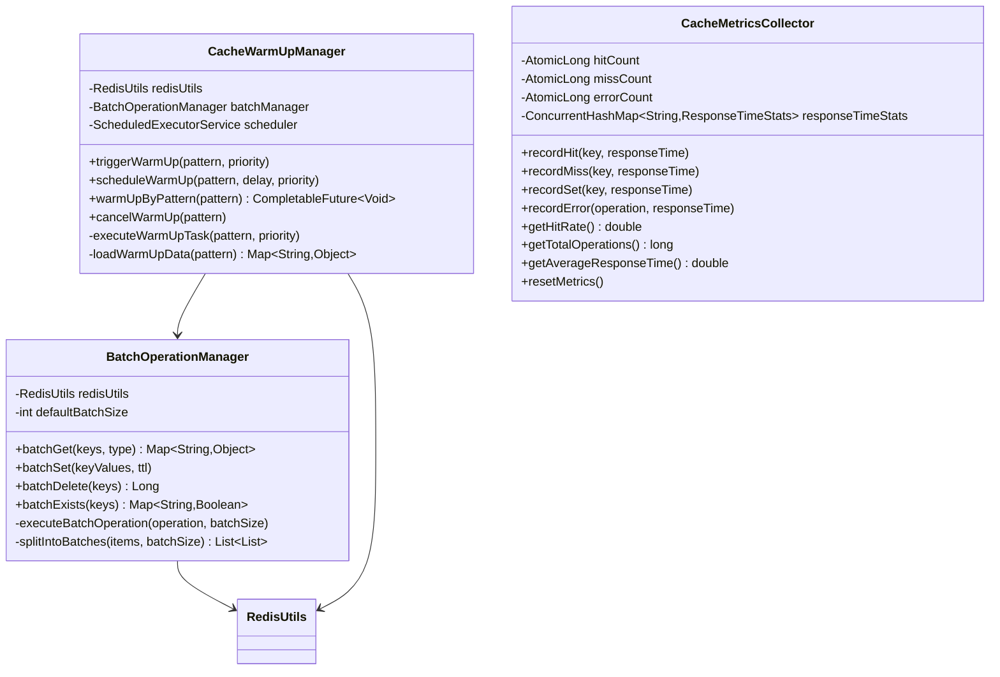

# Redis Commons - 核心模块

## 🏢 代码结构概览

Redis Commons 采用清晰的模块化架构，按功能职责划分为不同的包和类，确保代码的高内聚低耦合。

```
src/main/java/com/david/redis/commons/
├── annotation/                  # 注解定义
│   ├── RedisCacheable.java     # 缓存注解
│   ├── RedisEvict.java         # 缓存清除注解
│   └── RedisTransactional.java # 事务注解
├── aspect/                      # AOP 切面
│   ├── CacheAspect.java        # 缓存切面
│   └── TransactionAspect.java  # 事务切面
├── config/                      # 配置类
│   ├── RedisCommonsAutoConfiguration.java
│   ├── RedisConfig.java
│   └── RedissonConfig.java
├── core/                        # 核心功能
│   ├── RedisUtils.java         # 门面类
│   ├── cache/                  # 缓存核心
│   ├── lock/                   # 分布式锁
│   ├── operations/             # 数据操作
│   └── transaction/            # 事务管理
├── enums/                      # 枚举定义
├── exception/                  # 异常定义
├── manager/                    # 管理器类
├── monitor/                    # 监控相关
└── properties/                 # 配置属性
```

## 🎯 核心模块类图

### 门面层设计



### 分布式锁模块



### 缓存注解与切面模块



### 事务管理模块



### 批量操作与缓存预热模块



## 📋 核心操作接口详解

### String 操作接口

`RedisStringOperations` 提供了完整的 Redis String 类型操作：

**基础操作**：

- `set(key, value)` - 设置键值对
- `set(key, value, timeout)` - 设置带过期时间的键值对
- `get(key, clazz)` - 获取指定类型的值
- `getString(key)` - 获取字符串值

**批量操作**：

- `multiGet(keys)` - 批量获取多个键的值
- `multiSet(keyValues)` - 批量设置多个键值对
- `delete(keys...)` - 批量删除键

**高级操作**：

- `expire(key, timeout)` - 设置过期时间
- `hasKey(key)` - 检查键是否存在
- `scanKeys(pattern)` - 安全的键扫描

### Hash 操作接口

```java
public interface RedisHashOperations {
    // 基础操作
    void hset(String key, String field, Object value);
    <T> T hget(String key, String field, Class<T> clazz);
    Map<String, Object> hgetall(String key);
    Boolean hdel(String key, String... fields);

    // 批量操作
    void hmset(String key, Map<String, Object> fieldValues);
    List<Object> hmget(String key, String... fields);

    // 高级操作
    Boolean hexists(String key, String field);
    Set<String> hkeys(String key);
    Long hincrBy(String key, String field, long delta);
    Double hincrByFloat(String key, String field, double delta);
}
```

### List 操作接口

```java
public interface RedisListOperations {
    // 推入操作
    Long lpush(String key, Object... values);
    Long rpush(String key, Object... values);

    // 弹出操作
    <T> T lpop(String key, Class<T> clazz);
    <T> T rpop(String key, Class<T> clazz);

    // 范围操作
    <T> List<T> lrange(String key, long start, long end, Class<T> clazz);
    void ltrim(String key, long start, long end);

    // 索引操作
    <T> T lindex(String key, long index, Class<T> clazz);
    void lset(String key, long index, Object value);
    Long llen(String key);
}
```

### Set 操作接口

```java
public interface RedisSetOperations {
    // 基础操作
    Long sadd(String key, Object... values);
    Boolean srem(String key, Object... values);
    Boolean sismember(String key, Object value);

    // 集合运算
    Set<Object> sunion(String... keys);
    Set<Object> sinter(String... keys);
    Set<Object> sdiff(String... keys);

    // 随机操作
    <T> T spop(String key, Class<T> clazz);
    <T> T srandmember(String key, Class<T> clazz);
    <T> List<T> srandmember(String key, int count, Class<T> clazz);
}
```

### ZSet 操作接口

```java
public interface RedisZSetOperations {
    // 基础操作
    Boolean zadd(String key, double score, Object value);
    Boolean zrem(String key, Object... values);
    Double zscore(String key, Object value);

    // 排名操作
    Long zrank(String key, Object value);
    Long zrevrank(String key, Object value);

    // 范围操作
    <T> Set<T> zrange(String key, long start, long end, Class<T> clazz);
    <T> Set<T> zrevrange(String key, long start, long end, Class<T> clazz);
    <T> Set<T> zrangeByScore(String key, double min, double max, Class<T> clazz);

    // 统计操作
    Long zcount(String key, double min, double max);
    Long zcard(String key);
}
```

## 🔧 支撑组件模块

### 操作执行器

```java
@Component
public class RedisOperationExecutor {
    private final RedisLoggerHelper loggerHelper;

    public <T> T execute(String operation, Supplier<T> supplier) {
        long startTime = System.currentTimeMillis();
        try {
            T result = supplier.get();
            loggerHelper.logSuccess(operation, System.currentTimeMillis() - startTime);
            return result;
        } catch (Exception e) {
            loggerHelper.logError(operation, e, System.currentTimeMillis() - startTime);
            throw new RedisOperationException(operation, e);
        }
    }
}
```

### 结果处理器

```java
@Component
public class RedisResultProcessor {

    public <T> T processResult(Object result, Class<T> targetType) {
        if (result == null) {
            return null;
        }

        if (targetType.isAssignableFrom(result.getClass())) {
            return targetType.cast(result);
        }

        return convertType(result, targetType);
    }

    @SuppressWarnings("unchecked")
    private <T> T convertType(Object source, Class<T> targetType) {
        // 类型转换逻辑
        if (targetType == String.class) {
            return (T) source.toString();
        }
        // ... 其他转换逻辑
        throw new IllegalArgumentException("不支持的类型转换");
    }
}
```

### 日志助手

```java
@Component
public class RedisLoggerHelper {
    private static final Logger log = LoggerFactory.getLogger(RedisLoggerHelper.class);

    public void logSuccess(String operation, long duration) {
        if (log.isDebugEnabled()) {
            log.debug("Redis操作成功 - 操作: {}, 耗时: {}ms", operation, duration);
        }
    }

    public void logError(String operation, Exception e, long duration) {
        log.error("Redis操作失败 - 操作: {}, 耗时: {}ms", operation, duration, e);
    }

    public void logSlowOperation(String operation, long duration, long threshold) {
        if (duration > threshold) {
            log.warn("Redis慢操作 - 操作: {}, 耗时: {}ms, 阈值: {}ms",
                    operation, duration, threshold);
        }
    }
}
```

## 🎨 设计模式应用

### 1. 门面模式（Facade Pattern）

- **应用场景**：`RedisUtils` 类作为统一门面
- **优势**：简化客户端调用，隐藏复杂的子系统

### 2. 策略模式（Strategy Pattern）

- **应用场景**：缓存更新策略、序列化策略
- **优势**：灵活切换算法实现

### 3. 模板方法模式（Template Method Pattern）

- **应用场景**：Redis操作的通用执行模板
- **优势**：统一异常处理和日志记录

### 4. 装饰器模式（Decorator Pattern）

- **应用场景**：为Redis操作添加事务、监控等功能
- **优势**：动态扩展功能，不修改原有代码

### 5. 观察者模式（Observer Pattern）

- **应用场景**：性能指标收集和事件通知
- **优势**：松耦合的事件处理机制
