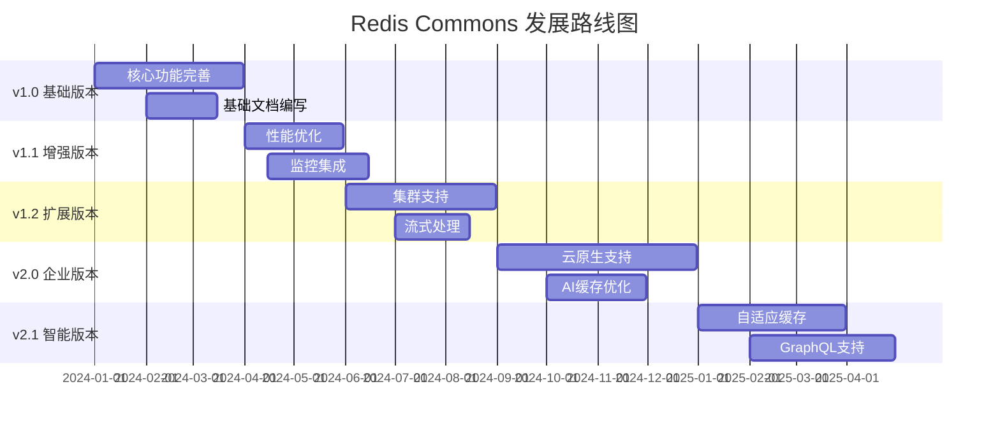
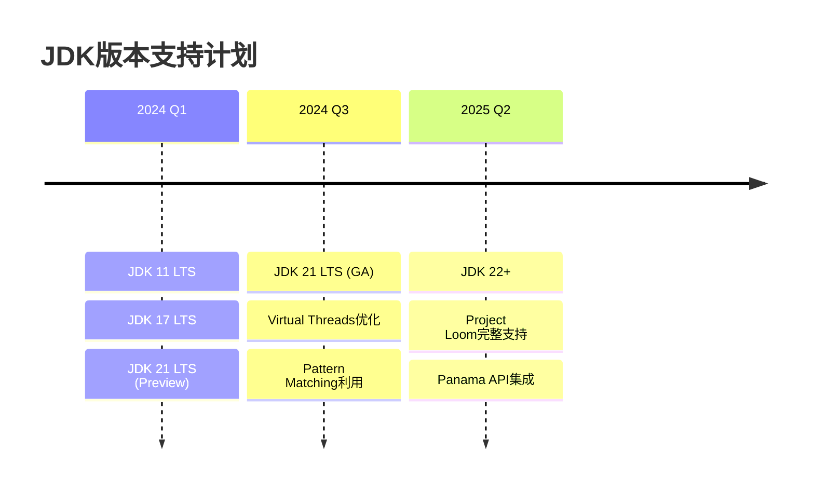

# Redis Commons - 未来规划

## 🎯 发展愿景

Redis Commons 致力于成为 Java 生态中最完善、最易用的 Redis 工具类库，为开发者提供企业级的缓存和分布式协调解决方案。

### 核心目标

- **易用性第一**：持续简化API设计，降低学习成本
- **性能优先**：追求极致的性能优化和资源利用率
- **生态完善**：与主流框架和中间件深度集成
- **标准化**：建立Redis操作的最佳实践标准

## 📅 版本规划路线图



## 🚀 近期功能规划 (v1.1 - v1.2)

### 1. 性能优化增强

#### 连接池智能管理

```java
// 规划中的智能连接池
@Component
public class IntelligentConnectionPool {

    /**
     * 基于负载自动调整连接池大小
     */
    public void autoAdjustPoolSize() {
        // 监控连接使用率
        // 动态调整min-idle, max-active参数
        // 预测性连接预热
    }

    /**
     * 连接健康检查和自动恢复
     */
    public void connectionHealthManagement() {
        // 定期健康检查
        // 异常连接自动剔除
        // 连接池自愈机制
    }
}
```

#### 智能批量操作

```java
// 规划中的自适应批量处理
@Service
public class AdaptiveBatchProcessor {

    /**
     * 基于网络延迟自动调整批量大小
     */
    public void adaptiveBatchSize() {
        // 实时监控网络延迟
        // 动态调整批量大小
        // 最优吞吐量寻找
    }

    /**
     * 智能批量合并窗口
     */
    public void intelligentBatchWindowing() {
        // 基于请求频率调整窗口大小
        // 延迟敏感操作优先处理
        // 批量操作负载均衡
    }
}
```

### 2. 高级缓存策略

#### 预测性缓存预热

```java
// 规划中的AI驱动缓存预热
@Service
public class PredictiveCacheWarming {

    /**
     * 基于历史访问模式预测热点数据
     */
    public void predictHotData() {
        // 机器学习模型训练
        // 访问模式识别
        // 预测性数据预加载
    }

    /**
     * 智能缓存替换算法
     */
    public void intelligentCacheReplacement() {
        // 自定义LRU增强算法
        // 访问频率和时效性平衡
        // 业务价值权重考虑
    }
}
```

#### 多级缓存优化

```java
// 规划中的智能多级缓存
@Component
public class IntelligentMultiLevelCache {

    /**
     * 自适应缓存层级选择
     */
    public void adaptiveCacheLayerSelection() {
        // 根据数据特征选择最优缓存层
        // 动态调整各层缓存比例
        // 成本效益优化
    }

    /**
     * 缓存层间智能同步
     */
    public void intelligentCacheSynchronization() {
        // 异步增量同步
        // 冲突检测和解决
        // 一致性保证机制
    }
}
```

### 3. 高可用性增强

#### 故障自动恢复

```java
// 规划中的自愈系统
@Component
public class SelfHealingSystem {

    /**
     * 自动故障检测和切换
     */
    public void autoFailoverManagement() {
        // 实时健康监控
        // 故障节点自动剔除
        // 流量自动切换
    }

    /**
     * 渐进式恢复策略
     */
    public void progressiveRecovery() {
        // 故障节点渐进式恢复
        // 负载逐步迁移
        // 恢复过程监控
    }
}
```

## 🌟 中期目标 (v2.0 - v2.1)

### 1. 云原生支持

#### Kubernetes 集成

- **Operator 开发**：Redis Commons Kubernetes Operator
- **自动扩缩容**：基于指标的Pod自动伸缩
- **配置热更新**：无重启配置动态更新
- **服务网格支持**：Istio/Linkerd 集成

#### 容器化优化

```yaml
# 规划中的 Helm Chart
apiVersion: v2
name: redis-commons
description: Redis Commons Kubernetes部署
version: 2.0.0
dependencies:
  - name: redis-cluster
    version: "6.2.0"
  - name: prometheus-operator
    version: "0.50.0"
```

### 2. 可观测性增强

#### 分布式链路追踪

```java
// 规划中的链路追踪集成
@Component
public class DistributedTracing {

    /**
     * 自动链路追踪
     */
    @TraceAsync
    public void redisOperationWithTracing() {
        // 自动生成Span
        // 操作性能采样
        // 异常链路标记
    }
}
```

#### 智能监控告警

```java
// 规划中的智能告警系统
@Service
public class IntelligentAlerting {

    /**
     * 基线学习和异常检测
     */
    public void anomalyDetection() {
        // 建立性能基线
        // 异常模式识别
        // 智能阈值调整
    }
}
```

### 3. AI 驱动优化

#### 智能参数调优

```java
// 规划中的AI参数优化
@Service
public class AIParameterOptimization {

    /**
     * 基于强化学习的参数自动调优
     */
    public void reinforcementLearningTuning() {
        // 实时性能监控
        // 参数空间搜索
        // 自动最优配置应用
    }
}
```

## 🔮 长期愿景 (v3.0+)

### 1. 分布式计算集成

#### Stream Processing

```java
// 愿景中的流处理集成
@StreamProcessor
public class RedisStreamProcessor {

    @StreamHandler("order.events")
    public void processOrderEvents(OrderEvent event) {
        // Redis Streams + Apache Kafka集成
        // 实时流数据处理
        // 状态管理和容错
    }
}
```

#### Edge Computing

```java
// 边缘计算支持
@EdgeCache
public class EdgeCacheManager {

    /**
     * 边缘节点缓存管理
     */
    public void manageEdgeCache() {
        // 就近缓存部署
        // 边缘-中心同步
        // 网络分区容忍
    }
}
```

### 2. 多模数据支持

#### 图数据库集成

```java
// 图数据处理能力
@GraphOperations
public interface RedisGraphOperations {

    /**
     * 图遍历和查询
     */
    <T> Set<T> traverseGraph(String startNode, TraversalQuery query);

    /**
     * 最短路径算法
     */
    Path findShortestPath(String from, String to);
}
```

#### 向量搜索

```java
// 向量相似性搜索
@VectorOperations
public interface RedisVectorOperations {

    /**
     * 向量相似性搜索
     */
    List<SearchResult> vectorSearch(float[] vector, int topK);

    /**
     * 向量聚类
     */
    Map<String, List<String>> vectorClustering(String indexName);
}
```

### 3. 开发者生态建设

#### IDE 插件开发

- **IntelliJ IDEA 插件**：Redis Commons代码智能提示
- **VS Code 扩展**：配置文件智能补全
- **Spring Boot DevTools**：热重载支持

#### 社区生态

- **Spring Boot Starter**：零配置集成
- **Spring Cloud 集成**：服务发现和配置管理
- **Quarkus 扩展**：云原生Java框架支持

## 📋 技术栈演进计划

### JDK 版本支持



### 依赖升级路径

- **Spring Boot 3.x**：全面迁移到Spring Boot 3
- **Redis 7.x**：支持最新Redis特性
- **GraalVM Native**：原生镜像支持
- **Project Reactor**：响应式编程增强

## 🤝 社区贡献指南

### 贡献方式

1. **功能开发**：新功能特性实现
2. **性能优化**：现有功能性能提升
3. **文档完善**：用户文档和API文档
4. **测试用例**：单元测试和集成测试
5. **示例项目**：最佳实践示例

### 参与流程

1. **Issue讨论**：在GitHub提出功能需求或Bug报告
2. **设计评审**：核心团队进行技术方案评审
3. **代码实现**：按照代码规范进行开发
4. **测试验证**：完整的测试覆盖
5. **文档更新**：同步更新相关文档

## 📈 成功指标

### 技术指标

- **性能提升**：操作延迟降低30%，吞吐量提升50%
- **内存优化**：内存使用效率提升25%
- **可用性**：99.99%的服务可用性
- **扩展性**：支持万级并发，千万级数据

### 社区指标

- **GitHub Stars**：10k+ 星标
- **下载量**：100万+ 月下载量
- **社区贡献者**：500+ 活跃贡献者
- **企业采用**：1000+ 企业生产使用

Redis Commons 将持续演进，为Java生态系统提供最优秀的Redis解决方案，推动缓存技术的发展和普及。
